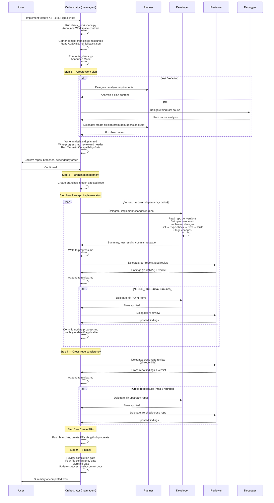
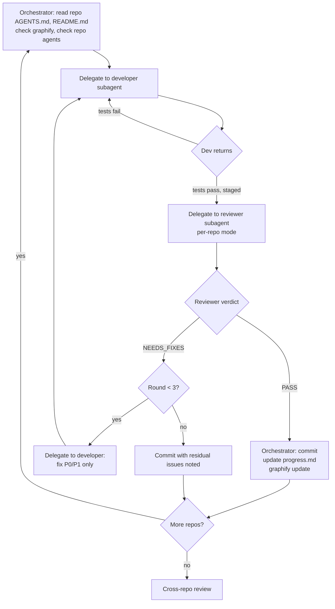

# Agent Orchestration — Design Document

How the fullstack skills coordinate workspace subagents for multi-repo
implementation. Covers the agent model, orchestration strategy, delegation
protocol, and rationale.

**Last updated**: 2026-07-28

---

## Problem Statement

Multi-repo fullstack work was originally designed around **role-play**:
the main AI agent reads a subagent's instruction file (`planner.md`,
`developer.md`, `reviewer.md`, `debugger.md`) and then "becomes" that
agent. This causes three problems:

1. **Context pollution** — The main agent's context window fills with
   implementation details, code diffs, and review findings, crowding out
   the high-level orchestration context.
2. **No true isolation** — A reviewer that shares context with the
   developer cannot be truly independent. The same session sees both
   "what was intended" and "what was built," undermining the
   falsification mindset.
3. **Linear execution** — Without proper subagent delegation, work is
   strictly serial even when repos are independent.

The fix: use **native subagent delegation** where the tool supports it
(OpenCode's `task`, Claude Code's Agent tool), with the main AI agent
acting as **orchestrator** — managing flow, confirming decisions,
delegating detail work, and aggregating results.

---

## Agent Model

### Four specialized subagents

```
┌─────────────────────────────────────────────────────────────────────┐
│                        ORCHESTRATOR (main agent)                    │
│  Manages flow, confirms with user, delegates, writes docs from      │
│  subagent output. NEVER writes code or performs reviews directly.   │
└──────┬──────────────┬────────────────┬──────────────────────────────┘
       │              │                │
       ▼              ▼                ▼
┌─────────────┐ ┌─────────────┐ ┌─────────────┐ ┌─────────────────────┐
│   PLANNER   │ │  DEVELOPER  │ │  REVIEWER   │ │      DEBUGGER       │
│  read-only  │ │  full access│ │  read-only  │ │    full access      │
│             │ │             │ │             │ │                     │
│ analysis.md │ │ source code │ │ review.md   │ │ analysis.md (fix)   │
│ plan.md     │ │ test files  │ │ findings    │ │ minimal code fixes  │
│             │ │ env setup   │ │             │ │                     │
│ MUST NOT:   │ │ MUST NOT:   │ │ MUST NOT:   │ │ MUST NOT:           │
│ source code │ │ review.md   │ │ source code │ │ plan.md, refactors  │
└─────────────┘ └─────────────┘ └─────────────┘ └─────────────────────┘
```

| Agent | Permission | Primary output | Boundary |
|-------|-----------|---------------|----------|
| **Planner** | `edit: deny`, `bash: allow` | `analysis.md` content, `plan.md` content | Never reads source code. Analyzes requirements and architecture only. |
| **Developer** | `edit: allow`, `bash: allow` | Production code, tests, config | Never touches `review.md`. Implements and validates per repo. |
| **Reviewer** | `edit: deny`, `bash: allow` | Review findings (P0/P1/P2 + verdict) | Never touches source code. Two modes: per-repo staged, cross-repo. |
| **Debugger** | `edit: allow`, `bash: allow` | Root cause analysis, minimal fixes | Never touches `plan.md`. Focused debugging only. |

### The orchestrator's role

The main AI agent is the **only agent that writes files** from subagent
output. Subagents return structured text; the orchestrator writes it
into the work directory. This keeps subagents truly independent (no
shared file system state) and creates a clean audit trail.

The orchestrator also handles:
- Gathering external context (Jira, Confluence, Figma, GitHub)
- Presenting repo/branch proposals to the user for confirmation
- Branch management across repos
- PR creation (when `github_repos=true`)
- Updating `progress.md` and the `review.md` header
- Mode routing (Fresh / Reference / Iteration / Follow-up / Resume)

---

## Orchestration Flow

### Full lifecycle (Fresh Mode)



### Per-repo implementation loop (detail)



---

## Delegation Protocol

### How to delegate

The orchestrator uses the **tool's native subagent mechanism**. The
SKILL.md instructions are tool-agnostic — the AI agent knows which API
to call:

```
"Delegate to the planner subagent to analyze the requirements."
```

The AI translates this into the appropriate call:
- OpenCode: `task("analyze requirements", subagent_type="planner")`
- Claude Code: Agent tool with `planner` subagent type
- Other tools: read agent file and role-play (fallback)

### What context to provide

For each delegation, provide the subagent with exactly what it needs —
no more, no less. This keeps subagent context windows small and focused.

| Subagent | Required context | Optional context |
|----------|-----------------|------------------|
| **Planner** | User requirements, workspace AGENTS.md repo table, gathered external context (Jira/Confluence/Figma) | Spike docs, prior work analysis |
| **Developer** | `plan.md`, `analysis.md`, repo AGENTS.md, repo README.md, branch name | Graphify query results, prior implementation notes |
| **Reviewer** | `plan.md`, `analysis.md`, `progress.md`, diffs or staged changes | Repo conventions, predecessor contracts (Follow-up mode) |
| **Debugger** | Error logs, stack traces, reproduction steps, affected repo context | Related bug reports, prior fix attempts |

### What to expect back

Subagents return structured text, not modified files. The orchestrator
writes all output to files. This ensures:

1. **Auditability** — Every file write comes from the orchestrator.
2. **No race conditions** — Subagents don't write concurrently.
3. **Clean rollback** — If a subagent returns bad output, you just
   don't write the file.

| Subagent | Returns |
|----------|---------|
| **Planner** | Problem framing, affected repos, recommended approach, phased plan, acceptance criteria, risks |
| **Developer** | Summary of changes per file, test results, recommended commit message, issues encountered |
| **Reviewer** | P0/P1/P2 findings with file/line evidence, verdict, recommendations |
| **Debugger** | What's broken, reproduction steps, root cause with evidence, minimal fix, validation results |

---

## Context Window Strategy

The orchestration model is designed to keep the main agent's context
window lean. Here's how:

```
┌─────────────────────────────────────────────────────────┐
│  MAIN AGENT CONTEXT WINDOW                               │
│                                                          │
│  ┌───────────────────────────────────────────────────┐  │
│  │ ORCHESTRATION STATE (~20% of window)               │  │
│  │ • Workspace contract (docs_dir, github_repos)     │  │
│  │ • Current step and mode                           │  │
│  │ • Repo dependency order                           │  │
│  │ • Work directory paths                            │  │
│  │ • User preferences and decisions                  │  │
│  │ • Branch names per repo                           │  │
│  └───────────────────────────────────────────────────┘  │
│  ┌───────────────────────────────────────────────────┐  │
│  │ SUBAGENT OUTPUT (~60% of window, transient)        │  │
│  │ • Planner's analysis summary                      │  │
│  │ • Current developer's implementation summary      │  │
│  │ • Current reviewer's findings                     │  │
│  │ (replaced per delegation — previous output purged)│  │
│  └───────────────────────────────────────────────────┘  │
│  ┌───────────────────────────────────────────────────┐  │
│  │ COMMUNICATION BUFFER (~20% of window)              │  │
│  │ • User-facing messages and confirmations          │  │
│  │ • progress.md and review.md (current state)       │  │
│  └───────────────────────────────────────────────────┘  │
└─────────────────────────────────────────────────────────┘
          │                    │                    │
          ▼                    ▼                    ▼
   ┌──────────┐        ┌──────────┐        ┌──────────┐
   │ PLANNER  │        │DEVELOPER │        │ REVIEWER │
   │ context  │        │ context  │        │ context  │
   │ (clean,  │        │ (clean,  │        │ (clean,  │
   │ focused) │        │ focused) │        │ focused) │
   └──────────┘        └──────────┘        └──────────┘
```

**Key principle**: Subagent output enters the main context only as a
summary. The orchestrator does NOT read every line of code the developer
wrote or every finding the reviewer made — it reads the summary and
writes it to the work tracking files. Deep detail stays in the subagent's
own context window.

---

## Repo-Level Agent Hierarchy

When a repo has its own `.agents/agents/`, those agents take priority
for that repo's internal concerns. The workspace-level agents handle
cross-repo coordination.

### Discovery

Before delegating to a workspace agent for a specific repo, check:

```bash
ls <repo>/.agents/agents/ 2>/dev/null
```

If the repo has specialized agents (e.g., `<repo>/.agents/agents/developer.md`),
delegate to them instead of the workspace agent. Provide the same context —
the repo agent already knows its own conventions.

### Priority

```
workspace/.agents/agents/planner.md   ← cross-repo planning
    │
    │  if <repo>/.agents/agents/planner.md exists:
    │  → use repo's planner for that repo's internal analysis
    │
    ▼
workspace/.agents/agents/developer.md ← cross-repo implementation
    │
    │  if <repo>/.agents/agents/developer.md exists:
    │  → use repo's developer for that repo's code
    │
    ▼
workspace/.agents/agents/reviewer.md  ← cross-repo review
    │
    │  if <repo>/.agents/agents/reviewer.md exists:
    │  → use repo's reviewer for that repo's changes
    │
    ▼
workspace/.agents/agents/debugger.md  ← cross-repo debugging
    │
    │  if <repo>/.agents/agents/debugger.md exists:
    │  → use repo's debugger for that repo's bugs
    │
    ▼
```

**Repo agents are NOT generated by fullstack-init.** They are maintained
by each repo's team. fullstack-init only generates workspace-level agents.

---

## Parallel Execution

Serial is the default because cross-repo dependencies are the norm. But
the orchestrator can run subagents in parallel when the planner confirms:

- ZERO shared interfaces between the repos
- ZERO data model overlap
- ZERO dependency edges

The planner must document this independence in `plan.md`. When in doubt,
default to serial.

For parallel execution, delegate to multiple developer subagents
simultaneously, then aggregate results. Cross-repo review still runs
after all repos are done.

---

## Migration from Role-Play

### What changed (v10)

| Aspect | Before (role-play) | After (subagent delegation) |
|--------|-------------------|---------------------------|
| **Agent invocation** | "Read the agent file and use it" | "Delegate to the X subagent" |
| **File ownership** | Subagents "write" files (but main agent actually writes) | Subagents return text; orchestrator writes files |
| **Review** | `code-review-staged` skill for per-repo; main agent for cross-repo | Reviewer subagent handles BOTH modes |
| **Context isolation** | None — everything in main agent context | Subagents get clean focused context windows |
| **review.md ownership** | Developer appends (contradicted agent definition) | Orchestrator appends reviewer's output |
| **Agent file format** | Plain markdown instructions | YAML frontmatter + markdown (tool-discoverable) |
| **Tool integration** | None | Symlinks: `.opencode/agents/`, `.claude/agents/`, etc. |

### Backward compatibility

All existing work tracking documents, branch names, and file structures
are unchanged. The migration affects only HOW agents are invoked — the
output format (analysis.md, plan.md, progress.md, review.md) is identical.
Existing work items continue to work with the new orchestration model.

---

## Requirements Traceability

| Requirement | How it's met |
|-------------|-------------|
| Main agent stays focused on flow | Orchestrator only handles flow control, confirmation, and delegation |
| Subagents do detail work | Planner/Developer/Reviewer/Debugger each own one domain |
| Context isolation | Subagents run in separate context windows (when tool supports it) |
| Audit trail | All file writes from orchestrator; each delegation produces discrete output |
| Repo-level agent support | Hierarchy with discovery and priority rules |
| Multi-tool compatibility | YAML frontmatter format + symlinks; fallback to role-play when no subagent system |
| Parallel execution when safe | Planner confirms independence; orchestrator can delegate in parallel |

---

## Changelog

### 2026-07-28 — v1: Initial orchestration design

- Defined four-subagent model with clear boundaries and ownership
- Designed serial-per-repo orchestration flow with sequence and flowchart diagrams
- Established delegation protocol: what to provide, what to expect back
- Documented context window strategy for the orchestrator
- Added repo-level agent hierarchy and discovery mechanism
- Specified parallel execution exception rules
- Migration guide from role-play to subagent delegation
