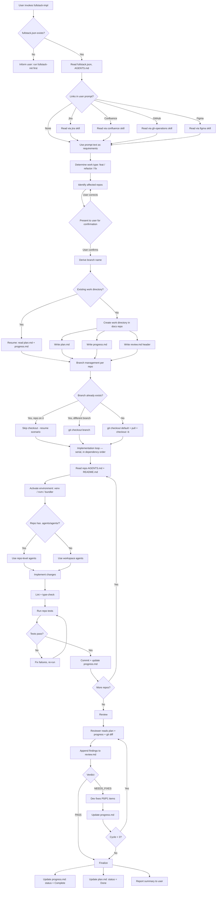
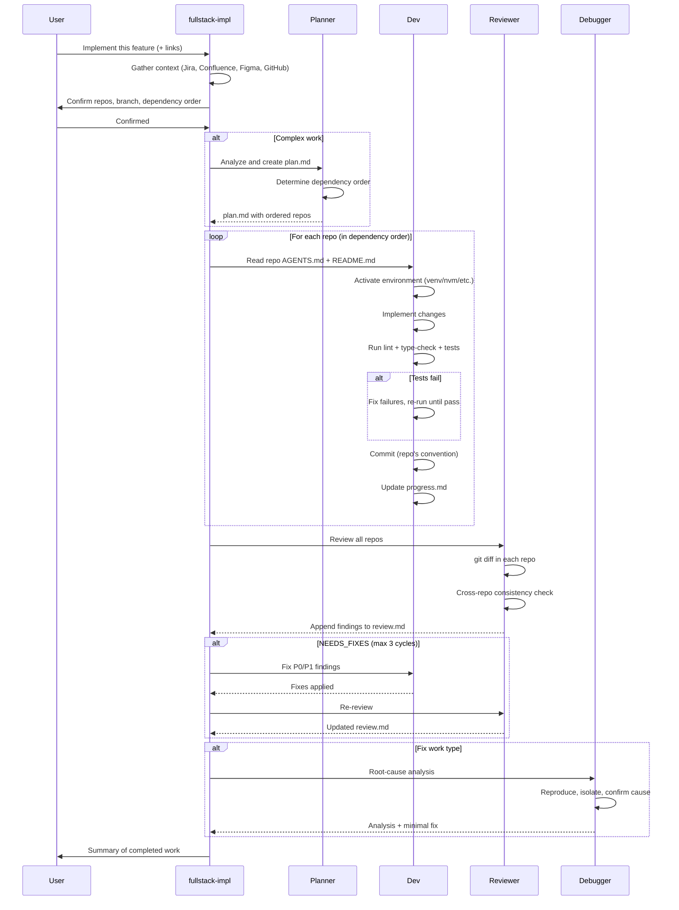

# Fullstack Impl — Design Document

Design document for the `fullstack-impl` skill. Covers requirements, solution
architecture, agent coordination, and workflow details.

**Last updated**: 2026-04-18

---

## Problem Statement

After a fullstack workspace is initialized by `fullstack-init`, developers
need to implement features, refactors, and fixes across multiple repos.
Without a structured approach:

1. Context is lost — requirements from Jira/Confluence/Figma aren't gathered
   before coding starts.
2. Branch management is inconsistent — each repo may end up on different
   branches or miss the latest main.
3. No work tracking — progress isn't documented, making resume after session
   breaks impossible.
4. No review cycle — changes go unchecked, cross-repo inconsistencies slip in.
5. No agent coordination — planner, implementer, reviewer, and debugger roles
   aren't separated, leading to shallow work.

## Workflow



## Requirements

### R1 — Context gathering before implementation

Must read all linked resources (Jira, Confluence, GitHub, Figma) before
planning or coding.

### R2 — Work type classification

Support three work types: `feat`, `refactor`, `fix`. Each has its own
directory in the docs repo and branch prefix.

### R3 — Mandatory user confirmation

Always present the list of affected repos and branch name for confirmation,
even when confident.

### R4 — Branch management

- Detect default branch (main/master/dev)
- Pull latest before branching
- Resume detection: skip checkout if already on the correct branch
- Naming: `<type>/<JIRA-KEY>/<Title>` or `<type>/<Title>`
- Docs repo does NOT use feature branches

### R5 — Agent coordination

Four agents with clear boundaries:

| Agent | Writes code? | Modifies review.md? | Modifies plan.md? |
|-------|-------------|---------------------|-------------------|
| Planner | No | No | Yes (creates) |
| Dev | Yes | No | No (after start) |
| Reviewer | No | Yes (append-only) | No |
| Debugger | Yes | No | May add follow-ups |

### R6 — Work tracking

Every work item creates plan.md, progress.md, review.md. Progress is updated
after every meaningful change. Review is append-only.

### R7 — Resume capability

When a previous session's work exists, detect it and resume from where it
left off.

### R8 — Repo-level agent delegation

If a repo has its own `.agents/agents/`, prefer those for repo-specific
concerns. Workspace agents handle cross-repo coordination.

### R9 — Serial per-repo orchestration

Repos are modified one at a time, in dependency order (upstream → services
→ consumers). Parallel per-repo execution is only allowed when the planner
explicitly confirms zero shared interfaces. Default is always serial.

### R10 — Repo convention compliance

Before touching any repo, read its AGENTS.md and README.md. Follow its
coding conventions, commit message format, and architecture constraints.
These are mandatory, not advisory.

### R11 — Environment management

Detect and activate repo-specific environments before running any commands:
venv/conda for Python, nvm for Node, bundler for Ruby, etc. If a venv
doesn't exist but is documented, create it per README instructions.

### R12 — Mandatory test execution

After implementing changes in a repo, run its full validation pipeline:
lint → type-check → tests → build. Fix all failures caused by your changes
before moving to the next repo. Pre-existing failures are documented but
do not block progress.

### R13 — Dependency-ordered implementation

The plan must establish a dependency order for repos (shared libs first,
consumers last). Implementation follows this exact order. Downstream repos
can rely on upstream changes being committed and validated.

## Agent Coordination Model

### Orchestration strategy: serial per-repo

Repos are modified **one at a time, in dependency order** (upstream first,
consumers last). This is the default, even when repos appear independent.

**Rationale (correctness > speed):**

1. **Cross-repo dependencies are the norm.** Shared types → API contracts →
   consumers. Parallel agents can't see each other's WIP, leading to
   contract mismatches that are expensive to fix.
2. **Context accumulates naturally.** What was built in repo A informs
   what needs to happen in repo B — serial flow preserves this.
3. **Shared state conflicts.** Multiple agents writing to `progress.md`
   concurrently creates race conditions.
4. **Debugging is simpler.** Sequential execution gives a clean audit trail.

**Exception**: If the planner explicitly confirms that repos have ZERO
shared interfaces, ZERO data model overlap, and ZERO dependency edges,
they MAY be implemented in parallel. The planner must document this
independence in `plan.md`.

### Per-repo implementation loop

For each repo (serial, in dependency order):

```
Read AGENTS.md + README.md
  → Activate environment (venv, nvm, etc.)
    → Implement changes
      → Lint / type-check / test (fix if broken)
        → Commit (follow repo's commit convention)
          → Update progress.md
```

### Sequence diagram



## Branch Naming Examples

| Scenario | Branch name |
|----------|-------------|
| Jira feature | `feat/XYZ-706/Import-Export` |
| Jira fix | `fix/XYZ-708/iPad-Ble-Not-Working` |
| Jira refactor | `refactor/XYZ-707/Refine-Models` |
| No-Jira feature | `feat/Dark-Mode-Toggle` |
| No-Jira fix | `fix/Login-Crash-On-Empty-Password` |

## File Inventory

```
mythril_agent_skills/skills/fullstack-impl/
└── SKILL.md                     # Pure instruction skill (no scripts)

plugins/fullstack-impl/
└── skills/
    └── fullstack-impl -> ../../../mythril_agent_skills/skills/fullstack-impl
```

This skill is pure instructions — no Python scripts. It orchestrates
behavior through the SKILL.md instructions, delegating actual code changes
to the AI agent following the workspace agents' guidelines.

## Relationship to fullstack-init

| Concern | fullstack-init | fullstack-impl |
|---------|---------------|----------------|
| When | Before any work | For each work item |
| Creates | Workspace infrastructure | Work-specific plans + branches |
| Modifies | AGENTS.md, README.md | Source code in repos |
| Docs dir | Creates + git init | Reads + writes work tracking docs |
| Agents | Creates templates | Follows their guidelines |
| Idempotent | Yes (re-run safe) | Per-work-item (one dir per item) |

## Current Status

### Done

- [x] R1 — Context gathering (Jira, Confluence, GitHub, Figma)
- [x] R2 — Work type classification (feat, refactor, fix)
- [x] R3 — Mandatory user confirmation
- [x] R4 — Branch management with resume detection
- [x] R5 — Four-agent coordination model
- [x] R6 — Work tracking (plan.md, progress.md, review.md)
- [x] R7 — Resume capability
- [x] R8 — Repo-level agent delegation
- [x] R9 — Serial per-repo orchestration with parallel exception
- [x] R10 — Repo convention compliance (AGENTS.md/README.md mandatory)
- [x] R11 — Environment management (venv, nvm, bundler, etc.)
- [x] R12 — Mandatory test execution (lint → type-check → test → build)
- [x] R13 — Dependency-ordered implementation
- [x] Plugin wrapper + marketplace.json entry
- [x] Description validation under 1024 limit

### Planned / Ideas

- [ ] Auto-PR creation: after review passes, auto-create PRs in each repo
  using `gh-operations` skill
- [ ] Dependency graph visualization: generate a mermaid diagram of cross-repo
  dependencies for each work item
- [ ] Template customization: let users define their own plan.md template

## Changelog

### 2026-04-18 — v3: Serial orchestration, environment management, test rigor

- Added serial per-repo orchestration as default strategy with rationale
- Parallel per-repo only when planner explicitly confirms zero dependencies
- Added environment management (venv, nvm, bundler, conda, Docker)
- Mandatory validation pipeline: lint → type-check → tests → build
- Test failure handling: fix own failures, document pre-existing ones
- Dependency-ordered implementation: upstream repos first, consumers last
- Plan.md template now includes Depends On column for repos
- Enhanced cross-repo review checklist (API contracts, shared types, env vars)
- Detailed error handling for environment issues and contract mismatches

### 2026-04-18 — v2: Work types, branch management, four agents, Figma

- Generalized from features-only to feat/refactor/fix work types
- Added branch management with naming convention and resume detection
- Four agents: planner, dev, reviewer, debugger (from init scaffolding)
- Added Figma link support alongside Jira/Confluence/GitHub
- Docs repo does not use feature branches
- Created design document with mermaid workflow diagrams

### 2026-04-18 — v1: Initial implementation

- Context gathering from Jira, Confluence, GitHub
- Repo identification with mandatory user confirmation
- Feature plan creation (plan.md, progress.md, review.md)
- Dev/review cycle with max 3 fix iterations
- Resume capability for incomplete features
