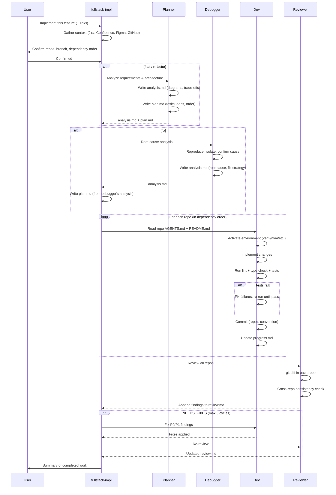

# Fullstack Impl — Design Document

Design document for the `fullstack-impl` skill. Covers requirements, solution
architecture, agent coordination, and workflow details.

**Last updated**: 2026-04-19

---

## Problem Statement

After a fullstack workspace is initialized by `fullstack-init`, developers
need to implement features, refactors, and fixes across multiple repos.
Without a structured approach:

1. Context is lost — requirements from Jira/Confluence/Figma aren't gathered
   before coding starts.
2. Branch management is inconsistent — each repo may end up on different
   branches or miss the latest main.
3. No work tracking — progress isn't documented, making resume after session
   breaks impossible.
4. No review cycle — changes go unchecked, cross-repo inconsistencies slip in.
5. No agent coordination — planner, implementer, reviewer, and debugger roles
   aren't separated, leading to shallow work.

## Workflow

```mermaid
flowchart TD
    A[User invokes fullstack-impl] --> B{Workspace validation}
    B --> B1{fullstack.json exists?}
    B --> B2{AGENTS.md exists?}
    B --> B3{.agents/ directory exists?}
    B1 -- No --> FAIL[Inform user: not a valid workspace]
    B2 -- No --> FAIL
    B3 -- No --> FAIL
    B1 & B2 & B3 -- All Yes --> C[Read fullstack.json, AGENTS.md]

    C --> D{Links in user prompt?}
    D -- Jira --> D1[Read via jira skill]
    D -- Confluence --> D2[Read via confluence skill]
    D -- GitHub --> D3[Read via gh-operations skill]
    D -- Figma --> D4[Read via figma skill]
    D -- None --> E[Use prompt text as requirements]
    D1 & D2 & D3 & D4 --> E

    E --> F[Determine work type: feat / refactor / fix]

    F --> G[Identify affected repos]
    G --> H{Present to user for confirmation}
    H -- User corrects --> G
    H -- User confirms --> I[Derive branch name]

    I --> J{Existing work directory?}
    J -- Yes --> K[Resume: read plan.md + progress.md]
    J -- No --> L[Create work directory in docs repo]

    L --> L0{Work type?}
    L0 -- feat/refactor --> L0a[Planner writes analysis.md]
    L0 -- fix --> L0b[Debugger writes analysis.md]
    L0a & L0b --> L1[Write plan.md]
    L1 --> L2[Write progress.md]
    L2 --> L3[Write review.md header]

    K --> M[Branch management per repo]
    L1 & L2 & L3 --> M

    M --> M1{Branch already exists?}
    M1 -- Yes, repo on it --> M2[Skip checkout - resume scenario]
    M1 -- Yes, different branch --> M3[git checkout branch]
    M1 -- No --> M4[git checkout default + pull + checkout -b]

    M2 & M3 & M4 --> N[Implementation loop — serial, in dependency order]

    N --> N1[Read repo AGENTS.md + README.md]
    N1 --> N1a[Activate environment: venv / nvm / bundler]
    N1a --> N2{Repo has .agents/agents/?}
    N2 -- Yes --> N3[Use repo-level agents]
    N2 -- No --> N4[Use workspace agents]
    N3 & N4 --> N5[Implement changes]
    N5 --> N6[Lint + type-check]
    N6 --> N7[Run repo tests]
    N7 --> N7a{Tests pass?}
    N7a -- No --> N7b[Fix failures, re-run]
    N7b --> N7
    N7a -- Yes --> N8[Commit + update progress.md]
    N8 --> N9{More repos?}
    N9 -- Yes --> N1
    N9 -- No --> O[Review]

    O --> O1[Reviewer reads plan + progress + git diff]
    O1 --> O2[Append findings to review.md]
    O2 --> O3{Verdict}
    O3 -- PASS --> P[Finalize]
    O3 -- NEEDS_FIXES --> O4[Dev fixes P0/P1 items]
    O4 --> O5[Update progress.md]
    O5 --> O6{Cycle < 3?}
    O6 -- Yes --> O1
    O6 -- No --> P

    P --> P1[Update progress.md: status = Complete]
    P --> P2[Update plan.md: status = Done]
    P --> P3[Report summary to user]
```



## Requirements

### R0 — Workspace validation gate

Before any work, verify the current directory is a valid fullstack workspace
by checking for ALL three markers: `fullstack.json`, `AGENTS.md`, and
`.agents/` directory. If any are missing, stop and inform the user to
`cd` to the workspace root or run `fullstack-init` first.

### R1 — Context gathering before implementation

Must read all linked resources (Jira, Confluence, GitHub, Figma) before
planning or coding.

### R2 — Work type classification

Support three work types: `feat`, `refactor`, `fix`. Each has its own
directory in the docs repo and branch prefix.

### R3 — Mandatory user confirmation

Always present the list of affected repos and branch name for confirmation,
even when confident.

### R4 — Branch management

- Detect default branch (main/master/dev)
- Pull latest before branching
- Resume detection: skip checkout if already on the correct branch
- Naming: `<type>/<JIRA-KEY>/<Title>` or `<type>/<Title>`
- Multiple Jira tickets: match each ticket to its repo by platform/role,
  each repo gets its own branch name with its own Jira key
- Docs repo does NOT use feature branches

### R5 — Agent coordination

Four agents with clear boundaries and work-type-based dispatch:

| Agent | Writes | Reads | Never touches |
|-------|--------|-------|---------------|
| Planner | `analysis.md` (feat/refactor), `plan.md` | everything | source code, `review.md` |
| Debugger | `analysis.md` (fix) | everything | `plan.md`, `review.md` |
| Dev | source code, `progress.md` | `analysis.md`, `plan.md` | `review.md` |
| Reviewer | `review.md` (append-only) | everything | source code, `plan.md` |

Lifecycle per work type:

| Phase | `feat/` / `refactor/` | `fix/` |
|-------|----------------------|--------|
| Analysis | Planner → `analysis.md` | Debugger → `analysis.md` |
| Planning | Planner → `plan.md` | Planner → `plan.md` (from debugger's analysis) |
| Implementation | Developer | Developer |
| Review | Reviewer → `review.md` | Reviewer → `review.md` |

### R6 — Work tracking

Every work item creates analysis.md, plan.md, progress.md, review.md.
Analysis captures the technical thinking (architecture, root cause, design
options). Progress is updated after every meaningful change. Review is
append-only. Analysis may be skipped for trivial work.

### R7 — Resume capability

When a previous session's work exists, detect it and resume from where it
left off.

### R8 — Repo-level agent delegation

If a repo has its own `.agents/agents/`, prefer those for repo-specific
concerns. Workspace agents handle cross-repo coordination.

### R9 — Serial per-repo orchestration

Repos are modified one at a time, in dependency order (upstream → services
→ consumers). Parallel per-repo execution is only allowed when the planner
explicitly confirms zero shared interfaces. Default is always serial.

### R10 — Repo convention compliance

Before touching any repo, read its AGENTS.md and README.md. Follow its
coding conventions, commit message format, and architecture constraints.
These are mandatory, not advisory.

### R11 — Environment management

Detect and activate repo-specific environments before running any commands:
venv/conda for Python, nvm for Node, bundler for Ruby, etc. If a venv
doesn't exist but is documented, create it per README instructions.

### R12 — Mandatory test execution

After implementing changes in a repo, run its full validation pipeline:
lint → type-check → tests → build. Fix all failures caused by your changes
before moving to the next repo. Pre-existing failures are documented but
do not block progress.

### R13 — Dependency-ordered implementation

The plan must establish a dependency order for repos (shared libs first,
consumers last). Implementation follows this exact order. Downstream repos
can rely on upstream changes being committed and validated.

### R14 — Language-aware documentation

All generated work tracking documents (analysis.md, plan.md, progress.md,
review.md) must match the language of the user's prompt. If the prompt
contains any Chinese characters, use Chinese templates; otherwise English.
Each invocation detects language independently — mixed languages across
work items is acceptable. Branch names and directory names always remain
English.

### R15 — Technical analysis document

Non-trivial work items produce `analysis.md` before `plan.md`. This
document captures the deep technical thinking — architecture diagrams,
root cause analysis, design option trade-offs, flow visualizations — that
informs the plan but doesn't belong in an execution checklist. Content
must favor visual formats (mermaid diagrams, markdown tables) over prose.
The analysis agent varies by work type: Planner for feat/refactor,
Debugger for fix. May be skipped for trivial work.

## Agent Coordination Model

### Orchestration strategy: serial per-repo

Repos are modified **one at a time, in dependency order** (upstream first,
consumers last). This is the default, even when repos appear independent.

**Rationale (correctness > speed):**

1. **Cross-repo dependencies are the norm.** Shared types → API contracts →
   consumers. Parallel agents can't see each other's WIP, leading to
   contract mismatches that are expensive to fix.
2. **Context accumulates naturally.** What was built in repo A informs
   what needs to happen in repo B — serial flow preserves this.
3. **Shared state conflicts.** Multiple agents writing to `progress.md`
   concurrently creates race conditions.
4. **Debugging is simpler.** Sequential execution gives a clean audit trail.

**Exception**: If the planner explicitly confirms that repos have ZERO
shared interfaces, ZERO data model overlap, and ZERO dependency edges,
they MAY be implemented in parallel. The planner must document this
independence in `plan.md`.

### Per-repo implementation loop

For each repo (serial, in dependency order):

```
Read AGENTS.md + README.md
  → Activate environment (venv, nvm, etc.)
    → Implement changes
      → Lint / type-check / test (fix if broken)
        → Commit (follow repo's commit convention)
          → Update progress.md
```

### Sequence diagram



## Branch Naming Examples

### Single Jira ticket or no ticket

All affected repos share the same branch name:

| Scenario | Branch name |
|----------|-------------|
| Jira feature | `feat/XYZ-706/Import-Export` |
| Jira fix | `fix/XYZ-708/iPad-Ble-Not-Working` |
| Jira refactor | `refactor/XYZ-707/Refine-Models` |
| No-Jira feature | `feat/Dark-Mode-Toggle` |
| No-Jira fix | `fix/Login-Crash-On-Empty-Password` |

### Multiple Jira tickets (cross-platform work)

Each repo gets the branch name matching its platform's ticket. The agent
matches tickets to repos by cross-referencing the ticket's title,
description, labels, and components with each repo's role/platform/tech
stack from the workspace `AGENTS.md` table (and the repo's own AGENTS.md /
README.md if needed).

| Repo | Jira ticket | Branch name |
|------|-------------|-------------|
| shared-lib/ | — | `feat/Dark-Mode-Toggle` |
| api/ | BE-450 | `feat/BE-450/Dark-Mode-Toggle` |
| android/ | MOBILE-301 | `feat/MOBILE-301/Dark-Mode-Toggle` |
| ios/ | MOBILE-302 | `feat/MOBILE-302/Dark-Mode-Toggle` |

All branches share the same descriptive title (derived from the work name).
Repos without a matching ticket use the no-Jira format.

## File Inventory

```
mythril_agent_skills/skills/fullstack-impl/
└── SKILL.md                     # Pure instruction skill (no scripts)

plugins/fullstack-impl/
└── skills/
    └── fullstack-impl -> ../../../mythril_agent_skills/skills/fullstack-impl
```

This skill is pure instructions — no Python scripts. It orchestrates
behavior through the SKILL.md instructions, delegating actual code changes
to the AI agent following the workspace agents' guidelines.

## Relationship to fullstack-init

| Concern | fullstack-init | fullstack-impl |
|---------|---------------|----------------|
| When | Before any work | For each work item |
| Creates | Workspace infrastructure | Work-specific plans + branches |
| Modifies | AGENTS.md, README.md | Source code in repos |
| Docs dir | Creates + git init | Reads + writes work tracking docs |
| Agents | Creates templates | Follows their guidelines |
| Idempotent | Yes (re-run safe) | Per-work-item (one dir per item) |

## Current Status

### Done

- [x] R0 — Workspace validation gate (fullstack.json + AGENTS.md + .agents/)
- [x] R1 — Context gathering (Jira, Confluence, GitHub, Figma)
- [x] R2 — Work type classification (feat, refactor, fix)
- [x] R3 — Mandatory user confirmation
- [x] R4 — Branch management with resume detection
- [x] R5 — Four-agent coordination model
- [x] R6 — Work tracking (plan.md, progress.md, review.md)
- [x] R7 — Resume capability
- [x] R8 — Repo-level agent delegation
- [x] R9 — Serial per-repo orchestration with parallel exception
- [x] R10 — Repo convention compliance (AGENTS.md/README.md mandatory)
- [x] R11 — Environment management (venv, nvm, bundler, etc.)
- [x] R12 — Mandatory test execution (lint → type-check → test → build)
- [x] R13 — Dependency-ordered implementation
- [x] R14 — Language-aware documentation (EN/ZH based on user prompt)
- [x] R15 — Technical analysis document (analysis.md with mermaid/table emphasis)
- [x] Plugin wrapper + marketplace.json entry
- [x] Description validation under 1024 limit

### Planned / Ideas

- [ ] Auto-PR creation: after review passes, auto-create PRs in each repo
  using `gh-operations` skill
- [ ] Dependency graph visualization: generate a mermaid diagram of cross-repo
  dependencies for each work item
- [ ] Template customization: let users define their own plan.md template

## Changelog

### 2026-04-20 — v7: Review enforcement — gate, structured output, diff-first

- **Problem**: In practice, Step 7 (Review) was consistently skipped or
  produced empty output. `review.md` ended up containing only the initial
  header ("审查结果将由 reviewer agent 追加到此文件") with no actual review
  findings. Root cause: the instructions were too vague ("append findings")
  and Step 9 had no gate to block finalization when review was missing.
- **Step 7 restructured** into explicit sub-steps (7a–7f):
  - 7a: Read reviewer.md
  - 7b: Collect diffs (mandatory `git diff` per repo — ground truth)
  - 7c: Per-repo review with 4 concrete check dimensions
  - 7d: Cross-repo consistency checks
  - 7e: Write findings (mandatory structural elements: header + findings + verdict)
  - 7f: Fix cycle (unchanged logic, clearer step references)
- **Minimum output requirement**: Even a PASS review must write a full
  `## Review Pass` section with `### Findings` and `### Verdict`. Empty
  review.md is never acceptable.
- **Step 9 review gate**: Before finalization, verify `review.md` contains
  `### Verdict` (EN) or `### 结论` (ZH). If missing → STOP and go back
  to Step 7. Prevents the "skip review, go straight to finalize" failure.
- **review.md template updated**: Initial template now explicitly states
  that a `### Verdict` section is required before finalization can proceed,
  serving as a reminder to the agent when it reads the file.

### 2026-04-19 — v6: Technical analysis document, explicit agent dispatch

- Added R15: `analysis.md` — a technical thinking document that precedes
  `plan.md`. Contains architecture diagrams, root cause analysis, design
  option trade-offs, flow visualizations. Must favor mermaid diagrams and
  markdown tables over prose.
- Work directory now contains 4 files: analysis.md, plan.md, progress.md,
  review.md (analysis.md may be skipped for trivial work)
- Explicit agent dispatch rules per work type: Planner writes analysis for
  feat/refactor, Debugger writes analysis for fix
- Clear agent boundary table: who writes what, who reads what, who never
  touches what
- Full lifecycle table per work type showing all 5 phases
- Updated sequence diagram to show analysis phase before implementation
- Bilingual analysis.md templates with mermaid emphasis (feat/refactor
  template + fix template, each in EN and ZH)

### 2026-04-18 — v5: Language-aware docs, mandatory review, finalize fix

- Added R14: language-aware documentation — detect Chinese chars in user
  prompt → generate plan.md/progress.md/review.md in Chinese; otherwise
  English. Each invocation detects independently; mixed languages across
  work items is acceptable
- Full bilingual templates for all work tracking documents and review
  finding format
- Step 7 (Review) now explicitly marked as MANDATORY — do NOT skip
- Step 8 (Finalize) now explicitly requires updating plan.md status to
  Done and committing docs repo (both were missed in first real usage)

### 2026-04-18 — v4: Workspace validation gate

- Added R0: mandatory workspace validation before any work
- Check for three markers: fullstack.json, AGENTS.md, .agents/ directory
- If any are missing, stop with a clear error message listing what's missing
- Updated workflow diagram to show three-way validation check

### 2026-04-18 — v3: Serial orchestration, environment management, test rigor

- Added serial per-repo orchestration as default strategy with rationale
- Parallel per-repo only when planner explicitly confirms zero dependencies
- Added environment management (venv, nvm, bundler, conda, Docker)
- Mandatory validation pipeline: lint → type-check → tests → build
- Test failure handling: fix own failures, document pre-existing ones
- Dependency-ordered implementation: upstream repos first, consumers last
- Plan.md template now includes Branch and Depends On columns per repo
- Per-repo branch names when multiple Jira tickets target different platforms
- Ticket-to-repo matching by platform/role from workspace AGENTS.md
- Enhanced cross-repo review checklist (API contracts, shared types, env vars)
- Detailed error handling for environment issues and contract mismatches

### 2026-04-18 — v2: Work types, branch management, four agents, Figma

- Generalized from features-only to feat/refactor/fix work types
- Added branch management with naming convention and resume detection
- Four agents: planner, dev, reviewer, debugger (from init scaffolding)
- Added Figma link support alongside Jira/Confluence/GitHub
- Docs repo does not use feature branches
- Created design document with mermaid workflow diagrams

### 2026-04-18 — v1: Initial implementation

- Context gathering from Jira, Confluence, GitHub
- Repo identification with mandatory user confirmation
- Feature plan creation (plan.md, progress.md, review.md)
- Dev/review cycle with max 3 fix iterations
- Resume capability for incomplete features
