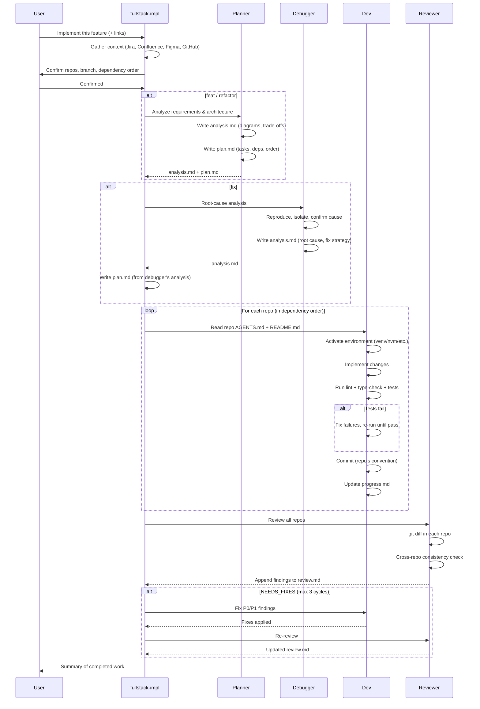

# Fullstack Impl — Design Document

Design document for the `fullstack-impl` skill. Covers requirements, solution
architecture, agent coordination, and workflow details.

**Last updated**: 2026-04-19

---

## Problem Statement

After a fullstack workspace is initialized by `fullstack-init`, developers
need to implement features, refactors, and fixes across multiple repos.
Without a structured approach:

1. Context is lost — requirements from Jira/Confluence/Figma aren't gathered
   before coding starts.
2. Branch management is inconsistent — each repo may end up on different
   branches or miss the latest main.
3. No work tracking — progress isn't documented, making resume after session
   breaks impossible.
4. No review cycle — changes go unchecked, cross-repo inconsistencies slip in.
5. No agent coordination — planner, implementer, reviewer, and debugger roles
   aren't separated, leading to shallow work.

## Workflow

```mermaid
flowchart TD
    A[User invokes fullstack-impl] --> B{Workspace validation}
    B --> B1{fullstack.json exists?}
    B --> B2{AGENTS.md exists?}
    B --> B3{.agents/ directory exists?}
    B1 -- No --> FAIL[Inform user: not a valid workspace]
    B2 -- No --> FAIL
    B3 -- No --> FAIL
    B1 & B2 & B3 -- All Yes --> C[Read fullstack.json, AGENTS.md]

    C --> D{Links in user prompt?}
    D -- Jira --> D1[Read via jira skill]
    D -- Confluence --> D2[Read via confluence skill]
    D -- GitHub --> D3[Read via gh-operations skill]
    D -- Figma --> D4[Read via figma skill]
    D -- None --> E[Use prompt text as requirements]
    D1 & D2 & D3 & D4 --> E

    E --> ESCAN[Scan existing work dirs by Status]
    ESCAN --> EROUTE{Route by match + Status + user verb}
    EROUTE -- "no match" --> F
    EROUTE -- "match: Planning/In Progress + continue verb" --> KRESUME[Resume original Step 1-9]
    EROUTE -- "match: Done + tweak/fix/log verb" --> KITER[Iteration Mode silent loop]
    EROUTE -- "match: Closed + follow-up verb" --> KFOLLOW[Follow-up Mode: create -vN dir]
    EROUTE -- "match: any + reading verb" --> KREF[Reference Mode: read prior dir, fresh new work]
    EROUTE -- "match: Closed + no verb (overlap only)" --> KASK{Ask 3-option question}
    KASK -- "Follow-up" --> KFOLLOW
    KASK -- "Reference" --> KREF
    KASK -- "Independent" --> F

    F[Determine work type: feat / refactor / fix]

    F --> G[Identify affected repos]
    G --> H{Present to user for confirmation}
    H -- "User corrects" --> G
    H -- "User confirms" --> I[Derive branch name]

    I --> L[Create work directory in docs repo]

    KFOLLOW --> KF1[Read predecessor 4 docs in full]
    KF1 --> KF2["Successor dir name: name-vN"]
    KF2 --> KF3[Append -vN suffix to branch names]
    KF3 --> L

    KREF --> KR1[Read prior dir 4 docs as background]
    KR1 --> KR2[Fresh free name; standard branch names]
    KR2 --> L

    L --> L0{Work type?}
    L0 -- "feat/refactor" --> L0a[Planner writes analysis.md]
    L0 -- "fix" --> L0b[Debugger writes analysis.md]
    L0a & L0b --> L0c{Follow-up Mode?}
    L0c -- "Yes" --> L0d["Add Predecessor field + Predecessor Context section"]
    L0c -- "No (Fresh / Reference)" --> L1
    L0d --> L1[Write plan.md]
    L1 --> L2[Write progress.md]
    L2 --> L2a{Follow-up Mode?}
    L2a -- "Yes" --> L2b["Append Successors row to predecessor progress.md"]
    L2a -- "No (Fresh / Reference)" --> L3
    L2b --> L3[Write review.md header]

    KRESUME --> M[Branch management per repo]
    KITER --> M
    L1 & L2 & L3 --> M

    M --> M1{Branch already exists?}
    M1 -- Yes, repo on it --> M2[Skip checkout - resume scenario]
    M1 -- Yes, different branch --> M3[git checkout branch]
    M1 -- No --> M4[git checkout default + pull + checkout -b]

    M2 & M3 & M4 --> N[Implementation loop — serial, in dependency order]

    N --> N1[Read repo AGENTS.md + README.md]
    N1 --> N1a[Activate environment: venv / nvm / bundler]
    N1a --> N2{Repo has .agents/agents/?}
    N2 -- Yes --> N3[Use repo-level agents]
    N2 -- No --> N4[Use workspace agents]
    N3 & N4 --> N5[Implement changes]
    N5 --> N6[Lint + type-check]
    N6 --> N7[Run repo tests]
    N7 --> N7a{Tests pass?}
    N7a -- No --> N7b[Fix failures, re-run]
    N7b --> N7
    N7a -- Yes --> N8[Commit + update progress.md]
    N8 --> N9{More repos?}
    N9 -- Yes --> N1
    N9 -- No --> O[Review]

    O --> O1[Reviewer reads plan + progress + git diff]
    O1 --> O2[Append findings to review.md]
    O2 --> O3{Verdict}
    O3 -- PASS --> P[Finalize]
    O3 -- NEEDS_FIXES --> O4[Dev fixes P0/P1 items]
    O4 --> O5[Update progress.md]
    O5 --> O6{Cycle < 3?}
    O6 -- Yes --> O1
    O6 -- No --> P

    P --> P1[Update progress.md: status = Complete]
    P --> P2[Update plan.md: status = Done]
    P --> P3[Report summary to user]
```



## Requirements

### R0 — Workspace validation gate

Before any work, verify the current directory is a valid fullstack workspace
by checking for ALL three markers: `fullstack.json`, `AGENTS.md`, and
`.agents/` directory. If any are missing, stop and inform the user to
`cd` to the workspace root or run `fullstack-init` first.

### R1 — Context gathering before implementation

Must read all linked resources (Jira, Confluence, GitHub, Figma) before
planning or coding.

### R2 — Work type classification

Support three work types: `feat`, `refactor`, `fix`. Each has its own
directory in the docs repo and branch prefix.

### R3 — Mandatory user confirmation

Always present the list of affected repos and branch name for confirmation,
even when confident.

### R4 — Branch management

- Detect default branch (main/master/dev)
- Pull latest before branching
- Resume detection: skip checkout if already on the correct branch
- Naming: `<type>/<JIRA-KEY>/<Title>` or `<type>/<Title>`
- Multiple Jira tickets: match each ticket to its repo by platform/role,
  each repo gets its own branch name with its own Jira key
- Docs repo does NOT use feature branches

### R5 — Agent coordination

Four agents with clear boundaries and work-type-based dispatch:

| Agent | Writes | Reads | Never touches |
|-------|--------|-------|---------------|
| Planner | `analysis.md` (feat/refactor), `plan.md` | everything | source code, `review.md` |
| Debugger | `analysis.md` (fix) | everything | `plan.md`, `review.md` |
| Dev | source code, `progress.md` | `analysis.md`, `plan.md` | `review.md` |
| Reviewer | `review.md` (append-only) | everything | source code, `plan.md` |

Lifecycle per work type:

| Phase | `feat/` / `refactor/` | `fix/` |
|-------|----------------------|--------|
| Analysis | Planner → `analysis.md` | Debugger → `analysis.md` |
| Planning | Planner → `plan.md` | Planner → `plan.md` (from debugger's analysis) |
| Implementation | Developer | Developer |
| Review | Reviewer → `review.md` | Reviewer → `review.md` |

### R6 — Work tracking

Every work item creates analysis.md, plan.md, progress.md, review.md.
Analysis captures the technical thinking (architecture, root cause, design
options). Progress is updated after every meaningful change. Review is
append-only. Analysis may be skipped for trivial work.

### R7 — Resume capability

When a previous session's work exists, detect it and resume from where it
left off.

### R8 — Repo-level agent delegation

If a repo has its own `.agents/agents/`, prefer those for repo-specific
concerns. Workspace agents handle cross-repo coordination.

### R9 — Serial per-repo orchestration

Repos are modified one at a time, in dependency order (upstream → services
→ consumers). Parallel per-repo execution is only allowed when the planner
explicitly confirms zero shared interfaces. Default is always serial.

### R10 — Repo convention compliance

Before touching any repo, read its AGENTS.md and README.md. Follow its
coding conventions, commit message format, and architecture constraints.
These are mandatory, not advisory.

### R11 — Environment management

Detect and activate repo-specific environments before running any commands:
venv/conda for Python, nvm for Node, bundler for Ruby, etc. If a venv
doesn't exist but is documented, create it per README instructions.

### R12 — Mandatory test execution

After implementing changes in a repo, run its full validation pipeline:
lint → type-check → tests → build. Fix all failures caused by your changes
before moving to the next repo. Pre-existing failures are documented but
do not block progress.

### R13 — Dependency-ordered implementation

The plan must establish a dependency order for repos (shared libs first,
consumers last). Implementation follows this exact order. Downstream repos
can rely on upstream changes being committed and validated.

### R14 — Language-aware documentation

All generated work tracking documents (analysis.md, plan.md, progress.md,
review.md) must match the language of the user's prompt. If the prompt
contains any Chinese characters, use Chinese templates; otherwise English.
Each invocation detects language independently — mixed languages across
work items is acceptable. Branch names and directory names always remain
English.

### R15 — Technical analysis document

Non-trivial work items produce `analysis.md` before `plan.md`. This
document captures the deep technical thinking — architecture diagrams,
root cause analysis, design option trade-offs, flow visualizations — that
informs the plan but doesn't belong in an execution checklist. Content
must favor visual formats (mermaid diagrams, markdown tables) over prose.
The analysis agent varies by work type: Planner for feat/refactor,
Debugger for fix. May be skipped for trivial work.

### R16 — Follow-up Mode for closed work items

When a previously closed work item (`plan.md` Status: `Closed`) needs
further changes (extension, post-shipping bug, post-release refactor)
AND the user uses an explicit follow-up verb, the skill MUST NOT reopen
the closed work directory. Instead, it creates a successor work
directory with `-vN` suffix (e.g. `dark-mode-v2/`) that explicitly
inherits predecessor context.

**Mandatory artifacts:**

1. Successor's `analysis.md` and `plan.md` MUST contain a `Predecessor:`
   field in the header.
2. Successor's `analysis.md` MUST contain a `## Predecessor Context`
   (or `## 前置工作上下文`) section with four parts: what was shipped,
   decisions inherited, assumptions that changed, predecessor's caveats.
3. Predecessor's `progress.md` MUST gain a `## Successors`
   (or `## 后续工作`) table linking to the new successor, committed in
   the same docs-repo commit.
4. Branch names append `-vN` to the descriptive title.
5. Successor branches start from the repo's current default branch, NOT
   the predecessor's merged branch.
6. Cross-repo review (Step 7) MUST add a backward-compatibility check
   against the predecessor's shipped contracts.

**Detection paths (explicit-trigger-only):**

- Explicit follow-up verb: "follow up on X", "extend X", "build on top
  of X", "在 X 基础上", "基于 X 做后续", "X 的后续", "扩展 X"
- Confirmation when the agent asks the 3-option clarifying question for
  ambiguous overlap (see R17)

The skill MUST NOT auto-route to Follow-up Mode based on scope overlap
alone. Misrouting Reference as Follow-up modifies a closed dir and
creates phantom Predecessor links — costly to undo. When unsure, ask.

### R17 — Reference Mode for reading prior work as background

Sometimes the user wants the agent to read an existing work directory
as background context — to understand prior decisions, data models,
naming conventions — but the new work is fundamentally independent.
Reference Mode covers this case without writing into the prior dir.

**Distinguishing characteristics:**

| Aspect | Reference Mode | Follow-up Mode |
|--------|---------------|----------------|
| Reads prior work's 4 docs | Yes | Yes |
| Writes into prior directory | **No** | Yes (appends `## Successors`) |
| New work directory naming | Free naming | `<predecessor>-vN/` |
| Branch naming | Standard | `<title>-vN` |
| `Predecessor:` field | **No** | Yes |
| `## Predecessor Context` section | **No** (may freely cite in prose) | Yes, mandatory |
| Backward-compat cross-repo check | Not required | Required |
| Reversibility cost | Zero | High |

**Triggers (explicit reading verbs):**

- English: "look at feat/X", "read feat/X docs", "based on the X docs",
  "reference feat/X", "use feat/X for context", "see what we did in X"
- Chinese: "参考 feat/X", "看一下 feat/X", "看看 feat/X 文档",
  "基于 feat/X 的文档", "X 当背景", "X 当参考"

**Disambiguation rule:** if a sentence mixes a reading verb and a
building verb ("look at feat/dark-mode and build on top of it"), the
**building** verb wins — that is Follow-up Mode. The agent should ASK
when uncertain.

**Promotion path:** during planning, if the agent realizes the new
work IS extending the prior work (touching the same endpoints,
modifying the same data model in incompatible ways), it should pause
and ask the user about switching to Follow-up Mode. The reverse
(Follow-up → Reference) is uncommon and harder because it requires
un-writing the back-link.

### R18 — SKILL.md size and progressive disclosure

Per skill-creator's progressive-disclosure pattern, the main `SKILL.md`
covers Steps 1-9 inline but delegates large reusable artifacts to
`references/`:

- `references/document-templates.md` — full English/Chinese templates
  for plan/progress/analysis/review documents + Mermaid Compatibility
  Gate details
- `references/review-formats.md` — per-round and cross-repo review
  section formats
- `references/iteration-mode.md` — full Iteration Mode protocol (sticky
  loop, doc sync checklist, Iteration Log schema, self-check,
  anti-patterns, closure)
- `references/followup-mode.md` — full Follow-up Mode protocol
  (predecessor inheritance, `-vN` naming, back-link, backward-compat
  gate, anti-patterns)
- `references/reference-mode.md` — full Reference Mode protocol
  (read-only relationship, free naming, prose citation rules,
  promotion to Follow-up)
- `references/mode-selection.md` — central routing table among
  Fresh / Reference / Iteration / Follow-up, the 3-option clarifying
  question, mode promotion / demotion rules

The main `SKILL.md` reads each reference file at the moment it becomes
relevant (e.g. mode-selection at Step 1, document-templates at Step 5,
iteration-mode after finalization). This keeps the main file compact
while preserving full detail in the references.

## Agent Coordination Model

### Orchestration strategy: serial per-repo

Repos are modified **one at a time, in dependency order** (upstream first,
consumers last). This is the default, even when repos appear independent.

**Rationale (correctness > speed):**

1. **Cross-repo dependencies are the norm.** Shared types → API contracts →
   consumers. Parallel agents can't see each other's WIP, leading to
   contract mismatches that are expensive to fix.
2. **Context accumulates naturally.** What was built in repo A informs
   what needs to happen in repo B — serial flow preserves this.
3. **Shared state conflicts.** Multiple agents writing to `progress.md`
   concurrently creates race conditions.
4. **Debugging is simpler.** Sequential execution gives a clean audit trail.

**Exception**: If the planner explicitly confirms that repos have ZERO
shared interfaces, ZERO data model overlap, and ZERO dependency edges,
they MAY be implemented in parallel. The planner must document this
independence in `plan.md`.

### Per-repo implementation loop

For each repo (serial, in dependency order):

```
Read AGENTS.md + README.md
  → Activate environment (venv, nvm, etc.)
    → Implement changes
      → Lint / type-check / test (fix if broken)
        → Commit (follow repo's commit convention)
          → Update progress.md
```

### Sequence diagram



## Branch Naming Examples

### Single Jira ticket or no ticket

All affected repos share the same branch name:

| Scenario | Branch name |
|----------|-------------|
| Jira feature | `feat/XYZ-706/Import-Export` |
| Jira fix | `fix/XYZ-708/iPad-Ble-Not-Working` |
| Jira refactor | `refactor/XYZ-707/Refine-Models` |
| No-Jira feature | `feat/Dark-Mode-Toggle` |
| No-Jira fix | `fix/Login-Crash-On-Empty-Password` |

### Multiple Jira tickets (cross-platform work)

Each repo gets the branch name matching its platform's ticket. The agent
matches tickets to repos by cross-referencing the ticket's title,
description, labels, and components with each repo's role/platform/tech
stack from the workspace `AGENTS.md` table (and the repo's own AGENTS.md /
README.md if needed).

| Repo | Jira ticket | Branch name |
|------|-------------|-------------|
| shared-lib/ | — | `feat/Dark-Mode-Toggle` |
| api/ | BE-450 | `feat/BE-450/Dark-Mode-Toggle` |
| android/ | MOBILE-301 | `feat/MOBILE-301/Dark-Mode-Toggle` |
| ios/ | MOBILE-302 | `feat/MOBILE-302/Dark-Mode-Toggle` |

All branches share the same descriptive title (derived from the work name).
Repos without a matching ticket use the no-Jira format.

## File Inventory

```
mythril_agent_skills/skills/fullstack-impl/
├── SKILL.md                     # Main file — Steps 1-9, routing, gates
├── scripts/
│   ├── check_github_repos.py    # Step 8 — deterministic GitHub-repo detection
│   ├── iteration_log_check.py   # Iteration Mode self-check
│   └── mermaid_validate.py      # Mermaid 10.2.3 compatibility gate
└── references/
    ├── mode-selection.md        # Routing among Fresh / Reference / Iteration / Follow-up
    ├── document-templates.md    # EN/ZH templates for plan/progress/analysis/review
    ├── review-formats.md        # Per-round and cross-repo review section formats
    ├── iteration-mode.md        # Post-finalization sticky loop protocol
    ├── followup-mode.md         # Closed-work successor protocol (-vN, Predecessor, Successors)
    └── reference-mode.md        # Read prior work as background; no writes to prior dir

plugins/fullstack-impl/
└── skills/
    └── fullstack-impl -> ../../../mythril_agent_skills/skills/fullstack-impl
```

The main `SKILL.md` (916 lines after v9 split) covers Steps 1-9 inline.
Cross-cutting concerns and lifecycle modes live in `references/` and
are loaded by reading the relevant file at the moment it becomes
relevant — `mode-selection.md` at Step 1 routing, `document-templates.md`
at Step 5 doc creation, `review-formats.md` at Step 6e and Step 7,
`iteration-mode.md` after finalization, `followup-mode.md` and
`reference-mode.md` when those modes are active. This follows
skill-creator's progressive-disclosure pattern.

The bundled scripts handle deterministic checks: `check_github_repos.py`
reads the user's saved choice from `fullstack.json` (avoiding LLM
guessing about hostnames), `iteration_log_check.py` validates the
audit trail after each iteration round, `mermaid_validate.py` enforces
diagram compatibility against the 10.2.3 baseline.

## Relationship to fullstack-init

| Concern | fullstack-init | fullstack-impl |
|---------|---------------|----------------|
| When | Before any work | For each work item |
| Creates | Workspace infrastructure | Work-specific plans + branches |
| Modifies | AGENTS.md, README.md | Source code in repos |
| Docs dir | Creates + git init | Reads + writes work tracking docs |
| Agents | Creates templates | Follows their guidelines |
| Idempotent | Yes (re-run safe) | Per-work-item (one dir per item) |

## Current Status

### Done

- [x] R0 — Workspace validation gate (fullstack.json + AGENTS.md + .agents/)
- [x] R1 — Context gathering (Jira, Confluence, GitHub, Figma)
- [x] R2 — Work type classification (feat, refactor, fix)
- [x] R3 — Mandatory user confirmation
- [x] R4 — Branch management with resume detection
- [x] R5 — Four-agent coordination model
- [x] R6 — Work tracking (plan.md, progress.md, review.md)
- [x] R7 — Resume capability
- [x] R8 — Repo-level agent delegation
- [x] R9 — Serial per-repo orchestration with parallel exception
- [x] R10 — Repo convention compliance (AGENTS.md/README.md mandatory)
- [x] R11 — Environment management (venv, nvm, bundler, etc.)
- [x] R12 — Mandatory test execution (lint → type-check → test → build)
- [x] R13 — Dependency-ordered implementation
- [x] R14 — Language-aware documentation (EN/ZH based on user prompt)
- [x] R15 — Technical analysis document (analysis.md with mermaid/table emphasis)
- [x] R16 — Follow-up Mode for closed work items (-vN suffix, Predecessor field, Predecessor Context section, Successors back-link, backward-compat check)
- [x] R17 — Reference Mode for reading prior work as background (read-only, no Predecessor link, free naming)
- [x] R18 — SKILL.md size and progressive disclosure (references/ split for templates, modes, review formats)
- [x] Plugin wrapper + marketplace.json entry
- [x] Description validation under 1024 limit

### Planned / Ideas

- [ ] Auto-PR creation: after review passes, auto-create PRs in each repo
  using `gh-operations` skill
- [ ] Dependency graph visualization: generate a mermaid diagram of cross-repo
  dependencies for each work item
- [ ] Template customization: let users define their own plan.md template
- [ ] Follow-up chain validator script: verify that every successor has a
  populated `## Predecessor Context` and that every closed work with a
  successor has a corresponding `## Successors` row

## Changelog

### 2026-05-02 — v9: Reference Mode + explicit-trigger-only routing + progressive disclosure (R17, R18)

- **Problem 1**: After v8 introduced Follow-up Mode, the implicit
  scope-overlap detection was too eager — it auto-proposed Follow-up
  Mode (with `-vN` naming and a back-link to the prior dir) whenever
  the new request hit the same repos and surface as a closed work
  item. Users frequently wanted to **just read** a closed work dir
  for context while doing independent new work, but had no way to
  signal that without manually rejecting Follow-up after the fact.
- **Problem 2**: SKILL.md had grown to 2272 lines after v8, well over
  skill-creator's recommended ~500 line ceiling for the main file.
  Templates (plan/progress/analysis/review in EN+ZH), Iteration Mode
  protocol, and Follow-up Mode protocol all sat inline.
- **R17 added — Reference Mode**: a third "looking at prior work"
  mode that reads the prior dir's four documents but writes nothing
  into it. New work uses free naming, no `Predecessor` field, no
  `## Predecessor Context`, no `## Successors` back-link. Cited only
  in prose when the new analysis references the prior dir's
  decisions. Triggered by reading verbs: "look at feat/X", "参考
  feat/X", "based on X docs". Includes a promotion path
  (Reference → Follow-up) for when the agent discovers mid-planning
  that the work is actually a true continuation.
- **Routing tightened to explicit-verb-only**: Follow-up Mode no
  longer auto-proposes based on scope overlap. The agent must see an
  explicit follow-up verb ("follow up on X", "在 X 基础上", "extend X")
  OR get user confirmation through a 3-option clarifying question
  (Follow-up / Reference / Independent). When the user describes a
  request whose scope happens to overlap a closed work item but uses
  no verb, the default is to ASK rather than guess. Misroute cost is
  asymmetric — Reference → Follow-up is cheap to upgrade later, but
  Follow-up → Reference is hard to undo.
- **R18 added — Progressive disclosure**: SKILL.md split into a main
  file + `references/` directory:
  - SKILL.md (916 lines, was 2272) — Steps 1-9 main flow + routing +
    key gates
  - `references/mode-selection.md` — routing table among 4 modes,
    explicit verbs, the 3-option clarifying question, mode
    promotion / demotion rules
  - `references/document-templates.md` — full EN/ZH templates for
    plan/progress/analysis-feat/analysis-fix/review + Mermaid
    Compatibility Gate
  - `references/review-formats.md` — per-round and cross-repo review
    section templates
  - `references/iteration-mode.md` — full Iteration Mode protocol
  - `references/followup-mode.md` — full Follow-up Mode protocol
  - `references/reference-mode.md` — full Reference Mode protocol
  - SKILL.md reads each reference file at the moment it becomes
    relevant (mode-selection at Step 1, document-templates at Step 5,
    iteration-mode after finalization, etc.)
- **Description trigger**: added Reference Mode reading verbs
  alongside the existing Follow-up Mode building verbs, while
  keeping under the 1024-char limit (1015 chars).
- **No breaking changes**: existing work directories with already-set
  `Predecessor` fields and `## Successors` tables continue to work
  unchanged. The tightened triggers only affect NEW routing decisions.

### 2026-05-02 — v8: Follow-up Mode for closed work items (R16)

- **Problem**: When a previously closed work item (PR merged, shipped to
  production) needed extension/adjustment weeks or months later, the
  skill had no protocol. The closing rule only said "creates a NEW work
  item" without naming convention, inheritance rules, or back-link
  requirements. Users either reopened closed dirs (corrupting the audit
  trail) or started orphan work items with no link to the predecessor
  (losing institutional knowledge).
- **R16 added**: Follow-up Mode is the explicit protocol for opening
  successor work items (`<name>-v2`, `-v3`, ...) on top of closed
  predecessors. Mandatory artifacts: `Predecessor:` header field,
  `## Predecessor Context` analysis section (4 sub-parts), `## Successors`
  back-link in predecessor's progress.md, `-vN` branch suffix,
  backward-compat check in cross-repo review.
- **SKILL.md changes**:
  - New section "Follow-up Mode — Iterating on Closed Work" inserted
    between "Iteration Mode" and "Resuming Previous Work"
  - Step 1 expanded with "Existing work directory scan" — list and
    classify all existing work dirs by `plan.md` Status, route on match
  - "Resuming Previous Work" decision tree restructured into a routing
    table mapping `(Status, request type) → (Resume | Iteration |
    Follow-up | New work item | Ask)`
  - "Closing the work item" forward-pointer rewritten to point to
    Follow-up Mode instead of the one-line throwaway
  - Description trigger keywords expanded to recognize follow-up phrasing
    ("on top of X", "extend X", "在 X 基础上", "follow up on X")
- **Branch convention**: successor branches append `-v2`/`-vN` to the
  descriptive title (e.g. `feat/MOBILE-580/Dark-Mode-Toggle-v2`). New
  Jira ticket is preferred but reusing the same key is allowed with a
  warning. Successor branches start from the repo's CURRENT default
  branch — never from the predecessor's merged feature branch.
- **Backward-compat gate**: Step 7's cross-repo review gains an explicit
  backward-compatibility check against the predecessor's shipped
  contracts (API, DB schema, shared types). Breaking changes must be an
  explicit goal documented in `analysis.md` Design Options.
- **Anti-patterns section**: documented five common failure modes
  (reopening closed dir, skipping predecessor context, copy-pasting
  predecessor analysis, branching off the merged branch, missing
  back-link).

### 2026-04-20 — v7: Review enforcement — gate, structured output, diff-first

- **Problem**: In practice, Step 7 (Review) was consistently skipped or
  produced empty output. `review.md` ended up containing only the initial
  header ("审查结果将由 reviewer agent 追加到此文件") with no actual review
  findings. Root cause: the instructions were too vague ("append findings")
  and Step 9 had no gate to block finalization when review was missing.
- **Step 7 restructured** into explicit sub-steps (7a–7f):
  - 7a: Read reviewer.md
  - 7b: Collect diffs (mandatory `git diff` per repo — ground truth)
  - 7c: Per-repo review with 4 concrete check dimensions
  - 7d: Cross-repo consistency checks
  - 7e: Write findings (mandatory structural elements: header + findings + verdict)
  - 7f: Fix cycle (unchanged logic, clearer step references)
- **Minimum output requirement**: Even a PASS review must write a full
  `## Review Pass` section with `### Findings` and `### Verdict`. Empty
  review.md is never acceptable.
- **Step 9 review gate**: Before finalization, verify `review.md` contains
  `### Verdict` (EN) or `### 结论` (ZH). If missing → STOP and go back
  to Step 7. Prevents the "skip review, go straight to finalize" failure.
- **review.md template updated**: Initial template now explicitly states
  that a `### Verdict` section is required before finalization can proceed,
  serving as a reminder to the agent when it reads the file.

### 2026-04-19 — v6: Technical analysis document, explicit agent dispatch

- Added R15: `analysis.md` — a technical thinking document that precedes
  `plan.md`. Contains architecture diagrams, root cause analysis, design
  option trade-offs, flow visualizations. Must favor mermaid diagrams and
  markdown tables over prose.
- Work directory now contains 4 files: analysis.md, plan.md, progress.md,
  review.md (analysis.md may be skipped for trivial work)
- Explicit agent dispatch rules per work type: Planner writes analysis for
  feat/refactor, Debugger writes analysis for fix
- Clear agent boundary table: who writes what, who reads what, who never
  touches what
- Full lifecycle table per work type showing all 5 phases
- Updated sequence diagram to show analysis phase before implementation
- Bilingual analysis.md templates with mermaid emphasis (feat/refactor
  template + fix template, each in EN and ZH)

### 2026-04-18 — v5: Language-aware docs, mandatory review, finalize fix

- Added R14: language-aware documentation — detect Chinese chars in user
  prompt → generate plan.md/progress.md/review.md in Chinese; otherwise
  English. Each invocation detects independently; mixed languages across
  work items is acceptable
- Full bilingual templates for all work tracking documents and review
  finding format
- Step 7 (Review) now explicitly marked as MANDATORY — do NOT skip
- Step 8 (Finalize) now explicitly requires updating plan.md status to
  Done and committing docs repo (both were missed in first real usage)

### 2026-04-18 — v4: Workspace validation gate

- Added R0: mandatory workspace validation before any work
- Check for three markers: fullstack.json, AGENTS.md, .agents/ directory
- If any are missing, stop with a clear error message listing what's missing
- Updated workflow diagram to show three-way validation check

### 2026-04-18 — v3: Serial orchestration, environment management, test rigor

- Added serial per-repo orchestration as default strategy with rationale
- Parallel per-repo only when planner explicitly confirms zero dependencies
- Added environment management (venv, nvm, bundler, conda, Docker)
- Mandatory validation pipeline: lint → type-check → tests → build
- Test failure handling: fix own failures, document pre-existing ones
- Dependency-ordered implementation: upstream repos first, consumers last
- Plan.md template now includes Branch and Depends On columns per repo
- Per-repo branch names when multiple Jira tickets target different platforms
- Ticket-to-repo matching by platform/role from workspace AGENTS.md
- Enhanced cross-repo review checklist (API contracts, shared types, env vars)
- Detailed error handling for environment issues and contract mismatches

### 2026-04-18 — v2: Work types, branch management, four agents, Figma

- Generalized from features-only to feat/refactor/fix work types
- Added branch management with naming convention and resume detection
- Four agents: planner, dev, reviewer, debugger (from init scaffolding)
- Added Figma link support alongside Jira/Confluence/GitHub
- Docs repo does not use feature branches
- Created design document with mermaid workflow diagrams

### 2026-04-18 — v1: Initial implementation

- Context gathering from Jira, Confluence, GitHub
- Repo identification with mandatory user confirmation
- Feature plan creation (plan.md, progress.md, review.md)
- Dev/review cycle with max 3 fix iterations
- Resume capability for incomplete features
