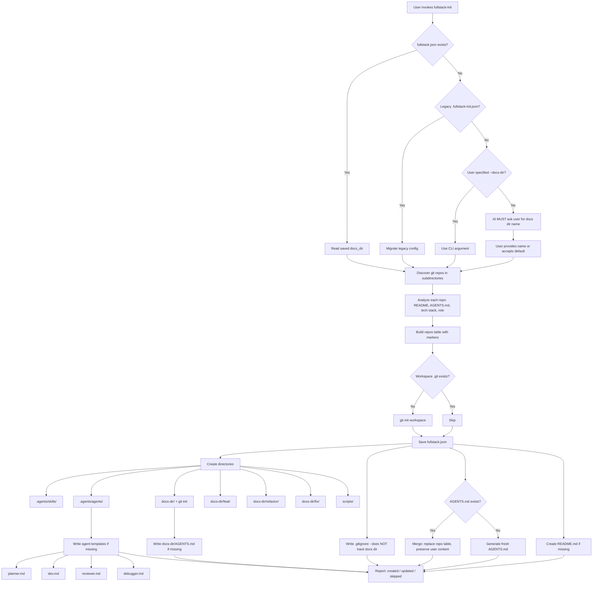

# Fullstack Init — Design Document

Design document for the `fullstack-init` skill. Covers requirements, solution
architecture, key decisions, and current status.

**Last updated**: 2026-04-18

---

## Problem Statement

Developers working on fullstack projects often manage multiple repos (web, api,
ios, android, shared-lib, …) as sibling directories under a single root. They
open their AI coding assistant at this root so it can access all repos at once.

Pain points:

1. No unified AGENTS.md at the root — the AI has no cross-repo context.
2. No workspace-level `.gitignore` — workspace infrastructure files aren't
   version-controlled because the root isn't a git repo.
3. No shared documentation directory — cross-cutting docs have no canonical home.
4. When new repos are added, the context must be manually updated.
5. Re-running init risks overwriting user-added content.
6. No workspace-level agent definitions for coordinated dev/review workflows.
7. No convention for tracking work (features, refactors, fixes) across repos.

## Workflow

## Requirements

### R1 — One-command init

Running a single script bootstraps all infrastructure: AGENTS.md, .gitignore,
docs dir (as independent repo), agents, skills, scripts, README, .git.

### R2 — Idempotent re-run (smart update)

Re-running preserves user content. Only the marked repo table is refreshed.

### R3 — User-configurable docs directory name

Persisted in `fullstack.json`. Legacy `.fullstack-init.json` auto-migrated.

### R4 — Repo analysis

Auto-detects tech stack, role, and description from each repo.

### R5 — No external dependencies

Python 3.10+ stdlib only.

### R6 — Agent scaffolding

Creates four agents: planner, dev, reviewer, debugger.

### R7 — Work tracking convention

Creates `feat/`, `refactor/`, `fix/` directories in the docs repo.

### R8 — Docs as independent repo

The docs directory has its own `.git` and is NOT tracked by workspace git.

## Solution

### Architecture: single idempotent script

`workspace_init.py` handles both init and update. No separate command needed.

### Config persistence: `fullstack.json`

Priority: CLI `--docs-dir` > saved config > default `"central-docs"`.

### Docs as independent git repo

The docs directory is `git init`'d as its own repo. The workspace `.gitignore`
does NOT include `!<docs-dir>/` patterns. This means:

- Workspace git tracks: AGENTS.md, README.md, .gitignore, fullstack.json,
  .agents/, scripts/
- Docs repo tracks: its own AGENTS.md, feat/, refactor/, fix/, architecture
  docs, API contracts, etc.

### Agent quality

Agents are based on the opencode agent patterns (planner.md, verifier.md,
debugger.md) but adapted for cross-repo fullstack context. Key principles:

- **Role purity**: reviewer never fixes code; planner never writes code
- **Falsification mindset**: reviewer assumes "this might be wrong"
- **Practical framing**: each agent's "How you think" section guides behavior
- **Cross-repo awareness**: all agents understand multi-repo boundaries

## Key Functions

| Function | Pure? | Purpose |
|----------|-------|---------|
| `load_config` / `save_config` | Yes/Side-effect | Read/write `fullstack.json` (with legacy migration) |
| `resolve_docs_dir` | Yes | Priority resolution: CLI > config > default |
| `discover_repos` | Yes | Find git repos, exclude infrastructure dirs |
| `detect_tech_stack` | Yes | Infer tech from config files |
| `detect_repo_role` | Yes | Infer role from directory name |
| `_extract_first_description` | Yes | Parse first paragraph from README.md |
| `build_repos_table` | Yes | Generate Markdown table with markers |
| `merge_repos_table` | Yes | Replace table preserving surrounding content |
| `generate_gitignore` | Yes | Generate .gitignore (does NOT track docs dir) |
| `needs_gitignore_update` | Yes | Check if .gitignore has required patterns |
| `generate_docs_agents_md` | Yes | Generate AGENTS.md for docs directory |
| `generate_fresh_agents_md` | Yes | Generate full AGENTS.md for workspace |
| `generate_agent_template` | Yes | Generate agent file by name |
| `bootstrap_workspace` | Side-effect | Orchestrator: calls all of the above |

## Current Status

### Done

- [x] R1 — One-command init
- [x] R2 — Idempotent re-run with marker-based merge
- [x] R3 — User-configurable docs dir with legacy migration
- [x] R4 — Repo analysis (tech stack, role, description)
- [x] R5 — Stdlib-only (zero dependencies)
- [x] R6 — Four agent templates (planner, dev, reviewer, debugger)
- [x] R7 — Work tracking (feat/, refactor/, fix/)
- [x] R8 — Docs as independent git repo
- [x] Plugin wrappers + marketplace.json entries
- [x] 88 tests, all passing
- [x] Description validation under 1024 limit

### Planned / Ideas

- [ ] Deep analysis mode: scan project structure for richer descriptions
- [ ] AGENTS.md template customization
- [ ] Interactive TUI mode for repo selection
- [ ] Git hooks for auto-refresh

## Changelog

### 2026-04-18 — v3: Docs independence, work types, four agents

- Docs dir is now an independent git repo (its own `.git`)
- Workspace `.gitignore` no longer tracks docs dir
- Work tracking generalized: `feat/`, `refactor/`, `fix/` (was `features/`)
- Four agents: planner, dev, reviewer, debugger (was 2: dev, review)
- Agent quality improved based on opencode agent patterns
- Branch naming convention added to workspace AGENTS.md
- Design doc moved to `docs/fullstack/`

### 2026-04-18 — v2: Agent scaffolding, feature tracking, config rename

- Renamed `.fullstack-init.json` → `fullstack.json`
- Added `.agents/agents/` with dev.md and review.md
- Added `features/` directory for per-feature tracking
- Updated AGENTS.md template with feature tracking and agent delegation

### 2025-04-18 — v1: Initial implementation

- Repo discovery, tech stack detection, role inference
- AGENTS.md generation with marker-based smart merge
- Config persistence via `.fullstack-init.json`
- 71 unit + integration tests
