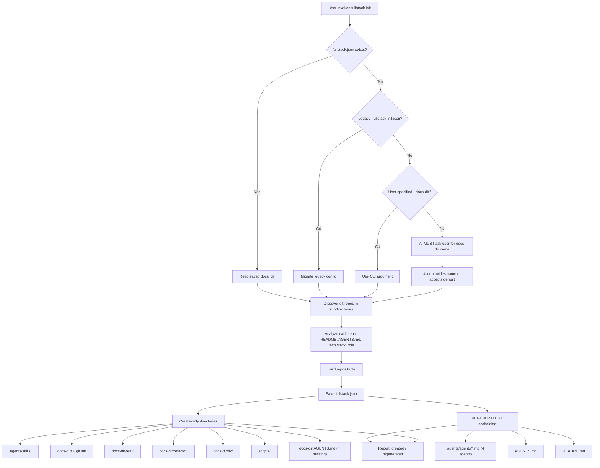

# Fullstack Init — Design Document

Design document for the `fullstack-init` skill. Covers requirements, solution
architecture, key decisions, and current status.

**Last updated**: 2026-04-18

---

## Problem Statement

Developers working on fullstack projects often manage multiple repos (web, api,
ios, android, shared-lib, …) as sibling directories under a single root. They
open their AI coding assistant at this root so it can access all repos at once.

Pain points:

1. No unified AGENTS.md at the root — the AI has no cross-repo context.
2. No shared documentation directory — cross-cutting docs have no canonical home.
3. When new repos are added, the context must be manually updated.
4. No workspace-level agent definitions for coordinated dev/review workflows.
5. No convention for tracking work (features, refactors, fixes) across repos.

## Design Philosophy

**Every run is a full refresh.** Generated files (AGENTS.md, README.md,
agent templates) are overwritten on every invocation. The only persistent
state is `fullstack.json`. User content lives in preserved directories
(docs, scripts, .agents/skills).

This eliminates:
- Merge logic (marker-based table replacement)
- Migration logic (rename mappings, legacy file detection)
- Stale state detection (needs_update checks)
- Versioning concerns (old templates vs new templates)

The result is a simpler, more predictable tool. Re-running always produces
a correct workspace — no matter what state it was in before.

## Workflow

## Requirements

### R1 — One-command init

Running a single script bootstraps all infrastructure: AGENTS.md, README.md,
docs dir (as independent repo), agents, skills, scripts.

### R2 — Full refresh on re-run

Every run regenerates scaffolding files from scratch. No merge, no migration,
no stale state. Safe to re-run at any time.

### R3 — User-configurable docs directory name

Persisted in `fullstack.json`. Legacy `.fullstack-init.json` auto-migrated.

### R4 — Repo analysis

Auto-detects tech stack, role, and description from each repo.

### R5 — No external dependencies

Python 3.10+ stdlib only.

### R6 — Agent scaffolding

Creates four agents: planner, developer, reviewer, debugger. Regenerated
on every run — always up to date.

### R7 — Work tracking convention

Creates `feat/`, `refactor/`, `fix/` directories in the docs repo.

### R8 — Docs as independent repo

The docs directory has its own `.git` — it is the only git repo managed
by the workspace initializer.

### R9 — No workspace-level git

The workspace root does NOT have `.git` or `.gitignore`. All major AI
agents (Cursor, Claude Code, Copilot, Codex, Gemini CLI, OpenCode, etc.)
respect `.gitignore` and hide ignored files from their search/indexing.
A workspace `.gitignore` that ignores subdirectory repos would make those
repos invisible to AI agents, defeating the purpose of the workspace.

## Solution

### Architecture: single idempotent script

`workspace_init.py` handles both init and update. No separate command needed.

### Two categories of output

| Category | Files | Behavior |
|----------|-------|----------|
| **Regenerated** | AGENTS.md, README.md, .agents/agents/*.md | Overwritten every run |
| **Create-only** | fullstack.json, docs-dir/, docs-dir/AGENTS.md, scripts/, .agents/skills/ | Created if missing, never touched after |

### Config persistence: `fullstack.json`

Priority: CLI `--docs-dir` > saved config > default `"central-docs"`.
This is the **only** persistent state the script reads.

### Docs as independent git repo

The docs directory is `git init`'d as its own repo — the only git repo
managed at workspace level. The docs dir AGENTS.md is create-only (user
may customize documentation conventions).

### Agent quality

Agents are based on the opencode agent patterns (planner.md, verifier.md,
debugger.md) but adapted for cross-repo fullstack context. Key principles:

- **Role purity**: reviewer never fixes code; planner never writes code
- **Falsification mindset**: reviewer assumes "this might be wrong"
- **Practical framing**: each agent's "How you think" section guides behavior
- **Cross-repo awareness**: all agents understand multi-repo boundaries

## Key Functions

| Function | Pure? | Purpose |
|----------|-------|---------|
| `load_config` / `save_config` | Yes/Side-effect | Read/write `fullstack.json` (with legacy migration) |
| `resolve_docs_dir` | Yes | Priority resolution: CLI > config > default |
| `discover_repos` | Yes | Find git repos, exclude infrastructure dirs |
| `detect_tech_stack` | Yes | Infer tech from config files |
| `detect_repo_role` | Yes | Infer role from directory name |
| `_extract_first_description` | Yes | Parse first paragraph from README.md |
| `build_repos_table` | Yes | Generate Markdown table |
| `generate_agents_md` | Yes | Generate full AGENTS.md for workspace |
| `generate_readme` | Yes | Generate README.md |
| `generate_docs_agents_md` | Yes | Generate AGENTS.md for docs directory |
| `generate_agent_template` | Yes | Generate agent file by name |
| `bootstrap_workspace` | Side-effect | Orchestrator: calls all of the above |

## Current Status

### Done

- [x] R1 — One-command init
- [x] R2 — Full refresh on re-run (no merge/migration complexity)
- [x] R3 — User-configurable docs dir with legacy migration
- [x] R4 — Repo analysis (tech stack, role, description)
- [x] R5 — Stdlib-only (zero dependencies)
- [x] R6 — Four agent templates (planner, developer, reviewer, debugger)
- [x] R7 — Work tracking (feat/, refactor/, fix/)
- [x] R8 — Docs as independent git repo
- [x] R9 — No workspace-level git (AI agent compatibility)
- [x] Plugin wrappers + marketplace.json entries
- [x] Description validation under 1024 limit

### Planned / Ideas

- [ ] Deep analysis mode: scan project structure for richer descriptions
- [ ] Interactive TUI mode for repo selection

## Changelog

### 2026-04-18 — v5: Remove workspace git

- **Breaking**: workspace root is no longer a git repo. No `.git`, no
  `.gitignore`. All major AI agents respect `.gitignore` and hide ignored
  files from search/indexing — a workspace `.gitignore` that ignores
  subdirectory repos would make their files invisible to AI agents.
- Removed: `generate_gitignore`, `discover_ignored_dirs`,
  `WORKSPACE_TRACKED_DIRS`
- Removed: workspace-level `git init`
- Docs directory remains an independent git repo (unchanged)

### 2026-04-18 — v4: Full refresh model

- **Breaking**: every run now regenerates AGENTS.md, README.md, and
  agent templates from scratch. No more merge/migration logic.
- Removed: marker-based table merging (`merge_repos_table`)
- Removed: `needs_gitignore_update` detection
- Removed: `LEGACY_AGENT_RENAMES` migration mechanism
- Renamed `dev.md` → `developer.md`
- Simpler codebase: ~480 lines (was ~980)
- Simpler tests: 67 tests (was 98) — fewer edge cases needed

### 2026-04-18 — v3: Docs independence, work types, four agents

- Docs dir is now an independent git repo (its own `.git`)
- Work tracking: `feat/`, `refactor/`, `fix/`
- Four agents: planner, developer, reviewer, debugger
- Agent quality improved based on opencode agent patterns
- Branch naming convention added

### 2026-04-18 — v2: Agent scaffolding, config rename

- Renamed `.fullstack-init.json` → `fullstack.json`
- Added `.agents/agents/` with dev.md and review.md
- Added `features/` directory for per-feature tracking

### 2026-04-18 — v1: Initial implementation

- Repo discovery, tech stack detection, role inference
- AGENTS.md generation with marker-based smart merge
- Config persistence via `.fullstack-init.json`
