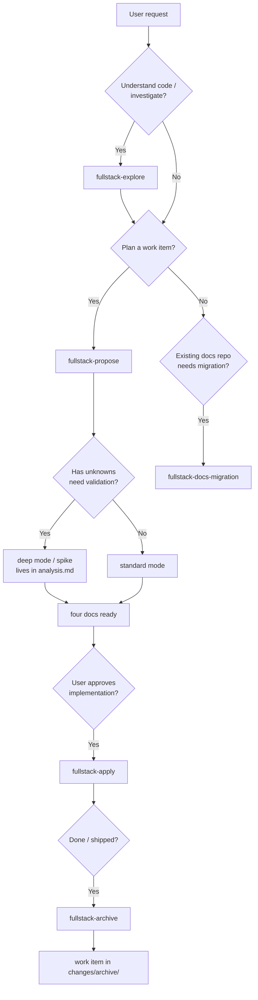
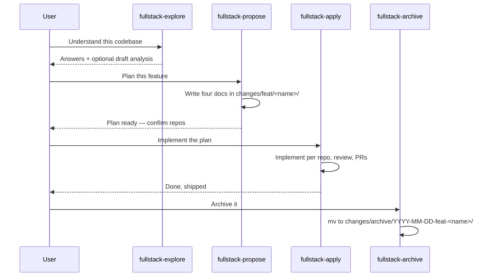

# Fullstack Skills — Workflows

This guide covers when to use each fullstack skill and how they hand off
to each other. For the mental model, see [Overview](overview.md). For the
deep design, see [Concepts](concepts.md).

---

## Workflow at a glance

## Skill handoffs

---

## Explore — understand before planning

**Use when** the user wants to understand code, investigate a problem, or
think through an idea — architecture questions, locating implementations,
cross-repo flow understanding, tech stack comparisons.

- Read-only. Never writes code, never creates branches, never commits.
- Uses graphify knowledge graphs first, source code as ground truth.
- Optionally produces a draft `analysis.md` **if the user asks** — that's
  capturing thinking, not implementing.

## Propose — plan a work item

**Use when** the user wants to plan a feature, fix, or refactor before
implementing — including validating unknowns first.

- Creates `changes/<type>/<work-name>/` with the four documents.
- **Standard mode**: requirements are clear; write the plan directly.
- **Deep mode (spike)**: unknowns exist; run experiments first, recording
  them in `analysis.md`, then complete the plan from the findings.
- **Planning boundary**: propose plans only. Even if the request says
  "and implement it", propose stops after the documents are ready and
  waits for a new request. No project code is edited.

## Apply — implement a planned work item

**Use when** the user wants to implement, continue, or finish a proposed
feature, fix, or refactor.

- Input is the propose-produced work directory. No planning happens here.
- Implements repo by repo in dependency order, delegating to the
  developer and reviewer subagents.
- Opens PRs when the workspace has GitHub repos.
- Iterations (user feedback, bug reports on the same item) are recorded
  in the same work directory's `progress.md` and `review.md` — there is
  no separate "mode".

## Archive — close a completed work item

**Use when** the user says a feature, fix, or refactor is done, shipped,
merged, or finished.

- Moves `changes/<type>/<work-name>/` to
  `changes/archive/YYYY-MM-DD-<type>-<work-name>/`.
- Does not reopen archived items. Further work on the same scope is a new
  `-vN` directory via propose.

## Docs migration — reorganize a legacy docs repo

**Use when** the user points at an existing docs repo with the old
structure (top-level `feat/fix/refactor/spike`, Status fields, no archive)
and wants it reorganized. The user only needs to provide the docs repo
path.

---

## When to use what

| Situation | Skill |
|---|---|
| "How does X work?" / "Where is X implemented?" | Explore |
| "Plan a feature" / "We should add X" | Propose |
| "This needs validation first" / "I'm not sure X is feasible" | Propose (deep mode) |
| "Implement it" / "Continue the work" | Apply |
| "It's done" / "Ship it" / "Merged" | Archive |
| "Reorganize this old docs repo" | Docs migration |
| "Set up a new workspace" | Init (see repo README) |

## Next Steps

- Want the deep design? [Concepts](concepts.md).
- Want the one-screen version? [Overview](overview.md).
