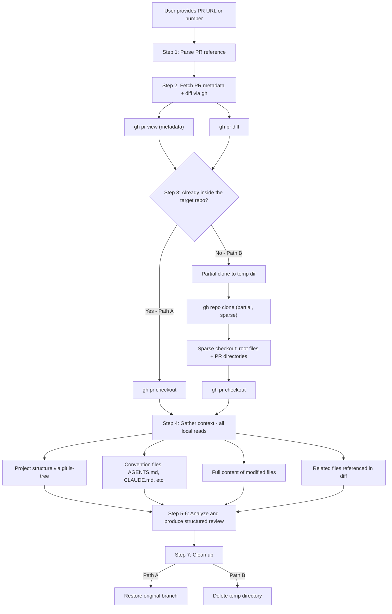
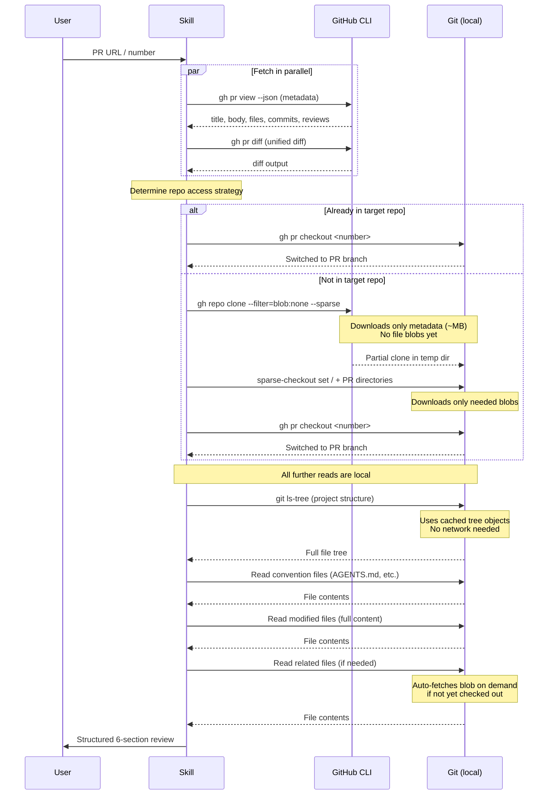

# code-review-pr

Context-aware code review for GitHub Pull Requests. Uses partial clone and sparse checkout to gather deep repository context without downloading the entire repo.

## How It Works

The key challenge of PR review is that a **diff alone lacks context**. To give a high-quality review, the skill needs to understand the project's structure, coding conventions, and the full content of modified files — not just the changed lines.

Naive approaches either download the entire repo (slow for large repos) or make dozens of GitHub API calls to fetch files one by one (slow due to network round-trips). This skill uses **git partial clone + sparse checkout** to download only what's needed.

### Review Flow



### Data Flow



## Why Partial Clone + Sparse Checkout?

The problem: you need repo context, but you don't want to download a 2 GB monorepo just to review a 10-file PR.

| Method | What gets downloaded | Typical size (50K-file repo) | Network round-trips |
|--------|---------------------|------------------------------|---------------------|
| Full clone | All commits + all blobs | ~2 GB | 1 |
| `--depth=1` (shallow) | 1 commit, but **all** blobs | ~500 MB | 1 |
| `--filter=blob:none --sparse` | Commits + trees only, blobs on demand | ~5-50 MB | 1 + on-demand |
| Per-file `gh api` calls | Only requested files | ~same bytes | 10-20 HTTP requests |

Partial clone wins because:

1. **Initial clone is tiny** — only git metadata (tree objects), no file content
2. **`git ls-tree` works immediately** — you can see the full project structure without downloading a single file
3. **Sparse checkout pulls only what you ask for** — root config files + directories of changed files
4. **On-demand blob fetch** — if you need a file you didn't sparse-checkout, git fetches just that one blob automatically
5. **One network operation** instead of N API calls — fewer round-trips, faster overall

## Context Gathering Strategy

The skill gathers context at three levels:

### 1. Project-level context (cheap, always gathered)

- **File tree** via `git ls-tree` — understand module layout and naming conventions
- **Convention files** — `AGENTS.md`, `CLAUDE.md`, `GEMINI.md`, `CONTRIBUTING.md`, `pyproject.toml`, `package.json`, `.editorconfig`, etc.
- These are all root-level files, checked out by default with `sparse-checkout set /`

### 2. Change-level context (selective)

- **Full file content** of modified files — not just the diff, but the complete file on the PR branch
- This lets the reviewer see the function a change sits inside, the class structure, nearby code patterns
- Sparse checkout targets only the directories containing changed files

### 3. Reference-level context (on-demand)

- If the diff imports from or calls into files not in the PR, those are fetched on demand
- Git's partial clone handles this transparently — just read the file and git fetches the blob
- Limited to 2-3 files to avoid scope creep

## Requirements

- **GitHub CLI (`gh`)** — installed and authenticated
- **Git 2.25+** — for sparse-checkout support (most systems have this)
- Run `skills-check code-review-pr` to verify

## Usage Examples

```
"Review this PR: https://github.com/owner/repo/pull/42"
"帮我审查一下这个 PR https://github.com/owner/repo/pull/42"
"PR review #15"
"review PR owner/repo#99"
```
