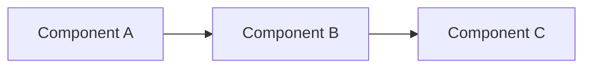
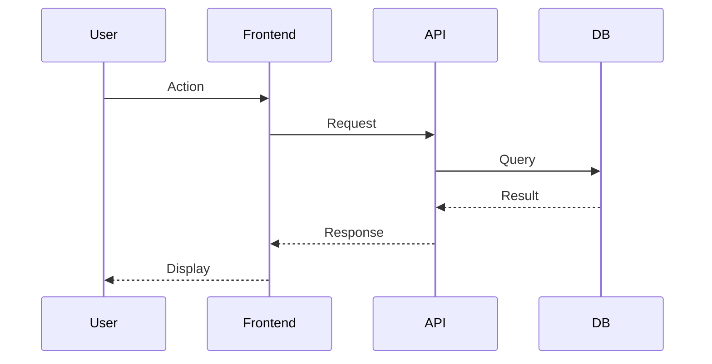
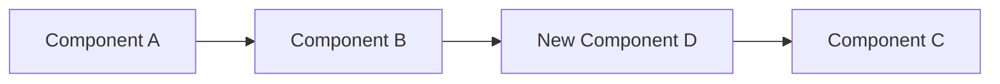
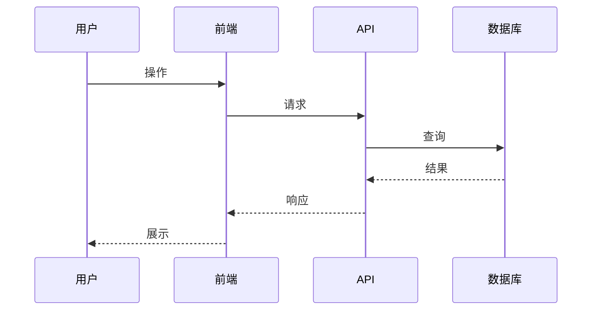
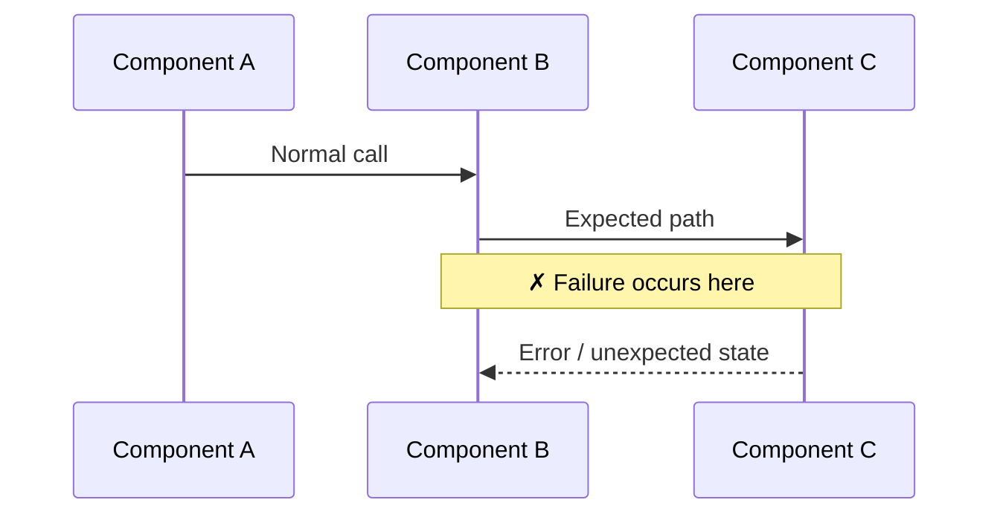
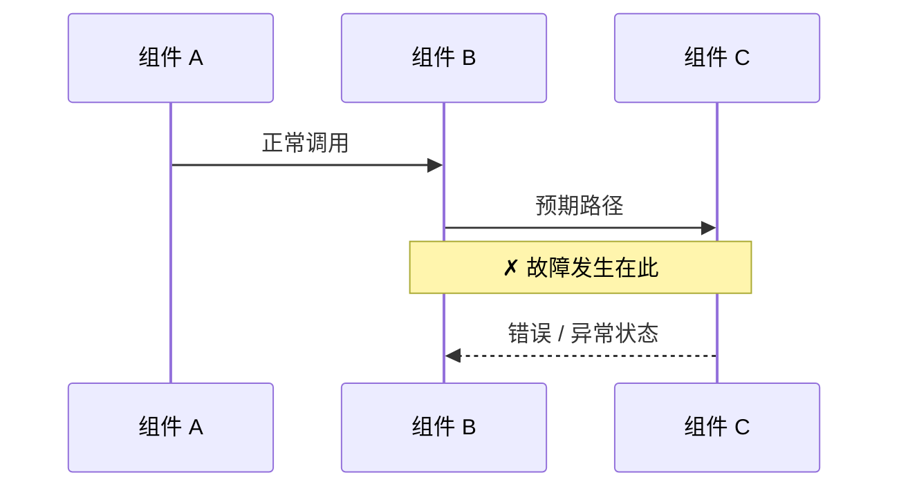

# Work Tracking Document Templates

The four work-tracking documents (`analysis.md`, `plan.md`, `progress.md`,
`review.md`) follow strict templates. Use the language matching the
user's prompt — Chinese if the prompt contains any Chinese characters,
otherwise English. The Markdown structure is identical between the two
languages; only the labels differ.

## Table of contents

- [`plan.md`](#planmd) — requirements, Success Criteria, execution checklist
- [`progress.md`](#progressmd) — dated change log
- [`analysis.md` (feat / refactor)](#analysismd--feature--refactor) — by Planner
- [`analysis.md` (fix)](#analysismd--fix) — by Debugger
- [`review.md` header](#reviewmd-header) — with Evidence table
- [Plan review round](#plan-review-round) — written before implementation
- [Visualization rules for analysis.md](#visualization-rules-for-analysismd)

---

## `plan.md`

### Status is the directory location — no Status field

The lifecycle state of a work item is expressed by its directory
location, NOT a text field. Active work lives in
`<docs-dir>/changes/<type>/<work-name>/`; archived work lives in
`<docs-dir>/changes/archive/YYYY-MM-DD-<type>-<work-name>/`. Do NOT
write a `**Status**:` field in `plan.md`.

### English

```markdown
# <Work Name>

**Source**: <Jira link / user prompt / Confluence page / predecessor work item>
**Type**: feat | refactor | fix
**Branch**: <branch-name>
**Created**: <date>


## Requirements

<Summary of requirements from gathered context>

## Success Criteria

<Testable, specific acceptance criteria — "Works correctly" is not a
criterion; "returns 200 with valid JSON matching schema X for inputs A,
B, C" is. Each criterion is checked against evidence in review.md.>

- [ ] Criterion 1: <observable behavior + expected outcome>
- [ ] Criterion 2: <...>

## Affected Repositories (in dependency order)

| # | Repository | Branch | Changes Needed | Depends On | Priority |
|---|-----------|--------|---------------|-----------|----------|
| 1 | shared-lib | feat/Dark-Mode-Toggle | Add theme types | — | P0 |
| 2 | api | feat/BE-450/Dark-Mode-Toggle | Add preference endpoint | shared-lib | P0 |
| 3 | android | feat/MOBILE-301/Dark-Mode-Toggle | Add toggle screen | shared-lib, api | P1 |

Repos MUST be listed in dependency order: upstream first (shared libs,
data models), then services (api, backend), then consumers (web, ios,
android). fullstack-apply derives its parallel implementation waves
from this table — repos sharing no dependency edge are developed and
committed concurrently. Every interface a downstream repo consumes
MUST be frozen in analysis.md (exact field names, types, error codes):
parallel developers write against the frozen contract, not against
upstream code that may not exist yet.

## Implementation Plan

### Phase 1: <name>
- [ ] Task 1 in repo-x
- [ ] Task 2 in repo-y

### Phase 2: <name>
- [ ] Task 3 in repo-x

## Dependencies

<Cross-repo dependencies, order constraints>

## Risks / Open Questions

<Known risks, things to clarify>
```

### Chinese

```markdown
# <工作名称>

**来源**：<Jira 链接 / 用户需求 / Confluence 页面 / 前置工作项>
**类型**：feat | refactor | fix
**分支**：<branch-name>
**创建时间**：<date>


## 需求

<根据采集到的上下文整理的需求摘要>

## 成功标准

<可测试、具体的验收标准 —— "能正常工作" 不算标准；"对输入 A、B、C
返回符合 schema X 的 200 响应" 才算。每条标准在 review.md 中对照证据核验。>

- [ ] 标准 1：<可观察行为 + 预期结果>
- [ ] 标准 2：<...>

## 涉及仓库（按依赖顺序）

| # | 仓库 | 分支 | 变更内容 | 依赖 | 优先级 |
|---|------|------|---------|------|--------|
| 1 | shared-lib | feat/Dark-Mode-Toggle | 添加主题类型定义 | — | P0 |
| 2 | api | feat/BE-450/Dark-Mode-Toggle | 添加偏好设置接口 | shared-lib | P0 |
| 3 | android | feat/MOBILE-301/Dark-Mode-Toggle | 添加切换页面 | shared-lib, api | P1 |

仓库必须按依赖顺序列出：上游优先（共享库、数据模型），然后是服务层
（api、backend），最后是消费者（web、ios、android）。fullstack-apply
依据本表推导并行波次——无依赖边交叉的仓库会同时开发与提交。所有被下
游消费的跨仓接口必须在 analysis.md 中冻结（精确字段名、类型、错误码）：
并行开发者以冻结契约为准，而非可能尚未实现的上游代码。

## 实现计划

### 阶段一：<名称>
- [ ] repo-x 中的任务 1
- [ ] repo-y 中的任务 2

### 阶段二：<名称>
- [ ] repo-x 中的任务 3

## 依赖关系

<跨仓库依赖、顺序约束>

## 风险 / 待确认问题

<已知风险、需要澄清的事项>
```

### Successor addition

When this work item inherits from an archived predecessor, add a
`Predecessor` line to the header right after `Created`:

- English: `**Predecessor**: feat/dark-mode/ (archived 2026-04-15)`
- Chinese: `**前置工作**：feat/dark-mode/（2026-04-15 归档）`

---

## `progress.md`

`progress.md` is a **dated log**. Every meaningful change — kickoff,
per-repo completion, review-driven fixes, user feedback, follow-up
edits — is recorded as a `### <date>` section. Git history is the
authoritative record of code changes; this file is the human-readable
narrative that ties changes to decisions.

### English

```markdown
# Progress: <Work Name>

**Last updated**: <date>
**Branch**: <branch-name>

## Completed Steps

(none yet)

## In Progress

- [ ] <current step>

## Blocked

(none)

## Change Log

### <date> — Started
- Created work plan
- Identified affected repos: <list>
- Created branches in: <list>

### <date> — <what happened>
- <what was done, why, and the result>
```

### Chinese

```markdown
# 进度：<工作名称>

**最后更新**：<date>
**分支**：<branch-name>

## 已完成

（暂无）

## 进行中

- [ ] <当前步骤>

## 阻塞

（无）

## 变更记录

### <date> — 启动
- 创建工作计划
- 确定涉及仓库：<list>
- 创建分支：<list>

### <date> — <发生了什么>
- <做了什么、为什么、结果如何>
```

### Successor back-link — `## Successors` table (optional)

The forward link is what always carries the chain forward: the
successor's `**Source**` / `**Predecessor**` points at the archived
predecessor and is written for every successor.

A reverse `## Successors` (English) / `## 后续工作` (Chinese) table can
**additionally** be appended to the predecessor's `progress.md` — but
only if the successor is already known while the predecessor is still
active, i.e. **before** it is archived. Because a successor is normally
planned only *after* archiving, this back-link is best-effort and often
absent. That is fine: archive is final and archived directories are
never edited; discovery relies on the `-vN` naming convention plus the
forward link instead.

---

## `analysis.md` — feature / refactor

`analysis.md` is a **technical thinking document** — it captures *why*
decisions were made. Unlike `plan.md` (an execution checklist),
`analysis.md` visualizes system behavior and documents trade-offs.

### English

```markdown
# Analysis: <Work Name>

**Created**: <date>
**Type**: feat | refactor
**Author**: Planner

## Current State

<Describe the existing system behavior, architecture, or user flow.>

### Architecture (as-is)



## Original Requirements

What was asked for, **verbatim** — the user's own words, the Jira
description, the spec text. Not a summary: this is the baseline the
plan-reviewer falsifies coverage against, and a paraphrase here is what
lets a narrowing pass as a documented limitation. One `REQ<n>` id per
ask; `plan.md` and `review.md` cite the ids.

## Requirements Analysis

<Break down requirements into concrete behaviors, inputs, outputs.>

### User Flow



## Design Options

| Option | Approach | Pros | Cons | Complexity |
|--------|----------|------|------|------------|
| A | ... | ... | ... | Low |
| B | ... | ... | ... | Medium |

**Recommended**: Option <X> — <rationale>

## Target Architecture



## Cross-Repo Impact

| Repo | Impact | Breaking Change? |
|------|--------|-----------------|
| shared-lib | New types added | No |
| api | New endpoint | No |
| web | New page | No |

## Risks & Mitigations

| Risk | Likelihood | Impact | Mitigation |
|------|-----------|--------|------------|
| ... | Medium | High | ... |
```

### Chinese

```markdown
# 分析：<工作名称>

**创建时间**：<date>
**类型**：feat | refactor
**作者**：Planner

## 现状

<描述现有的系统行为、架构或用户流程。>

### 现有架构


## 需求原文

**逐字**记录用户原话 / Jira description 原文 / 规格原文——不转述、不润色。
这一节是方案审查判定"需求有没有被遗漏或收窄"的唯一基线：转述会把收窄藏成
一条"已记录的边界"。每条诉求一个 `REQ<n>` 编号，plan.md 与 review.md 都
引用编号（`R<n>` 留给风险表）。

## 需求分析

<将需求拆解为具体的行为、输入、输出。>

### 用户流程



## 设计方案

| 方案 | 思路 | 优势 | 劣势 | 复杂度 |
|------|------|------|------|--------|
| A | ... | ... | ... | 低 |
| B | ... | ... | ... | 中 |

**推荐**：方案 <X> — <理由>

## 目标架构


## 跨仓库影响

| 仓库 | 影响 | 是否破坏性变更？ |
|------|------|-----------------|
| shared-lib | 新增类型定义 | 否 |
| api | 新增接口 | 否 |
| web | 新增页面 | 否 |

## 风险与应对

| 风险 | 可能性 | 影响 | 应对措施 |
|------|--------|------|---------|
| ... | 中 | 高 | ... |
```

---

## `analysis.md` — fix

### English

```markdown
# Analysis: <Work Name>

**Created**: <date>
**Type**: fix
**Severity**: <Critical | High | Medium | Low> — <one-line impact>
**Author**: Debugger

## Original Requirements

What was asked for, **verbatim** — the user's own words, the Jira
description, the report as received. Do not summarize or tidy it: this
section is the baseline the plan-reviewer falsifies coverage against,
and a paraphrase here is what lets a narrowing pass as a documented
limitation. One `REQ<n>` id per ask; `plan.md` and `review.md` cite the
ids. `plan_lint.py` fails a round that cites an undeclared id, and one
that never cites a declared id.

- **REQ1** "<exact words>" — <source: user prompt / PROJ-123 / page>
- **REQ2** "<exact words>" — <source>

## Symptom

<Exact observable behavior: error messages, logs, incorrect output.>

## Reproduction

1. <Step-by-step reproduction>
2. ...

**Environment**: <OS, versions, config>

## Root Cause

### System Model



### Cause

<Explain the root cause with evidence. "X is null" is a symptom;
"API changed response format but consumer still expects old format"
is a root cause.>

### Evidence

- Log line: `...`
- Code path: `file:line` → `file:line`
- Timing: ...

## Fix Strategy

| Approach | Description | Risk | Scope |
|----------|-------------|------|-------|
| A | ... | Low | 1 file |
| B | ... | Medium | 3 files |

**Chosen**: Approach <X> — <rationale>

### Before vs After

**Before:**
```
<problematic flow or code>
```

**After:**
```
<fixed flow or code>
```

## Affected Repos

| Repo | Files Changed | Nature of Change |
|------|--------------|-----------------|
| ... | ... | ... |

## Verification

- [ ] Original reproduction steps → no longer fails
- [ ] Regression tests pass
- [ ] Adjacent functionality unaffected

## Follow-ups

- <Preventive measures: tests, monitoring, guards>
```

### Chinese

```markdown
# 分析：<工作名称>

**创建时间**：<date>
**类型**：fix
**严重程度**：<严重 | 高 | 中 | 低> — <一句话影响>
**作者**：Debugger

## 需求原文

**逐字**记录用户原话（或 Jira description 原文、收到的报告原文）——不转述、
不润色。这一节是方案审查判定"需求有没有被遗漏或收窄"的唯一基线：转述会把
收窄藏成一条"已记录的边界"。每条诉求一个 `REQ<n>` 编号，plan.md 与
review.md 都引用编号（`R<n>` 留给风险表）。引用了未声明的编号、或声明了
却没有任何轮次引用，`plan_lint.py` 都会报错。

- **REQ1** 「<原话>」——<来源：用户消息 / PROJ-123 / 页面>
- **REQ2** 「<原话>」——<来源>

## 问题现象

<确切的可观察行为：错误信息、日志、异常输出。>

## 复现步骤

1. <逐步复现>
2. ...

**环境**：<操作系统、版本、配置>

## 根因分析

### 系统模型



### 根因

<用证据解释根因。"X 为空"是表象；"API 改了响应格式但消费端仍按旧格式解析"
是根因。>

### 证据

- 日志：`...`
- 代码路径：`file:line` → `file:line`
- 时序：...

## 修复策略

| 方案 | 描述 | 风险 | 影响范围 |
|------|------|------|---------|
| A | ... | 低 | 1 个文件 |
| B | ... | 中 | 3 个文件 |

**选择**：方案 <X> — <理由>

### 修复前 vs 修复后

**修复前：**
```
<问题流程或代码>
```

**修复后：**
```
<修复后流程或代码>
```

## 涉及仓库

| 仓库 | 变更文件 | 变更性质 |
|------|---------|---------|
| ... | ... | ... |

## 验证

- [ ] 原始复现步骤 → 不再出现故障
- [ ] 回归测试通过
- [ ] 相邻功能不受影响

## 后续

- <预防措施：测试、监控、防护>
```

---

## `review.md` header

### English

```markdown
# Review: <Work Name>

This file is the work item's falsification record. Canonical order:
Evidence (seeded here, filled at finalization) → plan review rounds
(fullstack-propose) → code review rounds and the cross-repo check
(fullstack-apply) → closing verdict. See
[`review-formats.md`](review-formats.md#canonical-order-of-reviewmd).

## Evidence

Seeded by fullstack-propose with one row per Success Criterion from
plan.md (all `待核验` / `Pending`), filled during finalization. A
criterion without a row here is a criterion nobody verified —
`plan_lint.py` fails the handoff and the finalization gate on it.

| Success Criterion | Result | Evidence |
|-------------------|--------|----------|
| Criterion 1 | ✅ Pass | <test result / PR link / screenshot> |
| Criterion 2 | ❌ Fail | <what disproved it> |
| Criterion 3 | ⚠️ Skipped | <tests not run — no harness or no documented run command> |
```

### Chinese

```markdown
# 审查：<工作名称>

本文件是该工作项的证伪记录。规范顺序：证据核验（此处预填，收尾阶段填写）
→ 方案审查轮次（fullstack-propose）→ 代码审查轮次与跨仓库审查
（fullstack-apply）→ 最终结论。见
[`review-formats.md`](review-formats.md#canonical-order-of-reviewmd)。

## 证据核验

由 fullstack-propose 预填：plan.md 中每条成功标准一行（全部标 `待核验`），
收尾阶段填写证据。这里没有行的成功标准就是没人核验的标准——
`plan_lint.py` 会在交付门与收尾门上报错。

| 成功标准 | 结果 | 证据 |
|---------|------|------|
| 标准 1 | ✅ 通过 | <测试结果 / PR 链接 / 截图> |
| 标准 2 | ❌ 未通过 | <反证依据> |
| 标准 3 | ⚠️ 跳过 | <测试未运行 — 无框架或无已记录的运行命令> |
```

The per-round review section format and cross-repo review format are
defined in [`review-formats.md`](review-formats.md).

---

## Plan review round

Written by **fullstack-propose** (Step 4.5), one section per round, before
any implementation starts. The plan-reviewer subagent returns the content; the
orchestrator appends it. Section labels follow the work item's language.

### English

```markdown
## Plan Review — Round <N> — <date>

### Scope Reviewed

- Documents: analysis.md, plan.md — <what changed since the last round, if N > 1>
- Requirements source: `analysis.md` §Original Requirements (REQ ids) — <plus
  Jira KEY / Confluence page when one exists>
- Codebase verification: <repos inspected> — graphify: used | skipped: <reason> | n/a

### Requirements Coverage

One row per `REQ` id declared in `analysis.md` §Original Requirements —
`plan_lint.py` fails the round when a declared REQ is missing here, and
when a REQ cited here was never declared. Use the ids, not a paraphrase:
`R<n>` belongs to plan.md's risk table, `REQ<n>` to the requirements.

| Requirement | Covered by criterion | Delivered by task | Status |
|-------------|---------------------|-------------------|--------|
| REQ1 | SC-1 | Phase 1, task 2 | OK |
| REQ2 | — | — | **DROPPED** |
| REQ3 | SC-2 | Phase 1, task 3 | **NARROWED** — <what was dropped, and who is asked about it> |

### Findings

- [P0] <doc/section> — <issue> — impact: <what breaks> — fix: <what would resolve it>
- [P1] <doc/section> — <issue> — impact: <rework cost> — fix: <...>

### Verified

- <claims checked and confirmed>

### Unverified

- <what could not be checked, and what would be needed>

### Verdict

<PASS | PASS_WITH_RISKS | NEEDS_FIXES | NEEDS_USER_DECISION> — <summary>

### Open Decisions (NEEDS_USER_DECISION only)

| Decision | Options | Why an AI cannot choose | Blocking |
|----------|---------|------------------------|----------|
| <question> | A / B | <product or policy call> | yes/no |
```

Verdict meanings: `PASS` (implementable as written), `PASS_WITH_RISKS`
(no open P0/P1, risks listed), `NEEDS_FIXES` (P0/P1 the planner can
resolve alone), `NEEDS_USER_DECISION` (blocking item only a human can
choose). `FAIL` and `BLOCKED` are code-review verdicts and do not apply
to a plan.

When the planner rejects a finding, the orchestrator records the
rejection in the same round:

```markdown
- [P0] <issue> — **Rejected**: <the planner's rationale>
```

A finding dropped during revision without a `Rejected:` line is
treated as a new P0 in the next round.

### Chinese

```markdown
## 方案审查 — 第 <N> 轮 — <date>

### 审查范围

- 文档：analysis.md、plan.md — <与上一轮的差异>
- 需求来源：analysis.md §需求原文（REQ 编号）— <有 Jira / Confluence 时附编号>
- 代码核验：<检查的仓库> — graphify：已用 | 跳过：<理由> | 无

### 需求覆盖

`analysis.md` §需求原文 里每个 `REQ` 编号一行——声明了却在这里缺行，
或这里引用了未声明的编号，`plan_lint.py` 都会报错。用编号，不要用转述：
`R<n>` 是 plan.md 风险表的编号，`REQ<n>` 才是需求的编号。

| 需求 | 对应成功标准 | 对应任务 | 状态 |
|------|------------|---------|------|
| REQ1 | 标准 1 | 阶段一 / 任务 2 | 覆盖 |
| REQ2 | — | — | **遗漏** |
| REQ3 | 标准 2 | 阶段一 / 任务 3 | **收窄** — <砍掉了什么，以及由谁裁定> |

### 问题清单

- [P0] <文档/章节> — <问题> — 影响：<会出什么错> — 建议：<如何解决>
- [P1] <文档/章节> — <问题> — 影响：<返工成本> — 建议：<...>

### 已核验

- <已确认成立的论断>

### 未核验

- <无法核验的内容及所需条件>

### 结论

<PASS | PASS_WITH_RISKS | NEEDS_FIXES | NEEDS_USER_DECISION> — <总结>

### 待决策事项（仅 NEEDS_USER_DECISION）

| 决策点 | 选项 | 为何 AI 无法决定 | 是否阻塞 |
|-------|------|----------------|---------|
| <问题> | A / B | <产品或策略选择> | 是/否 |
```

结论含义：`PASS`（可直接实施）、`PASS_WITH_RISKS`（无未决 P0/P1，风险
已列明）、`NEEDS_FIXES`（planner 可自行修复的 P0/P1）、
`NEEDS_USER_DECISION`（阻塞项只能由人决定）。`FAIL` / `BLOCKED` 属于
代码审查结论，不适用于方案。

planner 拒绝某条问题时，orchestrator 在同一轮记录：

```markdown
- [P0] <问题> — **已拒绝**：<planner 的理由>
```

未经 `已拒绝` 标注即在修订中消失的问题，在下一轮按新的 P0 处理。

### Author self-check (optional section)

An author's own pre-check of the plan is allowed and often worth
recording — it catches cheap things before the independent audit runs.
It is a **working artifact, not a gate**: its conclusion never
substitutes for a `## Plan Review` round, and the exit criteria ignore
it. Record it above the first plan-review round, clearly labelled:

```markdown
## 设计复核（可选，作者自审，非门禁）— <date>

**结论**：<作者的判断，仅供参考>
```

```markdown
## Design Self-Check (optional, author, NOT a gate) — <date>

**Conclusion**: <the author's own assessment — informational only>
```

### Reconciliation after a revision (MANDATORY)

Planner revisions touch one document at a time and the chain drifts.
After applying revisions, sync in the same edit:

| Revision | Must also update |
|----------|------------------|
| Success Criteria added / renamed / removed | the `## Evidence` table rows in `review.md` |
| A task added / removed / rescoped | the affected-task list in the round's 修订 section |
| Any round or revision | a dated section in `progress.md` |
| A diagram | re-run the Mermaid gate |
| The repositories table | re-run the DAG gate |

Then run the consistency gate:

```bash
python3 SKILL_PATH/scripts/plan_lint.py <docs-dir>/changes/<type>/<work-name>
```

`STATUS=PASS` is required before the plan may be reported ready. It
reports an unclosed review (last round ending in `NEEDS_FIXES`), an
Evidence row missing for a criterion, broken round numbering, and task
ids that no longer exist.

---

## Visualization rules for `analysis.md`

`analysis.md` should favor visual formats over prose wherever possible.
The reader should be able to skim diagrams and tables to grasp the
shape of the change without reading wall-of-text rationale.

| Need to express | Use |
|-----------------|-----|
| System architecture | mermaid `flowchart` or `graph` |
| Request / data flow | mermaid `sequenceDiagram` |
| State transitions | mermaid `stateDiagram-v2` |
| Before / after | markdown tables or side-by-side code blocks |
| Decision matrix | markdown table with trade-off columns |
| Timeline | mermaid `gantt` or numbered list |
| Component relationships | mermaid `classDiagram` or `erDiagram` |

### Mermaid 10.2.3 compatibility

Every diagram MUST parse and render correctly on Mermaid 10.2.3.

**The full rule set lives in [`MERMAID-RULES.md`](MERMAID-RULES.md)** —
shared canonical source kept in sync across all skills. Read that file
end-to-end before authoring any new diagram. The two most common traps:

1. **Unquoted parens / brackets / curlies in edge labels.** Wrap
   the label in double quotes. Same rule for `subgraph` titles.

   - Bad: `A -->|step (x)| B`
   - Good: `A -->|"step (x)"| B`

2. **Literal `\n` inside `flowchart` / `graph` node labels, edge
   labels, or subgraph titles.** On Mermaid 10.2.3 + GitHub + many
   other renderers, `\n` renders as the two characters `\` and `n`
   instead of a line break. Always use `<br/>` for line breaks
   (and wrap in double quotes because the surrounding text usually
   contains `(` or `)`).

   - Bad: `A[xxx-api\n(Domain API)]`
   - Good: `A["xxx-api<br/>(Domain API)"]`

   This rule applies to flowchart-family diagrams only — sequence
   diagrams have separate rendering and are out of scope.

After writing, run the **Mermaid Compatibility Gate**: invoke
`mermaid_lint.py` (bundled at `fullstack-propose/scripts/` or
`fullstack-apply/scripts/`) on every just-written or just-edited file.
The script accepts multiple files in one call. If `STATUS=FAIL`, read
each `ERROR:` line, apply the suggested fix from
[`MERMAID-RULES.md`](MERMAID-RULES.md), save, and re-run until
`STATUS=PASS`. Do NOT proceed to the next step with `STATUS=FAIL`
standing.

The gate runs whenever a mermaid-bearing doc is just written:
1. After writing `analysis.md` for the first time (propose Step 4)
2. After review-driven fixes that updated `analysis.md` (apply)
3. Once on resume, to confirm prior sessions did not leave broken
   diagrams behind

Locating the script across AI tools: check candidate paths in this
order, use the first that exists:
`~/.config/opencode/skills/fullstack-propose/scripts/mermaid_lint.py`,
`~/.claude/skills/fullstack-propose/scripts/mermaid_lint.py`,
`~/.copilot/...`, `~/.cursor/...`, `~/.gemini/...`, `~/.codex/...`,
`~/.qwen/...`, `~/.grok/...`. If none exist, fall back to manual
review against [`MERMAID-RULES.md`](MERMAID-RULES.md). Skipping the
gate entirely is NOT an acceptable shortcut — broken diagrams block
human reviewers.
