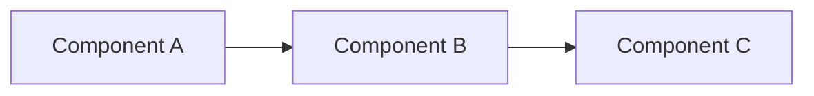
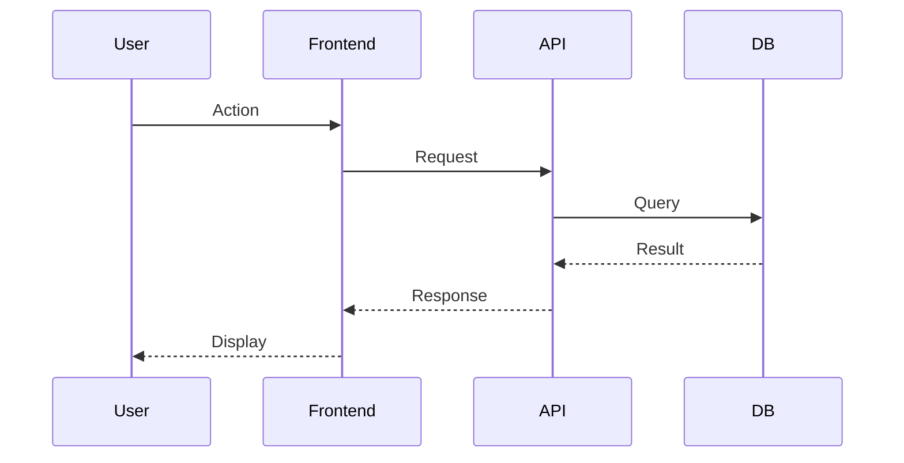
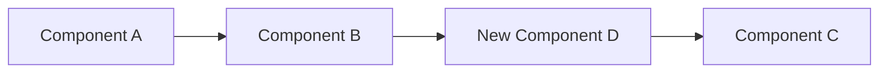
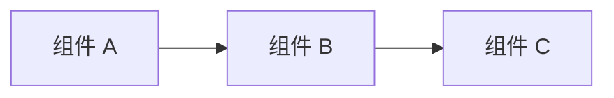
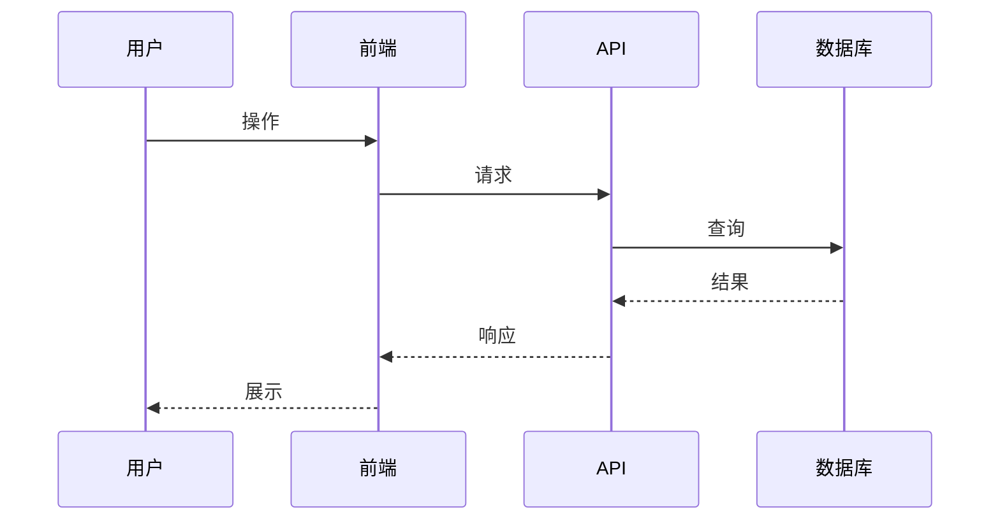
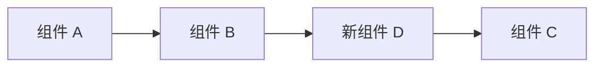
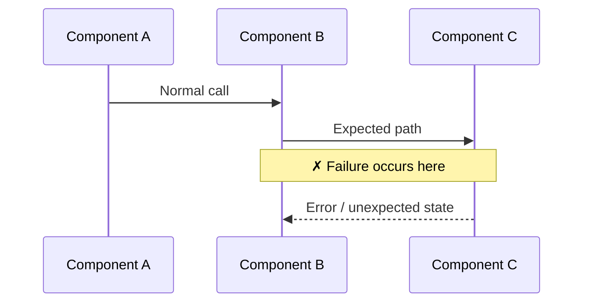
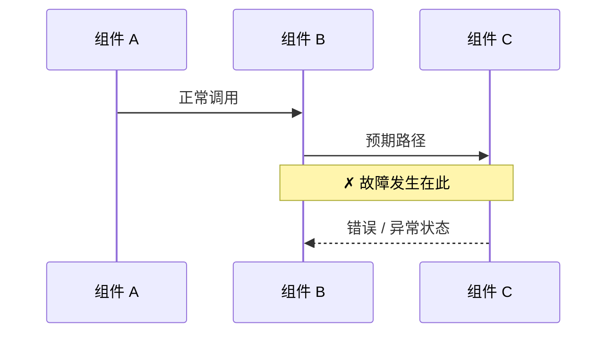

# Fullstack Implementation

Implement features, refactors, and fixes across a multi-repo fullstack
workspace that was initialized by `fullstack-init`. This skill handles the
full lifecycle: gather context, plan, create branches, implement across
repos, review, and track progress.

## Prerequisites — Workspace Validation Gate

This skill MUST NOT proceed unless it confirms the current working directory
is a valid fullstack workspace. Before doing ANY work, check for ALL three
markers:

1. **`fullstack.json`** — workspace config created by `fullstack-init`
2. **`AGENTS.md`** — workspace-level AGENTS.md generated by `fullstack-init`
3. **`.agents/`** — directory containing workspace agents and skills

### Validation logic

```
Check current working directory for:
  fullstack.json  — exists?
  AGENTS.md       — exists?
  .agents/        — exists and is a directory?

ALL THREE must be present → proceed to Step 1
ANY missing → STOP and show the error below
```

### If validation fails

**Do NOT proceed with any implementation work.** Instead, inform the user:

> **Workspace not detected.** This skill requires a fullstack workspace
> initialized by `fullstack-init`. The current directory is missing:
> - _(list each missing item)_
>
> Please `cd` to your project workspace root and restart your AI agent
> there, or run `fullstack-init` first to set up the workspace.

This gate exists because `fullstack-impl` relies on the workspace structure
(repo table in AGENTS.md, agent definitions in .agents/, docs directory
config in fullstack.json) to function correctly. Running it outside a
workspace would produce errors or incorrect behavior.

## Document Language Selection

All four work tracking documents (analysis.md, plan.md, progress.md,
review.md) and user-facing messages MUST match the language of the
user's prompt.

### Detection rule

1. If the user **explicitly requests a language** → use that language.
2. If the user's prompt contains **any Chinese characters** → use Chinese.
3. Otherwise → use English (default).

This rule applies independently to **each invocation**. Different work
items in the same docs repo may have different languages — that is fine.
Each run strictly follows the language of that run's prompt.

### What this affects

- **analysis.md** — section headers, diagram labels, analysis content
- **plan.md** — section headers, field labels, content
- **progress.md** — section headers, status labels, changelog entries
- **review.md** — header text, per-repo review sections, cross-repo review
- **Confirmation messages** — the repo/branch confirmation in Step 3
- **Final summary** — the completion report in Step 9

### What this does NOT affect

- **Branch names** — always English (Title-Case-With-Hyphens)
- **Work directory names** — always lowercase-hyphenated English
- **Markdown structure** — same template structure regardless of language
- **Git commit messages** — follow each repo's own convention

## Step 1 — Gather Context

Before doing ANY implementation work, gather all available context.

### External links in the user's prompt

Scan the user's message for links. For each type, use the corresponding skill:

| Link type | Skill to use | What to extract |
|-----------|-------------|-----------------|
| Jira URL or issue key (e.g. `PROJ-123`) | `jira` skill | Summary, description, acceptance criteria, subtasks |
| Confluence URL | `confluence` skill | Page content, requirements, specs |
| GitHub PR/issue URL | `gh-operations` skill | Description, comments, linked issues |
| Figma URL | `figma` skill | Design specs, components, layout, colors, typography |

**IMPORTANT**: Read ALL linked resources BEFORE proceeding to Step 2. Do not
start planning or implementing with incomplete context.

### Workspace context

Read these files from the workspace root:

1. **`fullstack.json`** — get the docs directory name and the `github_repos`
   flag (determines whether PRs will be created in Step 8)
2. **`AGENTS.md`** — understand the repo table, conventions, and structure
3. **`<docs-dir>/AGENTS.md`** — understand documentation conventions

### Prior spike context

If the user mentions a previous spike (e.g. "implement based on
the spike", "基于 spike 结果实现", or references a work name that
exists under `<docs-dir>/spike/`), read the spike documents:

1. **`<docs-dir>/spike/<name>/analysis.md`** — technical analysis,
   hypothesis, and spike approach
2. **`<docs-dir>/spike/<name>/findings.md`** — experiment records,
   observations, what worked and what didn't
3. **`<docs-dir>/spike/<name>/verdict.md`** — conclusion, evidence,
   and recommendations for implementation

Use these as **additional context** for planning. The `analysis.md` in
the work directory is still REQUIRED (four-file invariant) — but it may
reference and summarize the spike's analysis instead of
repeating it from scratch. For example: "Based on spike
`spike/<name>/`, the recommended approach is X (see
`spike/<name>/verdict.md` for full rationale)." Record the
spike reference in both `analysis.md` and `plan.md` under the
**Source** field.

**Note**: The spike may have left temporary code changes in the
affected repos. These changes are **not committed** — they exist only in
the working directory. The implementation should start from a clean state:
run `git checkout .` in affected repos before creating feature branches,
unless the user explicitly says to keep the spike changes.

## Step 2 — Determine Work Type

Classify the work into one of three categories:

| Category | Directory | Branch prefix | When to use |
|----------|-----------|--------------|-------------|
| Feature | `<docs-dir>/feat/` | `feat/` | New features, capabilities, enhancements |
| Refactor | `<docs-dir>/refactor/` | `refactor/` | Code restructuring, tech debt, cleanup |
| Fix | `<docs-dir>/fix/` | `fix/` | Bug fixes, issue resolution |

If the work type is ambiguous, ask the user.

## Step 3 — Identify Affected Repos

Based on the gathered context, determine which repositories need changes.

### Decision tree

1. **User explicitly listed repos** → use those, but still confirm
2. **User's description implies specific repos** (e.g. "add API endpoint" →
   api repo; "update the dashboard" → web repo) → propose your analysis
3. **Ambiguous or unclear** → ask the user explicitly

### Confirmation (MANDATORY)

**ALWAYS** present your analysis to the user for confirmation, even if you
are confident. Format:

```
Based on the requirements, I plan to modify these repositories:

  1. shared-lib/ — Add theme constants to shared types
     Branch: feat/Dark-Mode-Toggle
  2. api/ — Add user preference endpoint for theme setting
     Branch: feat/BE-450/Dark-Mode-Toggle
  3. android/ — Add dark mode toggle to settings screen
     Branch: feat/MOBILE-301/Dark-Mode-Toggle
  4. ios/ — Add dark mode toggle to settings screen
     Branch: feat/MOBILE-302/Dark-Mode-Toggle

Work type: feat

Does this look correct? You can:
- Confirm to proceed
- Remove repos that shouldn't be changed
- Add repos I missed
- Change the work type or branch names
- Reassign a Jira ticket to a different repo
```

**Do NOT proceed until the user confirms.** If the user corrects you, update
your plan accordingly and confirm again.

## Step 4 — Branch Management

### Branch naming convention

| Scenario | Format | Example |
|----------|--------|---------|
| With Jira key | `<type>/<JIRA-KEY>/<Title-Hyphenated>` | `feat/XYZ-706/Import-Export` |
| Without Jira | `<type>/<Title-Hyphenated>` | `refactor/Refine-Models` |

The descriptive part uses **Title-Case-With-Hyphens**.

### Multiple Jira tickets → per-repo branch names

When the user provides **multiple Jira tickets** (common in cross-platform
work), different repos may get **different branch names** based on which
ticket belongs to which platform.

**How to match tickets to repos:**

1. Read each Jira ticket's title, description, labels, and component fields
   (already gathered in Step 1).
2. Read each repo's identity from the workspace `AGENTS.md` repo table
   (role, tech stack, description) and, if needed, the repo's own
   `AGENTS.md` and `README.md` for more context.
3. Cross-reference: match each ticket to the repo whose role/platform best
   fits the ticket's content. Do NOT hardcode keyword lists — use your
   understanding of both sides to make the match.
4. If a ticket is clearly cross-cutting and doesn't map to a single repo,
   assign it to the most relevant shared/infra repo.
5. If matching is ambiguous, ask the user.

**Result**: Each repo gets its own branch name with its own Jira key:

| Repo | Jira ticket | Branch name |
|------|-------------|-------------|
| android/ | MOBILE-301 | `feat/MOBILE-301/Dark-Mode-Toggle` |
| ios/ | MOBILE-302 | `feat/MOBILE-302/Dark-Mode-Toggle` |
| api/ | BE-450 | `feat/BE-450/Dark-Mode-Toggle` |
| shared-lib/ | — (no ticket) | `feat/Dark-Mode-Toggle` |

**Rules:**
- Repos without a matching ticket use the no-Jira format (type + title only)
- All branches share the same descriptive title (the work name)
- The `plan.md` must record each repo's specific branch name

### Creating branches in affected repos

For **each affected code repo** (NOT the docs repo):

1. **Detect the default branch**: check for `main`, `master`, or `dev`
   (in that order) by running `git branch -a` in the repo.
2. **Check if the target branch already exists**: run `git branch --list <branch-name>`.
   - If the branch **already exists** and the repo is already on it →
     **skip checkout** (this is a resume scenario — see "Resuming Previous Work").
   - If the branch exists but the repo is on a different branch →
     `git checkout <branch-name>`.
3. **If creating a new branch**:
   ```bash
   git checkout <default-branch>
   git pull
   git checkout -b <branch-name>
   ```

### The docs repo does NOT use feature branches

The `<docs-dir>/` repo is an independent git repo for work tracking docs.
All work tracking documents (plan.md, progress.md, review.md) are committed
directly to the docs repo's main branch. Do NOT create feature branches in
the docs repo.

## Step 5 — Create Work Plan

Create a work directory under `<docs-dir>/<type>/`:

```
<docs-dir>/<type>/<work-name>/
├── analysis.md   (technical analysis — ALWAYS created first)
├── plan.md       (execution plan — derived from analysis)
├── progress.md   (status tracking — updated throughout)
└── review.md     (review findings — filled during review)
```

### Four-File Invariant (MANDATORY)

All four files (`analysis.md`, `plan.md`, `progress.md`, `review.md`)
MUST be created in the work directory. No exceptions.

```
RULE: Every work directory MUST contain all four files.
      analysis.md is NEVER optional — even for "simple" work.
      If you think the work is trivial, write a brief analysis.
      A one-page analysis.md is fine. A missing analysis.md is NOT.
```

**Why this is non-negotiable:**

1. `analysis.md` is the **foundation** — it captures *why* decisions
   were made and *what* was considered. Without it, the plan has no
   traceable rationale.
2. The four files form a **causal chain**: analysis → plan → progress →
   review. Removing any link breaks traceability.
3. External consumers (human reviewers, future sessions, other agents)
   expect all four files. A missing file signals incomplete work.

**If the user specifies an external tech doc location** (e.g., "put the
tech doc in `docs/feature-x/`" or links to an existing design doc):
- STILL create `analysis.md` in the work directory alongside the other
  three files. The content may reference or summarize the external doc,
  but the file MUST exist in the work directory.
- Rationale: the four files must be co-located and self-contained. An
  external doc supplements but does not replace the local `analysis.md`.

**Scaling by complexity** — the analysis depth should match the work:

| Work complexity | analysis.md depth |
|----------------|-------------------|
| Trivial (typo, config, version bump) | 1-2 sections: brief current state + change rationale |
| Simple (single repo, clear scope) | 3-4 sections: current state, requirements, chosen approach |
| Complex (multi-repo, architectural) | Full template: diagrams, options, trade-offs, risk matrix |

### Agent dispatch — analysis before planning

Different work types require different analysis. The skill dispatches to
the appropriate workspace agent based on work type:

| Work type | Analysis agent | Analysis focus |
|-----------|---------------|----------------|
| `feat/` | **Planner** | Requirements flow, architecture design, tech trade-offs |
| `refactor/` | **Planner** | Current-state analysis, target architecture, migration path |
| `fix/` | **Debugger** | Root-cause analysis, reproduction, fix strategy |

**Dispatch sequence:**

1. **Read the agent file** — `.agents/agents/planner.md` (feat/refactor)
   or `.agents/agents/debugger.md` (fix).
2. **Write `analysis.md`** — the analysis agent writes the technical
   thinking document using the appropriate template (see below). This
   is ALWAYS the first document created.
3. **Then write `plan.md`** — informed by the analysis. For `feat/refactor`,
   the Planner writes both sequentially. For `fix/`, the Debugger writes
   `analysis.md` first, then the skill creates `plan.md` based on the
   debugger's findings.

### Work name

Derive from the requirement. Use lowercase-hyphenated format:
- Jira card `PROJ-123: Add dark mode` → `add-dark-mode`
- User prompt "implement user search" → `user-search`
- If ambiguous, ask the user

### plan.md template

Use the Chinese template when the detected language is Chinese, otherwise
use the English template. The Markdown structure is identical — only the
human-readable labels and headers differ.

**English:**

```markdown
# <Work Name>

**Source**: <Jira link / user prompt / Confluence page>
**Type**: feat | refactor | fix
**Branch**: <branch-name>
**Created**: <date>
**Status**: Planning

## Requirements

<Summary of requirements from gathered context>

## Affected Repositories (in dependency order)

| # | Repository | Branch | Changes Needed | Depends On | Priority |
|---|-----------|--------|---------------|-----------|----------|
| 1 | shared-lib | feat/Dark-Mode-Toggle | Add theme types | — | P0 |
| 2 | api | feat/BE-450/Dark-Mode-Toggle | Add preference endpoint | shared-lib | P0 |
| 3 | android | feat/MOBILE-301/Dark-Mode-Toggle | Add toggle screen | shared-lib, api | P1 |

Repos MUST be listed in dependency order: upstream first (shared libs,
data models), then services (api, backend), then consumers (web, ios,
android). The implementation phase follows this exact order.

## Implementation Plan

### Phase 1: <name>
- [ ] Task 1 in repo-x
- [ ] Task 2 in repo-y

### Phase 2: <name>
- [ ] Task 3 in repo-x

## Dependencies

<Cross-repo dependencies, order constraints>

## Risks / Open Questions

<Known risks, things to clarify>
```

**Chinese:**

```markdown
# <工作名称>

**来源**：<Jira 链接 / 用户需求 / Confluence 页面>
**类型**：feat | refactor | fix
**分支**：<branch-name>
**创建时间**：<date>
**状态**：规划中

## 需求

<根据采集到的上下文整理的需求摘要>

## 涉及仓库（按依赖顺序）

| # | 仓库 | 分支 | 变更内容 | 依赖 | 优先级 |
|---|------|------|---------|------|--------|
| 1 | shared-lib | feat/Dark-Mode-Toggle | 添加主题类型定义 | — | P0 |
| 2 | api | feat/BE-450/Dark-Mode-Toggle | 添加偏好设置接口 | shared-lib | P0 |
| 3 | android | feat/MOBILE-301/Dark-Mode-Toggle | 添加切换页面 | shared-lib, api | P1 |

仓库必须按依赖顺序列出：上游优先（共享库、数据模型），然后是服务层
（api、backend），最后是消费者（web、ios、android）。实现阶段严格按此顺序。

## 实现计划

### 阶段一：<名称>
- [ ] repo-x 中的任务 1
- [ ] repo-y 中的任务 2

### 阶段二：<名称>
- [ ] repo-x 中的任务 3

## 依赖关系

<跨仓库依赖、顺序约束>

## 风险 / 待确认问题

<已知风险、需要澄清的事项>
```

### progress.md template

**English:**

```markdown
# Progress: <Work Name>

**Last updated**: <date>
**Overall status**: In Progress
**Branch**: <branch-name>

## Completed Steps

(none yet)

## In Progress

- [ ] <current step>

## Blocked

(none)

## Change Log

### <date> — Started
- Created work plan
- Identified affected repos: <list>
- Created branches in: <list>

## Iteration Log

Append one row per follow-up iteration AFTER the initial finalization
(see "Iteration Mode" section). Every code-touching round MUST add a
row — no exceptions. Mandatory for the post-implementation sticky loop.

| # | Date | Trigger | Repos | Files | Review | analysis.md | plan.md | Commit |
|---|------|---------|-------|-------|--------|-------------|---------|--------|
|   |      |         |       |       |        |             |         |        |
```

**Chinese:**

```markdown
# 进度：<工作名称>

**最后更新**：<date>
**整体状态**：进行中
**分支**：<branch-name>

## 已完成

（暂无）

## 进行中

- [ ] <当前步骤>

## 阻塞

（无）

## 变更记录

### <date> — 启动
- 创建工作计划
- 确定涉及仓库：<list>
- 创建分支：<list>

## 迭代记录

收尾完成后的每一轮后续迭代都必须在此追加一行（详见「迭代模式」章节）。
任何涉及代码改动的轮次都必须新增一行 —— 无例外。这是收尾后粘性循环的强制约束。

| # | 日期 | 触发 | 仓库 | 文件 | 审查 | analysis.md | plan.md | 提交 |
|---|------|------|------|------|------|-------------|---------|------|
|   |      |      |      |      |      |             |         |      |
```

### analysis.md template

`analysis.md` is a **technical thinking document** — it contains the deep
analysis that informs the plan. Unlike `plan.md` (which is an execution
checklist), `analysis.md` captures *why* decisions were made, visualizes
system behavior, and documents trade-offs.

**Visualization rules** — prefer visual formats over prose wherever possible:

- **System architecture** → mermaid `flowchart` or `graph`
- **Request/data flows** → mermaid `sequenceDiagram`
- **State transitions** → mermaid `stateDiagram-v2`
- **Before/after comparisons** → markdown tables or side-by-side code blocks
- **Decision matrices** → markdown tables with trade-off columns
- **Timelines** → mermaid `gantt` or numbered lists
- **Component relationships** → mermaid `classDiagram` or `erDiagram`

**Mermaid 10.2.3 compatibility** — every diagram MUST parse on
Mermaid 10.2.3. The biggest trap: edge labels (`|...|`) with
parentheses, brackets, or curlies MUST be wrapped in double quotes —
e.g. write `A -->|"step (x)"| B`, NOT `A -->|step (x)| B`. The same
rule applies to `subgraph` titles. After writing, run the
**Mermaid Compatibility Gate** (defined right after the template
block); it is a hard precondition for moving on.

The template varies by work type. Use the matching template below.

#### Feature / Refactor analysis (written by Planner)

**English:**

```markdown
# Analysis: <Work Name>

**Created**: <date>
**Type**: feat | refactor
**Author**: Planner

## Current State

<Describe the existing system behavior, architecture, or user flow.>

### Architecture (as-is)



## Requirements Analysis

<Break down requirements into concrete behaviors, inputs, outputs.>

### User Flow



## Design Options

| Option | Approach | Pros | Cons | Complexity |
|--------|----------|------|------|------------|
| A | ... | ... | ... | Low |
| B | ... | ... | ... | Medium |

**Recommended**: Option <X> — <rationale>

## Target Architecture



## Cross-Repo Impact

| Repo | Impact | Breaking Change? |
|------|--------|-----------------|
| shared-lib | New types added | No |
| api | New endpoint | No |
| web | New page | No |

## Risks & Mitigations

| Risk | Likelihood | Impact | Mitigation |
|------|-----------|--------|------------|
| ... | Medium | High | ... |
```

**Chinese:**

```markdown
# 分析：<工作名称>

**创建时间**：<date>
**类型**：feat | refactor
**作者**：Planner

## 现状

<描述现有的系统行为、架构或用户流程。>

### 现有架构



## 需求分析

<将需求拆解为具体的行为、输入、输出。>

### 用户流程



## 设计方案

| 方案 | 思路 | 优势 | 劣势 | 复杂度 |
|------|------|------|------|--------|
| A | ... | ... | ... | 低 |
| B | ... | ... | ... | 中 |

**推荐**：方案 <X> — <理由>

## 目标架构



## 跨仓库影响

| 仓库 | 影响 | 是否破坏性变更？ |
|------|------|-----------------|
| shared-lib | 新增类型定义 | 否 |
| api | 新增接口 | 否 |
| web | 新增页面 | 否 |

## 风险与应对

| 风险 | 可能性 | 影响 | 应对措施 |
|------|--------|------|---------|
| ... | 中 | 高 | ... |
```

#### Fix analysis (written by Debugger)

**English:**

```markdown
# Analysis: <Work Name>

**Created**: <date>
**Type**: fix
**Severity**: <Critical | High | Medium | Low> — <one-line impact>
**Author**: Debugger

## Symptom

<Exact observable behavior: error messages, logs, incorrect output.>

## Reproduction

1. <Step-by-step reproduction>
2. ...

**Environment**: <OS, versions, config>

## Root Cause

### System Model



### Cause

<Explain the root cause with evidence. "X is null" is a symptom;
"API changed response format but consumer still expects old format"
is a root cause.>

### Evidence

- Log line: `...`
- Code path: `file:line` → `file:line`
- Timing: ...

## Fix Strategy

| Approach | Description | Risk | Scope |
|----------|-------------|------|-------|
| A | ... | Low | 1 file |
| B | ... | Medium | 3 files |

**Chosen**: Approach <X> — <rationale>

### Before vs After

**Before:**
```
<problematic flow or code>
```

**After:**
```
<fixed flow or code>
```

## Affected Repos

| Repo | Files Changed | Nature of Change |
|------|--------------|-----------------|
| ... | ... | ... |

## Verification

- [ ] Original reproduction steps → no longer fails
- [ ] Regression tests pass
- [ ] Adjacent functionality unaffected

## Follow-ups

- <Preventive measures: tests, monitoring, guards>
```

**Chinese:**

```markdown
# 分析：<工作名称>

**创建时间**：<date>
**类型**：fix
**严重程度**：<严重 | 高 | 中 | 低> — <一句话影响>
**作者**：Debugger

## 问题现象

<确切的可观察行为：错误信息、日志、异常输出。>

## 复现步骤

1. <逐步复现>
2. ...

**环境**：<操作系统、版本、配置>

## 根因分析

### 系统模型



### 根因

<用证据解释根因。"X 为空"是表象；"API 改了响应格式但消费端仍按旧格式解析"
是根因。>

### 证据

- 日志：`...`
- 代码路径：`file:line` → `file:line`
- 时序：...

## 修复策略

| 方案 | 描述 | 风险 | 影响范围 |
|------|------|------|---------|
| A | ... | 低 | 1 个文件 |
| B | ... | 中 | 3 个文件 |

**选择**：方案 <X> — <理由>

### 修复前 vs 修复后

**修复前：**
```
<问题流程或代码>
```

**修复后：**
```
<修复后流程或代码>
```

## 涉及仓库

| 仓库 | 变更文件 | 变更性质 |
|------|---------|---------|
| ... | ... | ... |

## 验证

- [ ] 原始复现步骤 → 不再出现故障
- [ ] 回归测试通过
- [ ] 相邻功能不受影响

## 后续

- <预防措施：测试、监控、防护>
```

### review.md — create with header:

**English:**

```markdown
# Review: <Work Name>

Per-repo staged review results and cross-repo consistency checks
will be appended below during implementation.
Each repo section records the full `code-review-staged` output and verdict.
A final `### Verdict` or cross-repo `### Verdict` is required before
finalization can proceed.
```

**Chinese:**

```markdown
# 审查：<工作名称>

各仓库的暂存区审查结果和跨仓库一致性检查将在实现过程中追加到下方。
每个仓库的章节记录完整的 `code-review-staged` 输出和结论。
最终必须包含 `### 结论` 部分，否则无法进入收尾阶段。
```

### Mermaid Compatibility Gate (MANDATORY)

After writing or updating any work-tracking document that contains
```` ```mermaid ```` blocks (typically `analysis.md`, occasionally
`plan.md`), validate the file against Mermaid 10.2.3 using the bundled
linter `mermaid_validate.py`. **Skipping this gate is the single most
common cause of docs that render as `Syntax error in text` on
GitHub Enterprise, Confluence, Notion exports, and internal wikis.**

The most frequent failure is an unquoted edge label containing
parentheses — e.g. `A -->|step (x)| B`. The fix is always to wrap the
label in double quotes — e.g. `A -->|"step (x)"| B`. The validator
points at the exact line and prints the suggested replacement.

#### How to locate and run the script

Use the same path-candidate pattern as `iteration_log_check.py` (the
script is shipped under `fullstack-impl/scripts/`):

```python
import pathlib, subprocess, sys

candidates = [
    pathlib.Path.home() / ".config/opencode/skills/fullstack-impl/scripts/mermaid_validate.py",
    pathlib.Path.home() / ".claude/skills/fullstack-impl/scripts/mermaid_validate.py",
    pathlib.Path.home() / ".copilot/skills/fullstack-impl/scripts/mermaid_validate.py",
    pathlib.Path.home() / ".cursor/skills/fullstack-impl/scripts/mermaid_validate.py",
    pathlib.Path.home() / ".gemini/skills/fullstack-impl/scripts/mermaid_validate.py",
    pathlib.Path.home() / ".codex/skills/fullstack-impl/scripts/mermaid_validate.py",
    pathlib.Path.home() / ".qwen/skills/fullstack-impl/scripts/mermaid_validate.py",
    pathlib.Path.home() / ".grok/skills/fullstack-impl/scripts/mermaid_validate.py",
]
script = next((p for p in candidates if p.exists()), None)
if script:
    result = subprocess.run(
        [sys.executable, str(script),
         "<docs-dir>/<type>/<work-name>/analysis.md"],
        capture_output=True, text=True,
    )
    print(result.stdout)
```

Pass every just-written/just-edited Markdown file as a separate
positional argument. The script accepts multiple files in one call.

#### Decision logic

| Output line | Action |
|-------------|--------|
| `STATUS=PASS` | Proceed to the next step |
| `STATUS=FAIL` | Read each `ERROR:` line — it points at the file:line and shows the recommended quoted form. Apply EVERY fix, save, then re-run the script until `STATUS=PASS`. Do NOT proceed to the next step with `STATUS=FAIL` standing. |

#### When this gate runs

The gate is a hard precondition for moving forward at any point a
mermaid-bearing doc was just written:

1. **Step 5** — immediately after writing `analysis.md` for the first
   time (and `plan.md` if it contains mermaid)
2. **Step 7d / Step 9** — if review-driven fixes updated `analysis.md`
   to reflect a new chosen approach
3. **Iteration Mode** — every iteration round whose doc sync touched
   `analysis.md` (or any other mermaid-bearing file)
4. **Resuming previous work** — once, after the initial read, to
   confirm prior sessions did not leave broken diagrams behind

If the script is not found at any of the candidate paths, fall back to
manual review against the workspace `AGENTS.md` →
*Documentation Diagrams (Mermaid Compatibility)* section. Skipping the
gate entirely is NOT an acceptable shortcut — broken diagrams block
human reviewers and silently regress the doc's usefulness.

### Document Lifecycle & Consistency (MANDATORY)

The four documents form a **causal chain** — each is derived from its
predecessor. When any document is updated, its downstream documents
MUST be checked for consistency and corrected if needed.

```
analysis.md ──→ plan.md ──→ progress.md ──→ review.md
 (why)          (what)       (status)       (quality)
```

**Causal rules:**

| Event | Required sync |
|-------|---------------|
| `analysis.md` updated (new option chosen, risk identified) | Check `plan.md` — update affected tasks, dependencies, risks |
| `plan.md` updated (scope change, repo added/removed) | Check `progress.md` — update task list, status |
| Review finds issues → code fixed | Update `progress.md` (changelog). If fix changes architecture or approach, update `analysis.md` and `plan.md` too |
| Scope change mid-implementation | Update ALL four files: analysis rationale → plan tasks → progress status → review scope |
| **Post-finalization iteration** (any code edit after Step 9) | Run the full per-iteration doc sync checklist defined in "Iteration Mode — Post-Implementation Sticky Loop" |

**Consistency checkpoints** — the skill MUST verify consistency at:

1. **Before Step 6 starts** — `analysis.md` conclusions match `plan.md`
   approach (no stale divergence from prior edits)
2. **After cross-repo review (Step 7)** — if review findings require
   architectural changes, propagate back to `analysis.md` and `plan.md`
3. **During finalization (Step 9)** — all four files reflect the final
   state: `analysis.md` documents what was decided, `plan.md` tasks are
   checked off, `progress.md` shows completion, `review.md` has verdicts
4. **After EVERY iteration round** (post-finalization) — run the
   per-iteration doc sync checklist; finalization is NOT the end of the
   discipline, it is just the end of round 0

**Anti-pattern**: Updating `review.md` with fix information but leaving
`analysis.md` and `plan.md` stale. If a review-driven fix changes the
technical approach, ALL upstream documents must reflect that change.
This anti-pattern is most dangerous in the post-finalization phase,
where small fixes accumulate without anyone re-reading the analysis —
see "Iteration Mode" for the strict per-round protocol.

## Step 6 — Implement

### Orchestration model

Implementation follows a **serial per-repo** strategy: repos are modified
one at a time, in the dependency order established in `plan.md`. This is
the default — even when the work seems parallelizable.

**Why serial is the default:**

1. Cross-repo dependencies are the norm (shared types → API → consumers).
   Parallel agents can't see each other's WIP, leading to contract mismatches.
2. The developer accumulates cross-repo context naturally — what was built
   in repo A informs what needs to happen in repo B.
3. Shared docs (`progress.md`) can't be safely written concurrently.
4. Debugging failures is simpler with a clean sequential audit trail.

**Exception — truly independent repos**: If the planner explicitly confirms
that two or more repos have ZERO shared interfaces, ZERO data model overlap,
and ZERO dependency edges, they MAY be implemented in parallel via sub-agents.
The planner must document this independence in `plan.md`. When in doubt,
default to serial.

### Agent roles during implementation

Read the appropriate agent file from `.agents/agents/` before delegating.
The dispatch depends on work type:

**Full lifecycle per work type:**

| Phase | `feat/` | `refactor/` | `fix/` |
|-------|---------|-------------|--------|
| 1. Analysis | Planner → `analysis.md` | Planner → `analysis.md` | Debugger → `analysis.md` |
| 2. Planning | Planner → `plan.md` | Planner → `plan.md` | Planner → `plan.md` (informed by debugger's analysis) |
| 3. Implementation | Developer | Developer | Developer |
| 4. Per-repo review | `code-review-staged` → `review.md` | `code-review-staged` → `review.md` | `code-review-staged` → `review.md` |
| 5. Fix cycle | Developer (fix) → `code-review-staged` (re-review) | Developer (fix) → `code-review-staged` (re-review) | Developer (fix) → `code-review-staged` (re-review) |
| 6. Cross-repo review | Manual consistency check → `review.md` | Manual consistency check → `review.md` | Manual consistency check → `review.md` |

The review phase (4-5) happens **per repo, before commit** — not after
all repos are done. Each repo's implementation is staged (`git add .`),
reviewed via `code-review-staged`, fixed if needed, then committed. This
ensures issues are caught early and each commit is clean.

**Agent summary:**

| Agent | Writes | Reads | Never touches |
|-------|--------|-------|---------------|
| Planner | `analysis.md` (feat/refactor), `plan.md` | everything | source code, `review.md` |
| Debugger | `analysis.md` (fix) | everything | `plan.md`, `review.md` |
| Developer | source code, `progress.md`, `review.md` (append review output) | `analysis.md`, `plan.md` | — |
| `code-review-staged` | (output consumed by developer) | staged diff, repo context | — |

**Agent hierarchy:**

- **Workspace agents** (`.agents/agents/`) handle cross-repo coordination
- **Repo-level agents** (`<repo>/.agents/agents/`) handle repo-internal concerns
- When both exist, repo-level agents take priority for that repo's code

### Per-repo implementation loop

For each affected repository, in the dependency order from `plan.md`:

#### 6a. Read repo conventions

1. **Read `AGENTS.md`** (if it exists) — coding style, commit format,
   architecture constraints. These are MANDATORY to follow.
2. **Read `README.md`** — build commands, test commands, lint commands,
   environment setup instructions.
3. **Check for repo-level agents** at `<repo>/.agents/agents/` — if the
   repo has specialized agents, prefer them for that repo's changes.

#### 6b. Set up repo environment

Before running any build, test, or lint commands, activate the repo's
required environment:

| Indicator | Action |
|-----------|--------|
| `venv/`, `.venv/`, or `requirements.txt` / `pyproject.toml` with Python deps | Activate: `source <repo>/.venv/bin/activate` or `source <repo>/venv/bin/activate`. If venv doesn't exist but is documented, create it per README instructions. |
| `.nvmrc` or `.node-version` | Run `nvm use` in the repo directory |
| `Gemfile` | Run `bundle install` if needed |
| `go.mod` | Go modules — typically no setup needed |
| Dockerfile / docker-compose | Follow README for containerized dev workflow |

**Rules:**
- ALWAYS check if the repo documents a specific environment setup in its
  README or AGENTS.md. Follow those instructions exactly.
- If a venv/environment exists but isn't activated, activate it before
  running tests or linting.
- If the repo requires environment setup and you can't determine how,
  ask the user.

#### 6c. Implement changes

- Follow the repo's coding conventions strictly (from AGENTS.md/README.md)
- Write code that is consistent with the repo's existing patterns
- If the repo has a specific commit message format, follow it

#### 6d. Validate changes

Run all validation steps the repo requires, in this order:

1. **Lint / format** — if the repo has a linter configured (eslint,
   ruff, black, prettier, etc.), run it and fix any issues
2. **Type check** — if the repo uses type checking (mypy, pyright, tsc),
   run it and fix any issues
3. **Tests** — run the repo's test suite as documented in README/AGENTS.md:
   - Find the exact test command (e.g. `pytest`, `npm test`, `go test ./...`)
   - Run it in the correct environment (venv activated, correct node version)
   - If tests fail:
     a. Read the failure output carefully
     b. Determine if the failure is caused by your changes or was pre-existing
     c. Fix test failures caused by your changes
     d. If existing tests need updating due to intentional behavior changes,
        update them
     e. If pre-existing failures unrelated to your changes exist, note them
        in `progress.md` but do not try to fix them
   - Re-run tests after fixes until they pass
4. **Build** — if the repo has a build step, verify it succeeds

**IMPORTANT**: Do NOT skip validation steps. If a repo has tests, you MUST
run them. If tests fail due to your changes, you MUST fix them before
moving to the next repo.

#### 6e. Stage, review, and commit (per-repo staged review loop)

After validation passes, each repo goes through a **staged review loop**
before committing. This uses the `code-review-staged` skill to perform a
thorough, context-aware review of the staged diff — catching issues before
they become commits.

**Why review before commit (not after):**

1. Staged changes are the exact "candidate commit" — reviewing at this
   point prevents bad code from entering git history.
2. The `code-review-staged` skill gathers rich context (full files, project
   config, related files) that a post-commit branch diff review cannot match.
3. Fix cycles are cleaner — just edit files and re-stage, no amend/rebase.

**Flow per repo:**

```
Implement → Validate (lint/test/build) → git add . → code-review-staged
                                                          │
                                          ┌───────────────┴───────────────┐
                                          │                               │
                                     Has P0/P1                      No P0/P1
                                          │                               │
                                  Fix code → git add .              Commit with
                                          │                      recommended message
                                  code-review-staged
                                     (round N+1)
                                          │
                                   max 3 rounds
```

##### 6e-i. Stage all changes

```bash
cd <repo-dir>
git add .
```

Do NOT commit yet. The staged changes are the review input.

##### 6e-ii. Invoke `code-review-staged`

Trigger the `code-review-staged` skill. It will:

1. Run `git diff --cached` to collect the staged diff
2. Gather repo context (project structure, config files, full file contents,
   related files)
3. Produce a structured review with: Change Overview, Code Quality,
   Major Issues and Risks, Incremental Suggestions, and a Recommended
   Commit Message

##### 6e-iii. Evaluate review output and record to review.md

Map the `code-review-staged` output to a review verdict:

| code-review-staged output | Verdict | Action |
|---------------------------|---------|--------|
| Section 3 (Major Issues) has critical/high-severity items | `NEEDS_FIXES` | Fix and re-review |
| Section 2 (Code Quality) has significant violations | `NEEDS_FIXES` | Fix and re-review |
| Only minor suggestions (Section 4) or clean review | `PASS` | Proceed to commit |

**Append** the review output to `review.md` in the docs repo. Use the
following format (one section per round, per repo):

**English:**

```markdown
## <repo> — Review Round <N> — <date>

### Staged Review Output

<Full output from code-review-staged, preserving all sections>

### Verdict

<PASS | NEEDS_FIXES> — <one-line summary>
```

**Chinese:**

```markdown
## <repo> — 第 <N> 轮审查 — <date>

### 暂存区审查输出

<code-review-staged 的完整输出，保留所有章节>

### 结论

<PASS | NEEDS_FIXES> — <一句话总结>
```

##### 6e-iv. Fix cycle (max 3 rounds)

If the verdict is `NEEDS_FIXES`:

1. **Fix only P0/P1 issues** identified in the review — do NOT refactor
   unrelated code or chase P2 suggestions during fix rounds.
2. Re-run validation (lint/test/build) on the fixes.
3. Stage the fixes: `git add .`
4. Invoke `code-review-staged` again — it reviews the NEW staged diff
   which now includes the fixes.
5. Append the new review round to `review.md`.
6. Repeat until verdict is `PASS` or 3 rounds are exhausted.

**After 3 rounds**: If P0/P1 issues remain after 3 rounds, record them as
**residual issues** in `review.md` and `progress.md`, then proceed to
commit. These will be flagged in the final summary for the user's attention.

**Convergence principle**: Each round should have FEWER findings than the
previous round. If a round introduces MORE new issues than it fixes, the
developer is likely over-editing — stop the cycle and commit with the
residual issues noted.

##### 6e-v. Commit

Once the review passes (or max rounds exhausted):

1. Use the **recommended commit message** from the last `code-review-staged`
   output. If the repo has its own commit message convention (from
   AGENTS.md), reconcile the two — repo convention takes priority.
2. Commit: `git commit -m "<message>"`
3. Update `progress.md` in the docs repo with:
   - What was implemented in this repo
   - Review result (PASS after N rounds, or residual issues)
   - Test results (pass/fail, number of tests)
   - Any issues encountered and how they were resolved

##### 6e-vi. Forward pointer — what happens AFTER initial implementation

The staged-review-then-commit loop above (6e-i through 6e-v) is the
discipline for **round 0** — the initial implementation. After Step 9
finalizes round 0, every follow-up edit driven by user feedback, error
logs, manual test results, or reviewer comments MUST run through the
**same** stage → review → fix → commit loop, augmented with a per-round
doc-sync checklist and an Iteration Log row in `progress.md`.

Jump to "Iteration Mode — Post-Implementation Sticky Loop" (after
Step 9) for the full round-N protocol. Do NOT downgrade the discipline
just because the change is small or the user did not say
"fullstack impl" again.

## Step 7 — Cross-Repo Consistency Review (multi-repo only)

**Skip this step** if only one repo was modified. For multi-repo work,
this step verifies that changes across repos are consistent with each other.
This is separate from the per-repo staged review (Step 6e) which focuses
on code quality within a single repo.

### 7a. Collect cross-repo diffs

For **each** affected repo, run:

```bash
cd <repo-dir>
git diff <default-branch>...<feature-branch>
```

### 7b. Cross-repo consistency checks

Verify the following across ALL affected repos:

- **API contracts**: request/response shapes match between producer and consumer
- **Shared types**: type definitions in shared-lib match usage in all consumers
- **Environment variables**: any new env vars are documented in all affected repos
- **Database migrations**: schema changes are compatible across services
- **Error contracts**: error codes/messages are consistent across boundaries
- **Version compatibility**: dependency version bumps are aligned

### 7c. Write cross-repo findings to review.md

Append a cross-repo review section. Even if no issues are found, write a
PASS confirmation documenting what was checked.

**English:**

```markdown
## Cross-Repo Consistency Review — <date>

### Checks Performed

- API contracts: <result>
- Shared types: <result>
- Environment variables: <result>
- ...

### Findings

- [P0] <repo-A> ↔ <repo-B>: <contract mismatch> — must fix
- [P2] No cross-repo issues found

### Verdict

<PASS | NEEDS_FIXES> — <summary>
```

**Chinese:**

```markdown
## 跨仓库一致性审查 — <date>

### 检查项

- API 契约：<结果>
- 共享类型：<结果>
- 环境变量：<结果>
- ...

### 发现

- [P0] <repo-A> ↔ <repo-B>：<契约不匹配> — 必须修复
- [P2] 未发现跨仓库问题

### 结论

<PASS | NEEDS_FIXES> — <总结>
```

### 7d. Fix cross-repo issues

If P0/P1 cross-repo issues are found:

1. Fix the upstream repo first, then downstream.
2. For each repo that needs fixes, go through the staged review loop
   again (Step 6e-i through 6e-v).
3. Re-run the cross-repo consistency check.
4. Max 2 fix rounds for cross-repo issues — if issues persist, record
   as residual and proceed.

## Step 8 — Create Pull Requests (GitHub repos only)

### MANDATORY: Use the bundled script to decide

**Do NOT read `fullstack.json` yourself or guess from repo URLs.** Always
run the bundled detection script — it gives a deterministic answer:

```bash
python3 scripts/check_github_repos.py
```

**How to locate the script:**

Check these fixed paths in order. Use the first one that exists:

```python
import pathlib, subprocess, sys

candidates = [
    pathlib.Path.home() / ".config/opencode/skills/fullstack-impl/scripts/check_github_repos.py",
    pathlib.Path.home() / ".claude/skills/fullstack-impl/scripts/check_github_repos.py",
    pathlib.Path.home() / ".copilot/skills/fullstack-impl/scripts/check_github_repos.py",
    pathlib.Path.home() / ".cursor/skills/fullstack-impl/scripts/check_github_repos.py",
    pathlib.Path.home() / ".gemini/skills/fullstack-impl/scripts/check_github_repos.py",
    pathlib.Path.home() / ".codex/skills/fullstack-impl/scripts/check_github_repos.py",
    pathlib.Path.home() / ".qwen/skills/fullstack-impl/scripts/check_github_repos.py",
    pathlib.Path.home() / ".grok/skills/fullstack-impl/scripts/check_github_repos.py",
]
script = next((p for p in candidates if p.exists()), None)
if not script:
    print("ERROR: check_github_repos.py not found", file=sys.stderr)
    sys.exit(1)
result = subprocess.run([sys.executable, str(script)], capture_output=True, text=True)
print(result.stdout)
```

Machine-readable output:
- `GITHUB_REPOS=true|false` — the deterministic answer
- `CONFIG_PATH=<path>` — which fullstack.json was read
- `CONFIG_FOUND=true|false` — whether fullstack.json exists

**Decision logic:**
- `GITHUB_REPOS=true` → proceed with PR creation below
- `GITHUB_REPOS=false` → **skip this entire step**, go to Step 9
- Exit code 1 (config not found) → skip, workspace may not be initialized

**WHY a script instead of reading JSON directly:** The LLM must NEVER
decide whether a repo is "GitHub" or "not GitHub" based on domain names,
remote URLs, or any heuristic. The `fullstack-init` skill already asked
the user during workspace setup and saved the answer. This script simply
reads that saved answer. This eliminates the failure mode where a
GitHub Enterprise URL like `git.company.com` gets misclassified.

### Pre-conditions

- All repos must have their changes committed and pushed
- Review verdict must be PASS
- The current branch in each repo must be a feature branch (not the
  default branch)

### Per-repo PR creation

For each affected code repo (in the same dependency order as `plan.md`):

1. `cd` into the repo directory
2. Push the branch if not already pushed: `git push -u origin HEAD`
3. Use the `github-pr-create` skill to create the PR:
   - The base branch is the repo's default branch (main/master/dev)
   - The PR title should reflect the work item (derived from branch name
     or plan.md title)
   - The PR body should be filled according to the repo's PR template
     (if one exists). Use the code changes diff + plan.md context to fill it.
   - If the user provided a Jira ticket, include it in the PR body
     (in template placeholders or as a reference)
4. Record the PR URL returned by the skill

**IMPORTANT rules for PR body filling:**
- If the repo has a PR template, follow it strictly — only fill sections
  where you have information from the implementation
- Leave screenshot/image placeholders as-is
- Leave unfamiliar link placeholders as-is
- If a template field asks for Jira/ticket links and you have one from
  the plan, fill it in
- If a template field asks for tech doc links and you have one from the
  gathered context, fill it in
- When in doubt, preserve the template's original text

### After all PRs are created

Collect all PR URLs and:

1. **Update `progress.md`** — add a "Pull Requests" section:

   **English:**
   ```markdown
   ## Pull Requests

   | Repository | PR URL | Status |
   |-----------|--------|--------|
   | shared-lib | https://github.com/owner/shared-lib/pull/42 | Created |
   | api | https://github.com/owner/api/pull/99 | Created |
   | web | https://github.com/owner/web/pull/77 | Created |
   ```

   **Chinese:**
   ```markdown
   ## Pull Requests

   | 仓库 | PR 链接 | 状态 |
   |------|---------|------|
   | shared-lib | https://github.com/owner/shared-lib/pull/42 | 已创建 |
   | api | https://github.com/owner/api/pull/99 | 已创建 |
   | web | https://github.com/owner/web/pull/77 | 已创建 |
   ```

2. **Commit** the docs repo with the updated progress

### Error handling

- If `gh pr create` **fails for a repo** (auth error, not a GitHub remote,
  branch not pushed, etc.), **record the failure** in `progress.md` and
  move on to the next repo. Do NOT retry or investigate the platform —
  just report the `gh` error message to the user:

  ```markdown
  | api | — | Failed: `gh` error: ... |
  ```

- After all repos are attempted, report successes and failures together.
  The user can manually create PRs for the failed repos if needed.
- Do NOT block the entire finalization on a single repo's PR failure —
  create PRs for all repos that succeed and report failures separately

## Step 9 — Finalize Round 0

Step 9 closes the **initial implementation round** (round 0). It does
NOT close the work item — follow-up edits driven by user feedback,
testing, logs, or reviewer comments continue under "Iteration Mode"
(see the section after Step 9). Treat finalization here as "the end of
the green-field phase", not "the end of the work item".

### Review completion gate (MANDATORY)

Before finalizing, verify that `review.md` contains at least one
`### Verdict` (English) or `### 结论` (Chinese) section from the per-repo
staged reviews (Step 6e). For multi-repo work, also verify that the
cross-repo consistency review (Step 7) has been completed. If either is
missing, **STOP** and go back to complete the review.

```
Check review.md for:
  Per-repo: at least one "### Verdict" OR "### 结论"  — present?
  Multi-repo: "Cross-Repo" OR "跨仓库" section  — present? (skip if single repo)

ALL required sections present → proceed with finalization below
ANY missing → STOP. Go back and complete the review.
```

### Four-file consistency gate (MANDATORY)

Before finalizing, verify that all four documents exist and are
internally consistent:

```
Check work directory for:
  1. analysis.md  — exists and non-empty?
  2. plan.md      — exists and non-empty?
  3. progress.md  — exists and non-empty?
  4. review.md    — exists and non-empty?

  ALL FOUR must exist → proceed to consistency check
  ANY missing → STOP. Create the missing file(s) before finalizing.

Consistency check:
  5. analysis.md recommended approach matches plan.md chosen approach?
  6. plan.md tasks match progress.md completed/in-progress items?
  7. If review found issues that changed the approach, are analysis.md
     and plan.md updated to reflect the final state?

  ALL consistent → proceed to mermaid gate below
  ANY inconsistency → fix the stale document(s) first.

Mermaid gate (final pass):
  8. Run `mermaid_validate.py` against EVERY .md file in the work
     directory that contains ```mermaid blocks (typically analysis.md,
     possibly plan.md/progress.md/review.md if diagrams were added).

  STATUS=PASS for all → proceed with finalization below
  STATUS=FAIL on any  → fix every ERROR line and re-run; do NOT
                        finalize with broken diagrams. See
                        "Mermaid Compatibility Gate" under Step 5.
```

### Finalization steps

After review passes (and PRs are created if applicable):

1. **Update `analysis.md`** (if needed):
   - If the review cycle or implementation changed the technical approach,
     update the analysis to reflect the final decisions (add an
     "Updated" date and note what changed)
2. **Update `progress.md`**:
   - Set `**Overall status**` (or `**整体状态**`) to "Complete" (or "已完成")
   - Add final changelog entry with summary
3. **Update `plan.md`**:
   - Set `**Status**` (or `**状态**`) to "Done" (or "已完成")
   - Check off all completed tasks (`- [x]`)
4. **Commit** the docs repo with all tracking doc updates
5. **Report to user**: Summarize what was implemented across which repos.
   If PRs were created, list all PR URLs clearly so the user can click
   them directly:

   **English example:**
   ```
   Implementation complete. Pull Requests created:

     1. shared-lib — https://github.com/owner/shared-lib/pull/42
     2. api       — https://github.com/owner/api/pull/99
     3. web       — https://github.com/owner/web/pull/77
   ```

   **Chinese example:**
   ```
   实现完成。已创建 Pull Request：

     1. shared-lib — https://github.com/owner/shared-lib/pull/42
     2. api       — https://github.com/owner/api/pull/99
     3. web       — https://github.com/owner/web/pull/77
   ```

## Iteration Mode — Post-Implementation Sticky Loop (MANDATORY)

After Step 9 marks a work item as "Complete" / "已完成", real life rarely
ends there. Manual testing, pasted error logs, code review feedback, QA
pushback, edge cases, or new tiny requirements ALL produce follow-up
edits to the same work item. Those edits MUST stay inside the same
discipline as the initial implementation — same staged review, same
four-document sync, same audit trail.

This section defines that discipline as a sticky, autonomous loop.

### When Iteration Mode is active

Iteration Mode is **active** for a given work directory whenever ALL of
the following hold:

1. The work directory `<docs-dir>/<type>/<work-name>/` exists with the
   four files in place.
2. `plan.md` `Status` is `Done`/`已完成`, OR at least one repo has been
   committed under the work item's feature branch (i.e. real code has
   shipped to a branch).
3. The user is making any change request that touches the same scope —
   even a one-line tweak, even when the user does not say "fullstack
   impl" again.

### Detection cues — enter Iteration Mode automatically

The agent MUST silently enter Iteration Mode (no announcement needed)
when ANY of these signals appear in an active workspace with a
finalized or in-progress work item:

| Signal | Examples |
|--------|----------|
| Bug report on shipped code | "this is wrong", "doesn't work", "这里不对", "调一下", "再改一下" |
| Pasted error/log/stack trace | "got this error: ...", "log says ...", "报错：..." |
| Manual test feedback | "I clicked X and Y didn't happen", "tested on iOS, broken" |
| Reviewer comment | "PR comment says ...", "reviewer asked to ..." |
| Small follow-up requirement | "also add ...", "顺便加一下 ..." |
| Direct code edit request on touched files | "change this function", "把这个改成 ..." |

If the request is **clearly a brand-new unrelated work item** (different
feature, different repos), do NOT route it into the active work
directory — start a fresh `fullstack-impl` flow instead.

### The Iteration Loop (run for EVERY follow-up edit)

```
User feedback / log / bug report
        │
        ▼
1. Identify scope ──► which repo(s) and which work directory?
        │
        ▼
2. For each affected repo:
        │
        ├─► 2a. Edit code (smallest fix that addresses the feedback)
        │
        ├─► 2b. Validate (lint / type / test / build per repo conventions)
        │
        ├─► 2c. git add .   (stage the candidate commit)
        │
        ├─► 2d. Invoke `code-review-staged`
        │            │
        │            ├─► PASS         → continue
        │            └─► NEEDS_FIXES  → fix → re-stage → re-review
        │                              (max 3 rounds, same as Step 6e-iv)
        │
        ├─► 2e. Append review round to review.md
        │       (use the same per-round template as Step 6e-iii)
        │
        └─► 2f. git commit (use recommended commit message)
        │
        ▼
3. Sync the four documents (see "Per-iteration doc sync" below)
        │
        ▼
4. If the iteration touched MULTIPLE repos → re-run cross-repo
   consistency review (Step 7), append to review.md
        │
        ▼
5. Append a row to progress.md → Iteration Log
        │
        ▼
6. Report concise summary to the user (what changed, review verdict,
   updated docs, any residual issues)
```

### Per-iteration doc sync (MANDATORY checklist)

After each iteration round, BEFORE finishing the turn, run this
checklist. Treat it as a hard gate — do NOT skip even for "trivial"
fixes.

```
For each iteration that produced a code change:

  [ ] review.md   — appended this round's `code-review-staged` output
                    + Verdict (PASS / NEEDS_FIXES → resolved)
  [ ] progress.md — Iteration Log row added (date, trigger, repos,
                    files, review verdict, commit SHA)
  [ ] plan.md     — if scope changed: tasks added/removed; if not,
                    explicitly note "no plan change" in the iteration
                    log row
  [ ] analysis.md — if root cause, chosen approach, architecture, or
                    risk profile changed: update the relevant section
                    and add an "Updated" date stamp; if not, explicitly
                    note "no analysis change" in the iteration log row

  [ ] Mermaid Gate — if analysis.md (or any other tracked .md file)
                    was edited AND it contains ```mermaid blocks, run
                    `mermaid_validate.py` on it; the round is NOT
                    complete until STATUS=PASS. See "Mermaid
                    Compatibility Gate" section under Step 5.

  [ ] Commit the docs repo with all four files in a single commit
      (message: "<work-name>: iteration N — <one-line summary>")
```

The "explicitly note no change" requirement exists to prove the agent
**considered** each upstream document, not just skipped it. A silent
omission is indistinguishable from forgetting.

### Iteration Log — appended to progress.md per round

Every iteration round appends ONE row to the **Iteration Log** table in
`progress.md` (see updated template in Step 5). Schema:

| Field | Content |
|-------|---------|
| `#` | Sequential iteration number (1, 2, 3, ...) starting AFTER the initial finalization |
| `Date` | ISO date of the iteration |
| `Trigger` | One-line summary of the user's feedback (e.g. "iOS settings screen crashes on toggle") |
| `Repos` | Affected repo(s) for this round |
| `Files` | Key files changed (≤ 5; if more, write "N files in <area>") |
| `Review` | `PASS (round N)` / `RESIDUAL: <count>` |
| `analysis.md` | `unchanged` / `updated: <section>` |
| `plan.md` | `unchanged` / `updated: <section>` |
| `Commit` | Commit SHA(s) per repo (short form, e.g. `api@a1b2c3d`) |

### Stopping conditions for an iteration

ONE iteration round ends when ALL of:

1. Code change committed in each affected repo.
2. `review.md` updated with this round's output and verdict.
3. `progress.md` Iteration Log row appended.
4. `analysis.md` and `plan.md` either updated or explicitly noted as
   unchanged for this round.
5. Docs repo commit created.
6. **Automated structural check passes** — see "Self-check" below.

If the user gives more feedback → start round N+1. The loop continues
indefinitely until the user explicitly closes the work item (e.g. "PR
merged", "ship it", "this is done", "结了").

### Self-check — run `iteration_log_check.py` after each round

Before declaring the round done, run the bundled validator against the
work directory. It catches the most common "the agent forgot to
maintain the audit trail" failures (missing columns, non-sequential
iteration numbers, more iterations than review rounds, free-form text
where `unchanged`/`updated: ...` is required).

**How to locate and invoke the script** (same convention as
`check_github_repos.py` in Step 8):

```python
import pathlib, subprocess, sys

candidates = [
    pathlib.Path.home() / ".config/opencode/skills/fullstack-impl/scripts/iteration_log_check.py",
    pathlib.Path.home() / ".claude/skills/fullstack-impl/scripts/iteration_log_check.py",
    pathlib.Path.home() / ".copilot/skills/fullstack-impl/scripts/iteration_log_check.py",
    pathlib.Path.home() / ".cursor/skills/fullstack-impl/scripts/iteration_log_check.py",
    pathlib.Path.home() / ".gemini/skills/fullstack-impl/scripts/iteration_log_check.py",
    pathlib.Path.home() / ".codex/skills/fullstack-impl/scripts/iteration_log_check.py",
    pathlib.Path.home() / ".qwen/skills/fullstack-impl/scripts/iteration_log_check.py",
    pathlib.Path.home() / ".grok/skills/fullstack-impl/scripts/iteration_log_check.py",
]
script = next((p for p in candidates if p.exists()), None)
if script:
    result = subprocess.run(
        [sys.executable, str(script), "<docs-dir>/<type>/<work-name>"],
        capture_output=True, text=True,
    )
    print(result.stdout)
```

**Decision logic from the script's output:**

| Output line | Action |
|-------------|--------|
| `STATUS=PASS` | Round complete; report summary to user |
| `STATUS=WARN` | Round complete BUT report each `WARNING:` line to the user so they know what to tighten next time |
| `STATUS=FAIL` | Round NOT complete; fix every `ERROR:` line (usually means: append the missing Iteration Log row, fill empty columns, append the missing review round, or renumber rows), then re-run the script until it passes |

If the script is not found at any of the candidate paths, fall back to
manual checking against the per-iteration doc sync checklist above.
Skipping the self-check entirely is NOT an acceptable shortcut.

### Anti-patterns to refuse

The agent MUST refuse / self-correct when tempted to do any of these:

| Anti-pattern | Why it's wrong | Correct behavior |
|--------------|---------------|------------------|
| Edit code → commit directly without `code-review-staged` | Bypasses the audit loop; prior commits had reviews, this one doesn't → inconsistent history | Always stage → review → commit, even for one-line fixes |
| Update `review.md` only, leave `progress.md` Iteration Log empty | Loses the per-iteration audit trail | Every code-touching round MUST add a log row |
| Update `progress.md` but leave `analysis.md` stale after a root-cause discovery | Future readers see plan/progress that no longer matches the analysis | Update `analysis.md` and add an "Updated" date when the underlying technical understanding shifts |
| Treat the "second turn" as casual chat and skip the loop | Sticky loop is the whole point; "small fixes" are where regressions hide | Run the full loop; the loop is cheap when the change is small |
| Switch to a different work item silently when the user pastes an unrelated bug | Mixes audit trails | Recognize the scope mismatch, ask the user, and start a separate work item |

### Closing the work item

The work item is **closed** only when the user explicitly signals it
(merged PR, "done", "ship it", "结了"). On closure:

1. `plan.md` `Status` → `Closed` / `已关闭`
2. `progress.md` `Overall status` → `Closed` / `已关闭`, append final
   Iteration Log row marking closure
3. Docs repo commit: "<work-name>: closed — N iteration rounds"

After closure, any new request on the same scope creates a NEW work item
(e.g. `feat/dark-mode-v2/`).

## Resuming Previous Work

When this skill is invoked, check for existing work directories under
`<docs-dir>/feat/`, `<docs-dir>/refactor/`, and `<docs-dir>/fix/`.

If the user says something like "continue the dark mode feature" or
"look at the docs and keep going":

1. Find the matching work directory
2. Read `analysis.md`, `plan.md`, `progress.md`, and `review.md` to
   understand current state — including any prior Iteration Log rows
3. **Run `iteration_log_check.py` against the work directory** (see
   "Self-check" under Iteration Mode). If it returns `STATUS=FAIL` or
   `STATUS=WARN`, the previous session left the audit trail in a
   degraded state — fix it BEFORE adding any new rounds, or the new
   rows will compound the existing inconsistency.
4. Check which tasks are incomplete
5. Verify the branches still exist in the affected repos
6. If repos are already on the correct branch, skip checkout
7. **Determine routing**:
   - If `plan.md` `Status` is still `Planning` / `In Progress` AND
     incomplete tasks remain → resume from the last incomplete step in
     the original Step 1-9 flow
   - If `plan.md` `Status` is `Done` / `Complete` AND the user's
     request is a follow-up tweak/fix/feedback → enter **Iteration
     Mode** (the loop above)
   - If `plan.md` `Status` is `Closed` and the user is making fresh
     changes → ask whether to reopen as a new iteration round or start
     a brand-new work item

This handles both "an AI session was closed mid-work and the user starts
a new session wanting to continue" and "the work shipped last week and
the user is now reporting a bug from production".

## Error Handling

- **Test failures**: Fix test failures caused by your changes before moving
  to the next repo. Re-run tests in the correct environment (venv, nvm, etc.)
  until they pass. Do not skip to the next repo with broken tests.
- **Environment issues**: If a venv is missing, node version is wrong, or
  dependencies can't be installed, check the repo's README for setup
  instructions. If setup fails, note the issue in `progress.md` and ask
  the user.
- **Cross-repo contract mismatch**: If a downstream repo's tests fail because
  an upstream repo's API changed in a way that wasn't anticipated, go back
  and fix the upstream repo first, then re-validate downstream.
- **Pre-existing failures**: If a repo's tests were already failing before
  your changes, document the pre-existing failures in `progress.md` but do
  not block on them.
- **Unexpected blockers**: Update `progress.md` with blocker details and ask
  the user for guidance.

## Requirements

- Python 3.10+
- Workspace initialized by `fullstack-init` (must pass workspace validation gate:
  `fullstack.json` + `AGENTS.md` + `.agents/` directory all present)
- Other skills as needed: `jira`, `confluence`, `gh-operations`, `figma`
- For PR creation (Step 8): `github-pr-create` skill + `gh` CLI installed
  and authenticated (only when `fullstack.json` has `"github_repos": true`)
