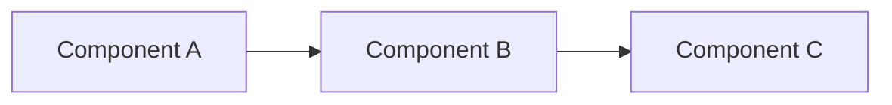
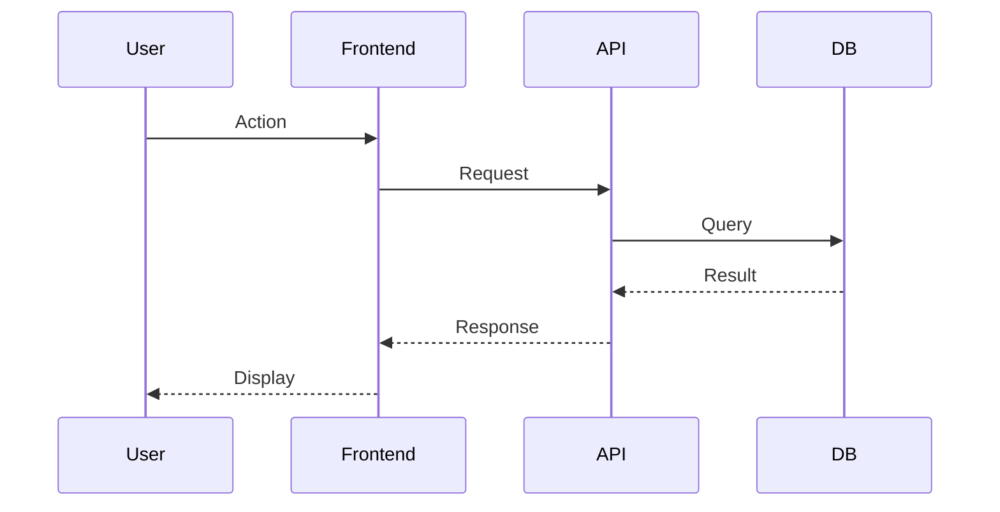
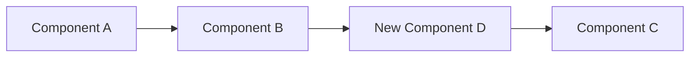
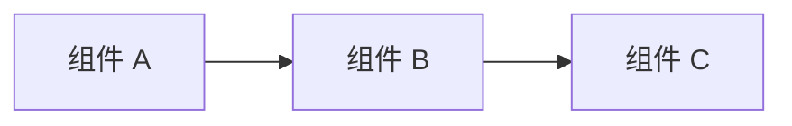
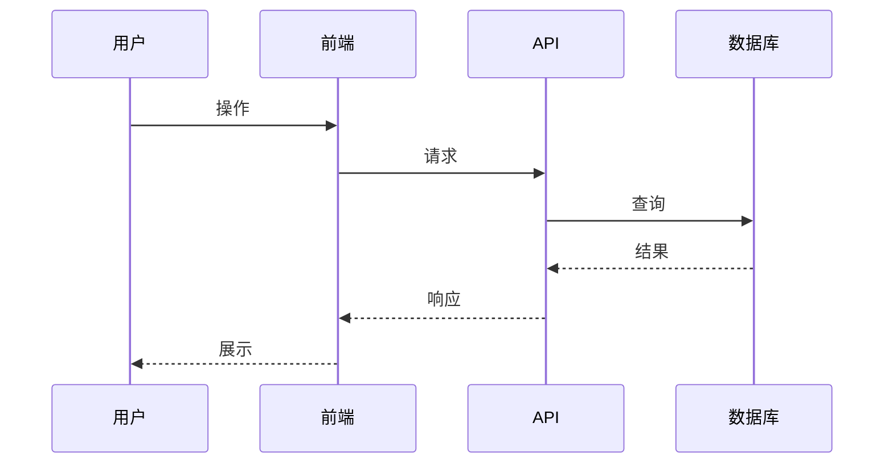
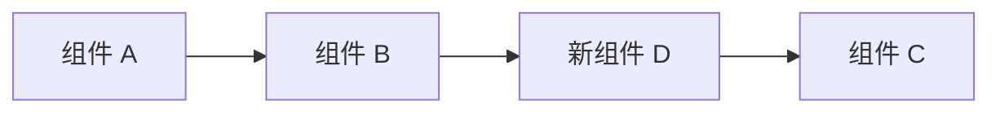
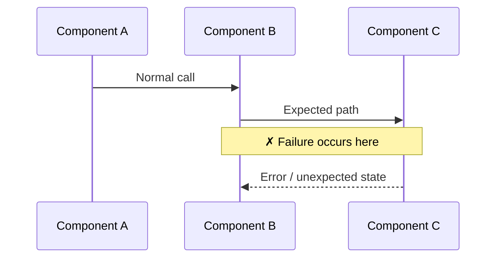
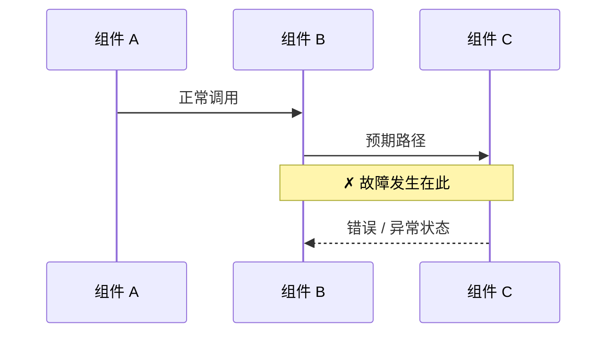

# Work Tracking Document Templates

The four work-tracking documents (`analysis.md`, `plan.md`, `progress.md`,
`review.md`) follow strict templates. Use the language matching the
user's prompt — Chinese if the prompt contains any Chinese characters,
otherwise English. The Markdown structure is identical between the two
languages; only the labels differ.

## Table of contents

- [`plan.md`](#planmd) — execution checklist
- [`progress.md`](#progressmd) — status tracking with Iteration Log
- [`analysis.md` (feat / refactor)](#analysismd--feature--refactor) — by Planner
- [`analysis.md` (fix)](#analysismd--fix) — by Debugger
- [`review.md` header](#reviewmd-header)
- [Visualization rules for analysis.md](#visualization-rules-for-analysismd)

---

## `plan.md`

### English

```markdown
# <Work Name>

**Source**: <Jira link / user prompt / Confluence page>
**Type**: feat | refactor | fix
**Branch**: <branch-name>
**Created**: <date>
**Status**: Planning

## Requirements

<Summary of requirements from gathered context>

## Affected Repositories (in dependency order)

| # | Repository | Branch | Changes Needed | Depends On | Priority |
|---|-----------|--------|---------------|-----------|----------|
| 1 | shared-lib | feat/Dark-Mode-Toggle | Add theme types | — | P0 |
| 2 | api | feat/BE-450/Dark-Mode-Toggle | Add preference endpoint | shared-lib | P0 |
| 3 | android | feat/MOBILE-301/Dark-Mode-Toggle | Add toggle screen | shared-lib, api | P1 |

Repos MUST be listed in dependency order: upstream first (shared libs,
data models), then services (api, backend), then consumers (web, ios,
android). The implementation phase follows this exact order.

## Implementation Plan

### Phase 1: <name>
- [ ] Task 1 in repo-x
- [ ] Task 2 in repo-y

### Phase 2: <name>
- [ ] Task 3 in repo-x

## Dependencies

<Cross-repo dependencies, order constraints>

## Risks / Open Questions

<Known risks, things to clarify>
```

### Chinese

```markdown
# <工作名称>

**来源**：<Jira 链接 / 用户需求 / Confluence 页面>
**类型**：feat | refactor | fix
**分支**：<branch-name>
**创建时间**：<date>
**状态**：规划中

## 需求

<根据采集到的上下文整理的需求摘要>

## 涉及仓库（按依赖顺序）

| # | 仓库 | 分支 | 变更内容 | 依赖 | 优先级 |
|---|------|------|---------|------|--------|
| 1 | shared-lib | feat/Dark-Mode-Toggle | 添加主题类型定义 | — | P0 |
| 2 | api | feat/BE-450/Dark-Mode-Toggle | 添加偏好设置接口 | shared-lib | P0 |
| 3 | android | feat/MOBILE-301/Dark-Mode-Toggle | 添加切换页面 | shared-lib, api | P1 |

仓库必须按依赖顺序列出：上游优先（共享库、数据模型），然后是服务层
（api、backend），最后是消费者（web、ios、android）。实现阶段严格按此顺序。

## 实现计划

### 阶段一：<名称>
- [ ] repo-x 中的任务 1
- [ ] repo-y 中的任务 2

### 阶段二：<名称>
- [ ] repo-x 中的任务 3

## 依赖关系

<跨仓库依赖、顺序约束>

## 风险 / 待确认问题

<已知风险、需要澄清的事项>
```

### Follow-up addition

When this work item inherits from a closed predecessor (Follow-up Mode),
add a `Predecessor` line to the header right after `Status`:

- English: `**Predecessor**: feat/dark-mode/ (closed 2026-04-15)`
- Chinese: `**前置工作**：feat/dark-mode/（2026-04-15 关闭）`

See [`followup-mode.md`](followup-mode.md) for full Follow-up Mode rules.

---

## `progress.md`

### English

```markdown
# Progress: <Work Name>

**Last updated**: <date>
**Overall status**: In Progress
**Branch**: <branch-name>

## Completed Steps

(none yet)

## In Progress

- [ ] <current step>

## Blocked

(none)

## Change Log

### <date> — Started
- Created work plan
- Identified affected repos: <list>
- Created branches in: <list>

## Iteration Log

Append one row per follow-up iteration AFTER the initial finalization
(see [`iteration-mode.md`](iteration-mode.md)). Every code-touching round
MUST add a row — no exceptions.

| # | Date | Trigger | Repos | Files | Review | analysis.md | plan.md | Commit |
|---|------|---------|-------|-------|--------|-------------|---------|--------|
|   |      |         |       |       |        |             |         |        |
```

### Chinese

```markdown
# 进度：<工作名称>

**最后更新**：<date>
**整体状态**：进行中
**分支**：<branch-name>

## 已完成

（暂无）

## 进行中

- [ ] <当前步骤>

## 阻塞

（无）

## 变更记录

### <date> — 启动
- 创建工作计划
- 确定涉及仓库：<list>
- 创建分支：<list>

## 迭代记录

收尾完成后的每一轮后续迭代都必须在此追加一行（详见
[`iteration-mode.md`](iteration-mode.md)）。任何涉及代码改动的轮次都必须
新增一行 —— 无例外。

| # | 日期 | 触发 | 仓库 | 文件 | 审查 | analysis.md | plan.md | 提交 |
|---|------|------|------|------|------|-------------|---------|------|
|   |      |      |      |      |      |             |         |      |
```

### Follow-up addition — `## Successors` table

When a follow-up work item is created from a closed predecessor, the
predecessor's `progress.md` MUST gain a `## Successors` (English) or
`## 后续工作` (Chinese) section appended at the very end. See
[`followup-mode.md`](followup-mode.md).

---

## `analysis.md` — feature / refactor

`analysis.md` is a **technical thinking document** — it captures *why*
decisions were made. Unlike `plan.md` (an execution checklist),
`analysis.md` visualizes system behavior and documents trade-offs.

### English

```markdown
# Analysis: <Work Name>

**Created**: <date>
**Type**: feat | refactor
**Author**: Planner

## Current State

<Describe the existing system behavior, architecture, or user flow.>

### Architecture (as-is)



## Requirements Analysis

<Break down requirements into concrete behaviors, inputs, outputs.>

### User Flow



## Design Options

| Option | Approach | Pros | Cons | Complexity |
|--------|----------|------|------|------------|
| A | ... | ... | ... | Low |
| B | ... | ... | ... | Medium |

**Recommended**: Option <X> — <rationale>

## Target Architecture



## Cross-Repo Impact

| Repo | Impact | Breaking Change? |
|------|--------|-----------------|
| shared-lib | New types added | No |
| api | New endpoint | No |
| web | New page | No |

## Risks & Mitigations

| Risk | Likelihood | Impact | Mitigation |
|------|-----------|--------|------------|
| ... | Medium | High | ... |
```

### Chinese

```markdown
# 分析：<工作名称>

**创建时间**：<date>
**类型**：feat | refactor
**作者**：Planner

## 现状

<描述现有的系统行为、架构或用户流程。>

### 现有架构



## 需求分析

<将需求拆解为具体的行为、输入、输出。>

### 用户流程



## 设计方案

| 方案 | 思路 | 优势 | 劣势 | 复杂度 |
|------|------|------|------|--------|
| A | ... | ... | ... | 低 |
| B | ... | ... | ... | 中 |

**推荐**：方案 <X> — <理由>

## 目标架构



## 跨仓库影响

| 仓库 | 影响 | 是否破坏性变更？ |
|------|------|-----------------|
| shared-lib | 新增类型定义 | 否 |
| api | 新增接口 | 否 |
| web | 新增页面 | 否 |

## 风险与应对

| 风险 | 可能性 | 影响 | 应对措施 |
|------|--------|------|---------|
| ... | 中 | 高 | ... |
```

---

## `analysis.md` — fix

### English

```markdown
# Analysis: <Work Name>

**Created**: <date>
**Type**: fix
**Severity**: <Critical | High | Medium | Low> — <one-line impact>
**Author**: Debugger

## Symptom

<Exact observable behavior: error messages, logs, incorrect output.>

## Reproduction

1. <Step-by-step reproduction>
2. ...

**Environment**: <OS, versions, config>

## Root Cause

### System Model



### Cause

<Explain the root cause with evidence. "X is null" is a symptom;
"API changed response format but consumer still expects old format"
is a root cause.>

### Evidence

- Log line: `...`
- Code path: `file:line` → `file:line`
- Timing: ...

## Fix Strategy

| Approach | Description | Risk | Scope |
|----------|-------------|------|-------|
| A | ... | Low | 1 file |
| B | ... | Medium | 3 files |

**Chosen**: Approach <X> — <rationale>

### Before vs After

**Before:**
```
<problematic flow or code>
```

**After:**
```
<fixed flow or code>
```

## Affected Repos

| Repo | Files Changed | Nature of Change |
|------|--------------|-----------------|
| ... | ... | ... |

## Verification

- [ ] Original reproduction steps → no longer fails
- [ ] Regression tests pass
- [ ] Adjacent functionality unaffected

## Follow-ups

- <Preventive measures: tests, monitoring, guards>
```

### Chinese

```markdown
# 分析：<工作名称>

**创建时间**：<date>
**类型**：fix
**严重程度**：<严重 | 高 | 中 | 低> — <一句话影响>
**作者**：Debugger

## 问题现象

<确切的可观察行为：错误信息、日志、异常输出。>

## 复现步骤

1. <逐步复现>
2. ...

**环境**：<操作系统、版本、配置>

## 根因分析

### 系统模型



### 根因

<用证据解释根因。"X 为空"是表象；"API 改了响应格式但消费端仍按旧格式解析"
是根因。>

### 证据

- 日志：`...`
- 代码路径：`file:line` → `file:line`
- 时序：...

## 修复策略

| 方案 | 描述 | 风险 | 影响范围 |
|------|------|------|---------|
| A | ... | 低 | 1 个文件 |
| B | ... | 中 | 3 个文件 |

**选择**：方案 <X> — <理由>

### 修复前 vs 修复后

**修复前：**
```
<问题流程或代码>
```

**修复后：**
```
<修复后流程或代码>
```

## 涉及仓库

| 仓库 | 变更文件 | 变更性质 |
|------|---------|---------|
| ... | ... | ... |

## 验证

- [ ] 原始复现步骤 → 不再出现故障
- [ ] 回归测试通过
- [ ] 相邻功能不受影响

## 后续

- <预防措施：测试、监控、防护>
```

---

## `review.md` header

### English

```markdown
# Review: <Work Name>

Per-repo staged review results and cross-repo consistency checks
will be appended below during implementation.
Each repo section records the full `code-review-staged` output and verdict.
A final `### Verdict` or cross-repo `### Verdict` is required before
finalization can proceed.
```

### Chinese

```markdown
# 审查：<工作名称>

各仓库的暂存区审查结果和跨仓库一致性检查将在实现过程中追加到下方。
每个仓库的章节记录完整的 `code-review-staged` 输出和结论。
最终必须包含 `### 结论` 部分，否则无法进入收尾阶段。
```

The per-round review section format and cross-repo review format are
defined in [`review-formats.md`](review-formats.md).

---

## Visualization rules for `analysis.md`

`analysis.md` should favor visual formats over prose wherever possible.
The reader should be able to skim diagrams and tables to grasp the
shape of the change without reading wall-of-text rationale.

| Need to express | Use |
|-----------------|-----|
| System architecture | mermaid `flowchart` or `graph` |
| Request / data flow | mermaid `sequenceDiagram` |
| State transitions | mermaid `stateDiagram-v2` |
| Before / after | markdown tables or side-by-side code blocks |
| Decision matrix | markdown table with trade-off columns |
| Timeline | mermaid `gantt` or numbered list |
| Component relationships | mermaid `classDiagram` or `erDiagram` |

### Mermaid 10.2.3 compatibility

Every diagram MUST parse on Mermaid 10.2.3. The biggest trap is edge
labels (`|...|`) containing parentheses, brackets, or curlies — they
MUST be wrapped in double quotes. Same rule for `subgraph` titles.

- Bad: `A -->|step (x)| B`
- Good: `A -->|"step (x)"| B`

After writing, run the **Mermaid Compatibility Gate**: invoke
`mermaid_validate.py` (bundled at `fullstack-impl/scripts/`) on every
just-written or just-edited file. The script accepts multiple files
in one call. If `STATUS=FAIL`, read each `ERROR:` line, apply the
suggested quoted form, save, and re-run until `STATUS=PASS`. Do NOT
proceed to the next step with `STATUS=FAIL` standing.

The gate runs whenever a mermaid-bearing doc is just written:
1. After writing `analysis.md` for the first time (Step 5)
2. After review-driven fixes that updated `analysis.md` (Step 7d / 9)
3. Every iteration round whose doc sync touched mermaid-bearing files
4. Once on resume, to confirm prior sessions did not leave broken
   diagrams behind

Locating the script across AI tools: check candidate paths in this
order, use the first that exists:
`~/.config/opencode/skills/fullstack-impl/scripts/mermaid_validate.py`,
`~/.claude/skills/fullstack-impl/scripts/mermaid_validate.py`,
`~/.copilot/...`, `~/.cursor/...`, `~/.gemini/...`, `~/.codex/...`,
`~/.qwen/...`, `~/.grok/...`. If none exist, fall back to manual
review against the workspace AGENTS.md *Documentation Diagrams
(Mermaid Compatibility)* section. Skipping the gate entirely is NOT
an acceptable shortcut — broken diagrams block human reviewers.
