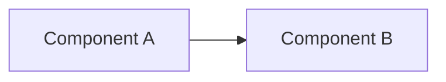

# Fullstack Propose

Turn an idea into a planned work item in a multi-repo fullstack workspace
initialized by `fullstack-init`. This skill produces the work-tracking
documents that `fullstack-apply` later implements.

## How this skill works

Two modes, one work directory:

| Mode | When | What happens |
|------|------|--------------|
| **Standard** | Requirements are clear, no major unknowns | Write the four work-tracking documents directly |
| **Deep (spike)** | Unknowns need validation first | Record Objective/Hypothesis/Unknowns/Success Criteria in `analysis.md`, run experiments, append Design Options / Target Architecture to the **same file**, then write `plan.md` |

The deep mode's output IS the final work directory — there is no rewrite
on handoff to `fullstack-apply`. One directory, one analysis, one
lifecycle.

Both modes end at the same gate: the **Plan Review Gate** (Step 4.5),
where an independent `plan-reviewer` subagent audits the written
documents against the original requirements before `fullstack-apply` is
allowed to start.

## Planning Boundary (MANDATORY)

This skill creates planning artifacts only. The user request that
triggered this skill authorizes planning only — **even if it asks to
build or fix something**. Do not:

- Edit project code (except temporary, uncommitted spike changes in deep
  mode — and those are cleaned up before finishing)
- Create branches (`git checkout -b`)
- Commit changes or push to any code repo
- Create Pull Requests
- Start implementation in the same response

After the planning artifacts are complete, **stop** and wait for a new
user request. Then `fullstack-apply` implements the plan.

## Prerequisites — Workspace Validation Gate (MANDATORY SCRIPT CALL)

This skill MUST NOT proceed past this gate. Run `check_workspace.py` and
inspect its output before planning anything.

```python
import pathlib, subprocess, sys

candidates = [
    pathlib.Path.home() / ".config/opencode/skills/fullstack-propose/scripts/check_workspace.py",
    pathlib.Path.home() / ".claude/skills/fullstack-propose/scripts/check_workspace.py",
    pathlib.Path.home() / ".copilot/skills/fullstack-propose/scripts/check_workspace.py",
    pathlib.Path.home() / ".cursor/skills/fullstack-propose/scripts/check_workspace.py",
    pathlib.Path.home() / ".gemini/skills/fullstack-propose/scripts/check_workspace.py",
    pathlib.Path.home() / ".codex/skills/fullstack-propose/scripts/check_workspace.py",
    pathlib.Path.home() / ".qwen/skills/fullstack-propose/scripts/check_workspace.py",
    pathlib.Path.home() / ".grok/skills/fullstack-propose/scripts/check_workspace.py",
]
script = next((p for p in candidates if p.exists()), None)
if not script:
    print("ERROR: check_workspace.py not found", file=sys.stderr)
    sys.exit(1)
result = subprocess.run([sys.executable, str(script)], capture_output=True, text=True)
print(result.stdout)
```

The script reports:

| Key | Meaning |
|-----|---------|
| `WORKSPACE_VALID=true\|false` | All three markers present? |
| `MISSING=<list>` | Comma-separated list of missing markers |
| `DOCS_DIR=<name>` | Docs directory name |
| `GITHUB_REPOS=true\|false` | Whether apply should create PRs later |

Decision logic:

- `WORKSPACE_VALID=true` → announce the Workspace contract line (below), then proceed to Step 1
- `WORKSPACE_VALID=false` → STOP and tell the user:

  > **Workspace not detected.** This skill requires a fullstack
  > workspace initialized by `fullstack-init`. Missing markers:
  > _(list from `MISSING=`)_.
  >
  > Please `cd` to your project workspace root and restart your AI
  > agent there, or run `fullstack-init` first to set up the workspace.

### Announce the Workspace contract (MANDATORY OUTPUT)

When `WORKSPACE_VALID=true`, output EXACTLY this line before doing
anything else:

```
Workspace: VALID | docs_dir=<DOCS_DIR> | github_repos=<true|false>
```

Use English for this line regardless of conversation language — it is a
machine-readable contract marker.

## Document Language Selection

All four work-tracking documents and user-facing messages MUST match the
language of the user's prompt.

1. If the user **explicitly requests a language** → use that language.
2. If the user's prompt contains **any Chinese characters** → use Chinese.
3. Otherwise → use English (default).

This applies independently per invocation. It does NOT affect work
directory names (always lowercase-hyphenated English) or branch names
(always English Title-Case-With-Hyphens).

## Step 1 — Gather Context

### 1a. Read external links in the user's prompt

| Link type | Skill | What to extract |
|-----------|-------|-----------------|
| Jira URL or issue key (e.g. `PROJ-123`) | `jira` | Summary, description, acceptance criteria, subtasks |
| Confluence URL | `confluence` | Page content, requirements, specs |
| GitHub PR/issue URL | `gh-operations` | Description, comments, linked issues |
| Figma URL | `figma` | Design specs, components, layout, colors, typography |

Read ALL linked resources BEFORE proceeding.

### 1b. Read workspace context

1. **`fullstack.json`** — get the docs directory name and `github_repos`
2. **`AGENTS.md`** — repo table, conventions, structure
3. **`<docs-dir>/AGENTS.md`** — documentation conventions

### 1c. Check knowledge graphs (MANDATORY when available)

For each repo relevant to the request, run
`python3 SKILL_PATH/scripts/graphify_check.py <repo>` to check for
`graphify-out/`. This script uses a direct filesystem check immune to
`.gitignore` filtering — do NOT use Glob. When `graphify-out/` exists,
`cd` into the repo and MUST use `graphify query "<question>"` to
understand the codebase BEFORE grep/read. If output shows `TRUNCATED`,
raise the budget (`--budget 8000`) or narrow the query.

### 1d. Check prior context

- If the user references a previous work item or spike, read its
  documents from `<docs-dir>/changes/<type>/<name>/` (or the archive)
  to build on prior work. Record it under `**Source**` in the plan.
- If the referenced work item is **archived** and this is genuinely new
  work on the same scope, plan a `-vN` successor (see Step 2).

## Step 2 — Determine Work Type

| Category | Directory | Branch prefix | When to use |
|----------|-----------|--------------|-------------|
| Feature | `changes/feat/` | `feat/` | New features, capabilities, enhancements |
| Refactor | `changes/refactor/` | `refactor/` | Code restructuring, tech debt, cleanup |
| Fix | `changes/fix/` | `fix/` | Bug fixes, issue resolution |

If ambiguous, ask.

For a successor to an archived work item, the directory is
`<work-name>-vN/` in the same `<type>/`, and `analysis.md` must carry a
predecessor reference under `**Source**`.

## Step 3 — Identify Affected Repos

### Decision tree

1. **User explicitly listed repos** → use those, but still confirm
2. **User's description implies specific repos** → propose your analysis
3. **Ambiguous** → ask explicitly

### Confirmation (MANDATORY)

ALWAYS present your analysis to the user for confirmation, even when
confident. Format:

```
Based on the requirements, I plan to involve these repositories:

  1. shared-lib/ — Add theme constants to shared types
  2. api/ — Add user preference endpoint for theme setting
  3. android/ — Add dark mode toggle to settings screen

Work type: feat
Work name: add-dark-mode

Does this look correct? You can:
- Confirm to proceed
- Remove repos that shouldn't be involved
- Add repos I missed
- Change the work type or work name
```

Do NOT proceed until the user confirms. If the user corrects you,
update and reconfirm.

## Step 4 — Create the Work Plan

Create a work directory under `<docs-dir>/changes/<type>/`:

```
<docs-dir>/changes/<type>/<work-name>/
├── analysis.md   (technical analysis — ALWAYS created first)
├── plan.md       (execution plan — derived from analysis)
├── progress.md   (status tracking — initial state)
└── review.md     (review findings — header only, filled during apply)
```

### Four-File Invariant (MANDATORY)

All four files MUST be created. `analysis.md` is NEVER optional — even
for "trivial" work. A one-page analysis is fine; a missing analysis is
not. The four files form a causal chain:
`analysis.md → plan.md → progress.md → review.md`. Removing any link
breaks traceability.

**Scaling by complexity** — analysis depth should match the work:

| Work complexity | analysis.md depth |
|----------------|-------------------|
| Trivial (typo, config, version bump) | 1-2 sections: brief current state + change rationale |
| Simple (single repo, clear scope) | 3-4 sections: current state, requirements, chosen approach |
| Complex (multi-repo, architectural) | Full template: diagrams, options, trade-offs, risk matrix |

### Standard mode — write the four documents

Delegate to the **planner** subagent (read-only, returns content; you
write the files):

| Work type | Analysis | Planning |
|-----------|----------|----------|
| `feat/` / `refactor/` | Delegate to **planner** | Delegate to **planner** |
| `fix/` | Delegate to **debugger** (root cause) → then **planner** | From debugger's analysis |

The planner must include testable **Success Criteria** in `plan.md` —
not subjective ones. "Works correctly" is not a criterion; "returns 200
with valid JSON matching schema X for inputs A, B, C" is.

**Freeze cross-repo contracts (MANDATORY for multi-repo plans).** The
`Depends On` column of the repositories table is a promise consumed by
two later steps:

1. `fullstack-apply` derives its parallel execution waves from it —
   repos that share no dependency edge are developed, reviewed, and
   committed concurrently.
2. Downstream developers write code against the interfaces you freeze
   here — while their upstream is still being implemented in parallel.

Therefore, every interface that crosses a dependency edge MUST be
frozen in `analysis.md` under explicit contract entries: endpoint /
function signatures with exact field names and types, error codes,
shared type definitions, env-var names, and migration ordering. A
downstream repo's brief cites these as immutable unless `analysis.md`
amends them. Parallel implementation without frozen contracts produces
integration drift discovered only at final review — do not leave the
interface names to be improvised during apply.

Then write `progress.md` (initial state) and `review.md` (header, plus the
plan review rounds the gate below records) yourself. Follow the templates
in
[`references/document-templates.md`](references/document-templates.md).

### Deep mode (spike) — validate unknowns first

Use this when Step 1 reveals significant unknowns (technical risk,
unproven feasibility, unclear design choice). The output is the SAME
work directory — no separate spike directory, no rewrite later.

**4a. Write the spike part of `analysis.md`:**

```markdown
# Analysis: <Work Name>
**Created**: <date>   **Type**: <feat|fix|refactor>   **Author**: Planner

## Objective
<What are we trying to find out? What question does this spike answer?>

## Current State
<Existing system behavior / architecture / limitations>
### Architecture (as-is)


## Hypothesis
<What do we believe will work? What assumptions are we testing?>

## Spike Approach
| Step | What to try | Repo | Expected outcome | Risk |
|------|-------------|------|-----------------|------|
| 1 | ... | api/ | ... | Low |

## Unknowns
- <What we don't know and need to find out>

## Success Criteria
<How do we know the validation succeeded? What evidence do we need?>
- [ ] Criterion 1
- [ ] Criterion 2
```

**4b. Execute the spike (temporary, uncommitted):**

1. Read each affected repo's `AGENTS.md` and `README.md`; use graphify
   when available (same protocol as Step 1c).
2. Make temporary code changes to validate the hypothesis. Do NOT run
   `git add` or `git commit` on any code repo.
3. Run tests, start dev servers, check logs — whatever validates the
   criteria.
4. Record each experiment, its result, and evidence directly in
   `analysis.md` under a `## Experiments` section (appended as you go).

**4c. Complete the analysis — same file:**

After validation, append to `analysis.md` (still the same file):

```markdown
## Experiments
### Experiment 1: <title>
**What was tried**: ...   **Result**: ...   **Evidence**: ...

## Verdict
<FEASIBLE | NOT_FEASIBLE | NEEDS_MORE_RESEARCH> — one paragraph
summarizing whether the approach works and what was learned.

## Design Options
| Option | Approach | Pros | Cons | Complexity |
|--------|----------|------|------|-----------|
| A (chosen) | ... | ... | ... | Medium |

## Target Architecture


## Cross-Repo Impact
| Repo | Impact | Breaking Change? |
|------|--------|------------------|
| api/ | ... | No |

## Risks & Mitigations
| Risk | Likelihood | Impact | Mitigation |
|------|-----------|--------|-----------|
```

**4d. Write `plan.md` from the verdict.** If NOT_FEASIBLE, write the
plan documenting why it's not proceeding (the plan still exists — the
record matters). If FEASIBLE, the plan reflects the chosen Design Option.

**4e. Clean up temporary spike changes** before finishing:

```bash
cd <repo-1> && git checkout .
cd <repo-2> && git checkout .
```

...unless the user explicitly says to keep the spike changes for
`fullstack-apply`.

### Mermaid Compatibility Gate (MANDATORY when diagrams are written)

After writing any doc with ` ```mermaid ` blocks, invoke `mermaid_lint.py`
from this skill's own bundled `scripts/` directory. Read
[`references/MERMAID-RULES.md`](references/MERMAID-RULES.md) before
authoring any diagram.

Locating the script across AI tools — check candidate paths in this
order, use the first that exists:
`~/.config/opencode/skills/fullstack-propose/scripts/mermaid_lint.py`,
`~/.claude/skills/fullstack-propose/scripts/mermaid_lint.py`,
`~/.copilot/...`, `~/.cursor/...`, `~/.gemini/...`, `~/.codex/...`,
`~/.qwen/...`, `~/.grok/...`. (If `fullstack-propose` is not installed
but `fullstack-apply` is, the same script lives under that skill's
bundled `scripts/` directory.)

If `STATUS=FAIL`, read each `ERROR:` line, apply the suggested fix,
save, and re-run until `STATUS=PASS`. Do NOT proceed with `STATUS=FAIL`.

### Dependency DAG Gate (MANDATORY for multi-repo plans)

After writing `plan.md` for a multi-repo work item, run
`compute_waves.py` from this skill's bundled `scripts/` directory on
the work directory:

```bash
python3 SKILL_PATH/scripts/compute_waves.py <docs-dir>/changes/<type>/<work-name>
```

This validates the repositories table exactly as `fullstack-apply`
will later consume it — before implementation starts, not after:

- `REPOS/WAVES/WAVE_i=…` → PASS. Record the wave summary in `plan.md`
  under the repositories table (one line: "Parallel waves:
  W1(a,b) → W2(c)") so reviewers see the intended grouping.
- `ERROR_NO_REPOS_TABLE` / `ERROR_DUPLICATE_REPO` /
  `ERROR_SELF_DEPENDENCY` / `ERROR_UNKNOWN_DEP` → fix the table, re-run.
- `CYCLE_REPOS=a,b,…` → repos depend on each other in a circle; apply
  cannot order them. Break the cycle by restructuring dependencies or
  splitting the work item, then update `analysis.md` and `plan.md`
  accordingly.

Do NOT finalize the plan with a failing DAG gate.

## Step 4.5 — Plan Review Gate (MANDATORY)

The documents are written; the Mermaid and DAG gates are green. None of
that says the plan is *right* — those gates check shape, this one checks
meaning. Before reporting the plan, delegate to the **plan-reviewer**
subagent to falsify it against the original requirements.

**Why an independent subagent and not a self-check.** You wrote these
files from the planner's returned text, so you have already absorbed the
planner's reasoning and its assumptions; a self-review re-runs the same
assumptions and finds nothing. The plan-reviewer gets a clean context,
the raw requirements, and the files **as written to disk** — which also
means it catches what was lost in transcription, a failure class no other
gate covers.

### Review depth — scaled to the work

Every work item is reviewed; the *loop* is what scales.

| Work item shape | Review depth |
|-----------------|--------------|
| Trivial / single repo, no cross-repo contract | **1 pass.** P0/P1 → planner revises → 1 confirmation pass. Cap: 2 rounds |
| Multi-repo, any frozen contract, deep (spike) mode, or architectural refactor | **Loop.** Pass → revise → re-review. Cap: 2 revision rounds (3 passes total) |

Do not skip the gate because the plan "looks fine" — that judgment is the
thing being tested.

### What the reviewer receives

- **The original requirements** gathered in Step 1a (Jira/Confluence/Figma
  content, the user's own words). Without this the reviewer cannot detect
  a dropped requirement.
- `analysis.md` and `plan.md` **as written to disk** — not the planner's
  returned message.
- The workspace `AGENTS.md` repo table, plus `AGENTS.md` / `README.md` of
  the affected repos.

The reviewer is read-only (`edit: deny`) and returns findings; you write
them into `review.md`.

### Handling the verdict

Append the reviewer's output to `review.md` as a
`## Plan Review — Round <N> — <date>` section (format in
[`references/document-templates.md`](references/document-templates.md)).

| Verdict | What you do |
|---------|-------------|
| `PASS` | Proceed to Step 5 |
| `PASS_WITH_RISKS` | Proceed to Step 5; make sure the risks appear in `plan.md` §Risks / Open Questions |
| `NEEDS_FIXES` | Delegate the P0/P1 findings back to the **planner** verbatim; apply the returned revisions to the affected sections only (do not regenerate untouched sections); record what changed; re-run the reviewer as round N+1 |
| `NEEDS_USER_DECISION` | Stop the loop. Put the open decisions in the Step 5 report and ask the user — planning is not complete until they are answered |

Rules that keep the loop convergent:

- **The planner must answer every P0/P1** — fix it, or reject it with a
  written rationale, which you record in the same round as
  `Rejected: <reason>`. A finding silently dropped during revision becomes
  a P0 in the next round.
- **Round 2+ verifies the previous findings and the content changed to
  resolve them only** — never a fresh full audit. Otherwise every round
  harvests new P2s and the plan never converges.
- **Never weaken a plan to satisfy a reviewer.** Deleting a criterion,
  widening a contract to "TBD", or dropping a requirement to reach `PASS`
  is worse than shipping with a documented P1. If the honest fix is a
  choice only the user can make, that is `NEEDS_USER_DECISION`.
- **Oscillation stops the loop.** If a round produces more new findings
  than the previous round resolved, stop, record the residual items as
  known risks in `plan.md`, and report them in Step 5.
- **Re-run the affected mechanical gates after revisions** — the Mermaid
  gate if a diagram changed, the DAG gate if the repositories table
  changed.

### Exit criteria — "implementable" is a definition, not a feeling

The plan may be handed to `fullstack-apply` only when ALL of these hold:

- [ ] Plan review verdict is `PASS` or `PASS_WITH_RISKS` — no unresolved
      P0/P1 (residual items are recorded as known risks, not as open fixes)
- [ ] Every requirement maps to ≥ 1 Success Criterion, and every criterion
      maps to ≥ 1 task
- [ ] Every frozen contract passes the completeness check, or is explicitly
      marked `TBD` with the user's decision recorded
- [ ] Every path / symbol / endpoint referenced as **existing** has been
      verified to exist
- [ ] Dependency edges verified semantically, not just structurally
- [ ] No unanswered `NEEDS_USER_DECISION`
- [ ] Mermaid gate PASS, and (multi-repo) DAG gate PASS

If a box is unchecked, do NOT report the plan as ready — report the
blocking items instead.

## Step 5 — Report the Plan

1. **Commit the work directory to the docs repo** (the ONLY repo that
   gets commits in this skill).
2. **Report to the user**:

```
Planned: <work-name> (<feat|fix|refactor>)
Location: <docs-dir>/changes/<type>/<work-name>/
Mode: standard | deep (spike)

- Requirements: <summary>
- Success Criteria: <N criteria>
- Repos: <list>
- Parallel waves: W1(<repos>) → W2(<repos>) → …
- Contracts frozen in analysis.md: <list or "single-repo — none">
- Design: <one-line summary of chosen option>
- Plan review: <PASS | PASS_WITH_RISKS> — <N> rounds, <N> findings fixed
- Open decisions: <none | list>

Next: tell me to "implement this" to run fullstack-apply.
```

When the verdict was `NEEDS_USER_DECISION`, replace the `Next:` line with
a request for the decisions instead:

```
Next: answer the open decisions above — I will re-run the plan review,
      then hand the plan to fullstack-apply.
```

## Resuming a Previous Plan

When invoked with a reference to an existing un-archived work item
(e.g. "continue planning X", "继续规划 X"):

1. Read the existing four documents in `<docs-dir>/changes/<type>/<name>/`
2. Determine what's incomplete (missing sections, unanswered Success
   Criteria, unfilled verdict, unresolved plan-review findings or open
   decisions in `review.md`)
3. Resume from the last incomplete step; re-confirm repos if the plan
   has changed

### Review-only re-entry — re-run the Plan Review Gate

When the user points at an existing plan and asks for it to be
**reviewed** rather than replanned ("审一下这个方案", "review the plan
for X", "re-review the plan", "方案靠谱吗", "is this plan ready?"), do
NOT re-run Steps 1–4 — the plan already exists. Run the gate alone:

1. **Locate the work item** — `<docs-dir>/changes/<type>/<name>/`. Search
   the active type directories; if several match, ask. If `plan.md` is
   missing, this is not a re-review — tell the user to plan it first.
2. **Determine the round** — read `review.md`, take the highest existing
   `## Plan Review — Round <N>`; the new round is N+1. If there are no
   rounds yet, this is a first review (round 1) — fine, proceed.
3. **Recover the requirements source** — read `**Source**` in `plan.md`
   and fetch it (`jira`, `confluence`, `gh-operations`, or the referenced
   work item). If the original requirements cannot be recovered — only a
   paraphrase survived — ask the user for them. A coverage check without
   the requirements is theater.
4. **Collect what changed since the last round** — the docs repo is a
   git repo:

   ```bash
   cd <docs-dir>
   git log --oneline -- changes/<type>/<name>/
   git log -p --since=<last round date> -- changes/<type>/<name>/
   ```

   Hand the reviewer the changed sections, not "please re-read
   everything" — round discipline (see Step 4.5) is what keeps repeats
   convergent.
5. **Delegate to plan-reviewer** with the round number, the documents as
   written to disk, the requirements source, and the diff — the same
   inputs Step 4.5 specifies.
6. **Handle the verdict** exactly as Step 4.5 does: `PASS` /
   `PASS_WITH_RISKS` → report with the Step 5 template; `NEEDS_FIXES` →
   the planner revises the affected sections only, then round N+2;
   `NEEDS_USER_DECISION` → ask the user. Re-run the Mermaid gate if a
   diagram changed and the DAG gate if the repositories table changed.
7. **Commit the docs repo** (the review rounds are part of the record)
   and report using the Step 5 template.

Boundaries for this path: it reviews and revises only. It never re-plans
the item from scratch, never creates branches, and never touches project
code. If the review shows the plan is wrong at the **requirements** level
rather than merely incomplete, stop — that is a new planning round; say so
and run the normal steps.

## Requirements

- Python 3.10+
- Workspace initialized by `fullstack-init` (must pass workspace
  validation gate)
- Other skills as needed: `jira`, `confluence`, `gh-operations`, `figma`

## Guardrails

- Planning only. Any implementation instruction in the request does not
  carry forward — stop after artifacts are presented.
- Every work item passes the Plan Review Gate. Reporting a plan as ready
  with an unresolved P0/P1, an unanswered `NEEDS_USER_DECISION`, or a
  failing mechanical gate is a failure of this skill.
- Never weaken a plan — delete a criterion, widen a contract to `TBD`, or
  drop a requirement — to reach a `PASS` verdict.
- No branches, no commits to code repos, no PRs.
- Review-only re-entry re-runs the gate; it does not replan. A plan whose
  requirements are wrong needs a new planning round, not a review round.
- The four documents are mandatory — a missing `analysis.md` is a failure.
- Success Criteria must be testable and specific, not subjective.
- Multi-repo plans MUST freeze cross-repo contracts in `analysis.md`
  and pass the Dependency DAG Gate before reporting the plan — apply
  derives parallel waves from this table, so a malformed dependency is
  an implementation-time failure you were asked to prevent.
- Deep mode's output IS the work directory — never create a separate
  spike directory and never rewrite analysis on handoff.
- Mermaid gate must PASS before finalizing.
