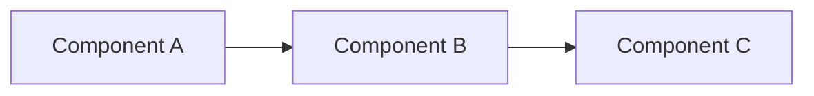

# Fullstack Spike

Run a time-boxed spike across a multi-repo fullstack workspace initialized
by `fullstack-init`. A spike is a short, hands-on experiment — write
throwaway code to validate a technical hypothesis, reduce uncertainty, or
estimate effort before committing to a full implementation.

## Core Principle — No Git Side Effects

This skill MUST NOT:

- Create branches (`git checkout -b`)
- Commit changes (`git commit`)
- Push to remotes (`git push`)
- Create Pull Requests

All code modifications are **temporary working directory changes**. The user
can verify them locally (run the app, run tests, inspect output), then either:

- **Proceed to implementation**: invoke `fullstack-impl` with the
  spike docs as context
- **Discard**: `git checkout .` in each affected repo to clean up

The ONLY git writes this skill makes are commits to the **docs repo**
(spike tracking documents).

## Prerequisites — Workspace Validation Gate

This skill MUST NOT proceed unless it confirms the current working directory
is a valid fullstack workspace. Before doing ANY work, check for ALL three
markers:

1. **`fullstack.json`** — workspace config created by `fullstack-init`
2. **`AGENTS.md`** — workspace-level AGENTS.md generated by `fullstack-init`
3. **`.agents/`** — directory containing workspace agents and skills

### Validation logic

```
Check current working directory for:
  fullstack.json  — exists?
  AGENTS.md       — exists?
  .agents/        — exists and is a directory?

ALL THREE must be present → proceed to Step 1
ANY missing → STOP and show the error below
```

### If validation fails

**Do NOT proceed with any spike work.** Instead, inform the user:

> **Workspace not detected.** This skill requires a fullstack workspace
> initialized by `fullstack-init`. The current directory is missing:
> - _(list each missing item)_
>
> Please `cd` to your project workspace root and restart your AI agent
> there, or run `fullstack-init` first to set up the workspace.

## Document Language Selection

All generated spike documents (analysis.md, findings.md, verdict.md)
and user-facing messages MUST match the language of the user's prompt.

### Detection rule

1. If the user **explicitly requests a language** → use that language.
2. If the user's prompt contains **any Chinese characters** → use Chinese.
3. Otherwise → use English (default).

### What this affects

- **analysis.md** — section headers, diagram labels, analysis content
- **findings.md** — section headers, experiment records, observations
- **verdict.md** — header text, conclusion, recommendations
- **Confirmation messages** — the repo confirmation in Step 3
- **Final summary** — the completion report in Step 7

### What this does NOT affect

- **Work directory names** — always lowercase-hyphenated English
- **Markdown structure** — same template structure regardless of language

## Step 1 — Gather Context

Before doing ANY spike work, gather all available context.

### External links in the user's prompt

Scan the user's message for links. For each type, use the corresponding skill:

| Link type | Skill to use | What to extract |
|-----------|-------------|-----------------|
| Jira URL or issue key (e.g. `PROJ-123`) | `jira` skill | Summary, description, acceptance criteria |
| Confluence URL | `confluence` skill | Page content, requirements, specs |
| GitHub PR/issue URL | `gh-operations` skill | Description, comments, linked issues |
| Figma URL | `figma` skill | Design specs, components, layout |

**IMPORTANT**: Read ALL linked resources BEFORE proceeding to Step 2.

### Workspace context

Read these files from the workspace root:

1. **`fullstack.json`** — get the docs directory name
2. **`AGENTS.md`** — understand the repo table, conventions, and structure
3. **`<docs-dir>/AGENTS.md`** — understand documentation conventions

### Existing spike context

Check if the user references a previous spike. If so, read its
documents from `<docs-dir>/spike/<name>/` to build on prior work.

## Step 2 — Determine Spike Scope

Define what is being spiked. Unlike `fullstack-impl` which classifies
into feat/refactor/fix, spikes have a single category.

| Category | Directory | Use for |
|----------|-----------|---------|
| Spike | `<docs-dir>/spike/` | Technical validation, prototyping, PoCs, effort estimation |

## Step 3 — Identify Affected Repos

Based on the gathered context, determine which repositories will be
examined or temporarily modified.

### Decision tree

1. **User explicitly listed repos** → use those, but still confirm
2. **User's description implies specific repos** → propose your analysis
3. **Ambiguous or unclear** → ask the user explicitly

### Confirmation (MANDATORY)

**ALWAYS** present your analysis to the user for confirmation. Format:

```
Based on the spike scope, I plan to examine/modify these repositories:

  1. api/ — Test new authentication flow
  2. web/ — Prototype the new login page

Spike scope: Verify OAuth2 PKCE integration feasibility

Note: No branches will be created. All code changes are temporary
and can be cleaned up with `git checkout .` in each repo.

Does this look correct?
```

**Do NOT proceed until the user confirms.**

## Step 4 — Create Spike Docs

Create a work directory under `<docs-dir>/spike/`:

```
<docs-dir>/spike/<work-name>/
├── analysis.md    # Technical analysis (architecture, feasibility, design options)
├── findings.md    # What was tried, what worked, what didn't
└── verdict.md     # Created with header, filled at the end
```

### Work name

Derive from the spike topic. Use lowercase-hyphenated format:
- "Can we use OAuth2 PKCE?" → `oauth2-pkce-feasibility`
- "试试 WebSocket 替换轮询" → `websocket-replace-polling`

### Agent dispatch — analysis

Read the Planner agent file from `.agents/agents/planner.md` and use it
to write the technical analysis. The analysis for a spike focuses
more on **feasibility** and **unknowns** than on implementation planning.

### analysis.md template

**English:**

```markdown
# Analysis: <Work Name>

**Created**: <date>
**Type**: spike
**Author**: Planner

## Objective

<What are we trying to find out? What question does this spike answer?>

## Current State

<Describe the existing system behavior, architecture, or limitations
that motivate this spike.>

### Architecture (as-is)



## Hypothesis

<What do we believe will work? What assumptions are we testing?>

## Spike Approach

| Step | What to try | Repo | Expected outcome | Risk |
|------|-------------|------|-----------------|------|
| 1 | ... | api/ | ... | Low |
| 2 | ... | web/ | ... | Medium |

## Unknowns

- <What we don't know and need to find out>
- <Technical uncertainties>
- <Dependency questions>

## Success Criteria

<How do we know the spike succeeded? What evidence do we need?>

- [ ] Criterion 1
- [ ] Criterion 2
```

**Chinese:**

```markdown
# 分析：<工作名称>

**创建时间**：<date>
**类型**：spike
**作者**：Planner

## 目标

<我们要弄清楚什么？这次 spike 要回答什么问题？>

## 现状

<描述现有的系统行为、架构或限制，说明为什么要做这次 spike。>

### 现有架构


## 假设

<我们认为什么方案可行？我们在验证什么假设？>

## Spike 方案

| 步骤 | 尝试内容 | 仓库 | 预期结果 | 风险 |
|------|---------|------|---------|------|
| 1 | ... | api/ | ... | 低 |
| 2 | ... | web/ | ... | 中 |

## 未知项

- <需要弄清楚的事项>
- <技术不确定性>
- <依赖问题>

## 成功标准

<如何判定 spike 成功？需要什么证据？>

- [ ] 标准 1
- [ ] 标准 2
```

### findings.md template

**English:**

```markdown
# Findings: <Work Name>

**Last updated**: <date>
**Status**: In Progress

## Experiments

### Experiment 1: <title>

**Repo**: <repo-name>
**What was tried**: <description>
**Result**: <what happened>
**Evidence**: <logs, output, screenshots description>

### Experiment 2: <title>

...

## Observations

- <Key observation 1>
- <Key observation 2>

## Issues Encountered

- <Issue 1>: <how it was handled or worked around>

## Temporary Changes Made

| Repo | Files Modified | Purpose | Cleanup |
|------|---------------|---------|---------|
| api/ | src/auth.py | Test OAuth flow | `git checkout .` |
| web/ | src/Login.tsx | Prototype UI | `git checkout .` |
```

**Chinese:**

```markdown
# Spike 发现：<工作名称>

**最后更新**：<date>
**状态**：进行中

## 实验记录

### 实验 1：<标题>

**仓库**：<repo-name>
**尝试内容**：<描述>
**结果**：<发生了什么>
**证据**：<日志、输出、截图描述>

### 实验 2：<标题>

...

## 观察

- <关键观察 1>
- <关键观察 2>

## 遇到的问题

- <问题 1>：<如何处理或绕过>

## 临时代码变更

| 仓库 | 修改文件 | 目的 | 清理方式 |
|------|---------|------|---------|
| api/ | src/auth.py | 测试 OAuth 流程 | `git checkout .` |
| web/ | src/Login.tsx | 原型 UI | `git checkout .` |
```

### verdict.md — create with header:

**English:**

```markdown
# Verdict: <Work Name>

Spike conclusion and recommendation will be written here
after all experiments are completed.
```

**Chinese:**

```markdown
# 结论：<工作名称>

Spike 结论和建议将在所有实验完成后写入此处。
```

### Mermaid 10.2.3 Compatibility Gate (MANDATORY when diagrams are written)

Every diagram MUST parse AND render correctly on Mermaid 10.2.3. The
two most common traps are:

1. Edge labels (`|...|`) or `subgraph` titles containing
   parens / brackets / curlies — must be wrapped in double quotes.

   - Bad: `A -->|step (x)| B`
   - Good: `A -->|"step (x)"| B`

2. Literal `\n` inside flowchart node labels, edge labels, or
   subgraph titles. On Mermaid 10.2.3 + GitHub + many other
   renderers, `\n` renders as the two characters `\` and `n`
   inside the box instead of a line break. Use the HTML break
   tag `<br/>`.

   - Bad: `A[patterns.md\nRefreshManager / Skeleton / Nav / Utils]`
   - Good: `A[patterns.md<br/>RefreshManager / Skeleton / Nav / Utils]`

After writing or editing any spike doc with ` ```mermaid ` blocks
(typically `analysis.md`), invoke `mermaid_validate.py` from the
bundled `fullstack-impl/scripts/` directory. The script accepts
multiple files in one call.

Locating the script across AI tools: check candidate paths in this
order, use the first that exists:
`~/.config/opencode/skills/fullstack-impl/scripts/mermaid_validate.py`,
`~/.claude/skills/fullstack-impl/scripts/mermaid_validate.py`,
`~/.copilot/...`, `~/.cursor/...`, `~/.gemini/...`, `~/.codex/...`,
`~/.qwen/...`, `~/.grok/...`.

If `STATUS=FAIL`, read each `ERROR:` line, apply the suggested fix,
save, and re-run until `STATUS=PASS`. Do NOT proceed to the next
step with `STATUS=FAIL` standing — broken diagrams block human
reviewers. If the script is not found at any candidate path, fall
back to manual review against the rules above.

## Step 5 — Execute the Spike

### Read repo conventions first

For each repo that will be examined or modified:

1. **Read `AGENTS.md`** (if it exists) — understand coding style and
   architecture constraints.
2. **Read `README.md`** — understand build commands, test commands, and
   environment setup.

### Set up repo environment

Follow the same environment setup as `fullstack-impl` (activate venvs,
nvm use, etc.) so that temporary changes can be tested properly.

### Make temporary changes

- Modify code as needed for the spike
- **Do NOT run `git add` or `git commit`** on any code repo
- Run tests, start dev servers, check logs — whatever validates the hypothesis
- Record each experiment and its results in `findings.md`

### Update findings as you go

After each significant experiment:

1. Append the experiment record to `findings.md`
2. Update the "Temporary Changes Made" table
3. Commit `findings.md` to the docs repo (this is the ONLY repo that
   gets commits)

## Step 6 — Review & Verdict

After the spike is complete, perform a review of the findings and
write the verdict.

### 6a. Review the spike

Read `.agents/agents/reviewer.md` and use the Reviewer perspective to
evaluate the spike:

- Were the success criteria met?
- Is the evidence sufficient to draw a conclusion?
- Are there gaps or untested scenarios?
- What risks were discovered?

### 6b. Write verdict.md

Replace the placeholder content with the full verdict.

**English:**

```markdown
# Verdict: <Work Name>

**Date**: <date>
**Author**: Reviewer
**Verdict**: <FEASIBLE | NOT_FEASIBLE | NEEDS_MORE_RESEARCH>

## Summary

<One paragraph: what was spiked, what was found, and the conclusion.>

## Evidence

| Success Criterion | Result | Evidence |
|------------------|--------|----------|
| Criterion 1 | ✅ Pass | <what proved it> |
| Criterion 2 | ❌ Fail | <what disproved it> |

## Recommendation

<What should happen next?>

### If proceeding to implementation

To implement based on this spike, tell your AI agent:

> Implement <work-name> based on the spike at
> `<docs-dir>/spike/<work-name>/`

The `fullstack-impl` skill will read the spike documents
(analysis.md, findings.md, verdict.md) as additional context for planning.

### If not proceeding

<Why not, and what alternatives exist?>

## Cleanup

To remove temporary code changes:

```bash
cd <repo-1> && git checkout .
cd <repo-2> && git checkout .
```

## Risks & Considerations for Implementation

<If feasible, what should the implementation team watch out for?>

- <Risk 1>
- <Risk 2>
```

**Chinese:**

```markdown
# 结论：<工作名称>

**日期**：<date>
**作者**：Reviewer
**结论**：<可行 | 不可行 | 需要更多调研>

## 摘要

<一段话：spike 了什么、发现了什么、得出了什么结论。>

## 证据

| 成功标准 | 结果 | 证据 |
|---------|------|------|
| 标准 1 | ✅ 通过 | <证明依据> |
| 标准 2 | ❌ 未通过 | <反证依据> |

## 建议

<下一步应该做什么？>

### 如果进入实现阶段

基于本次 spike 进入实现，告诉你的 AI agent：

> 基于 `<docs-dir>/spike/<work-name>/` 的 spike 结果，实现 <work-name>

`fullstack-impl` 技能会读取 spike 文档（analysis.md、findings.md、verdict.md）
作为规划的额外上下文。

### 如果不实现

<为什么不实现，有什么替代方案？>

## 清理

删除临时代码变更：

```bash
cd <repo-1> && git checkout .
cd <repo-2> && git checkout .
```

## 实现阶段的风险与注意事项

<如果可行，实现时需要注意什么？>

- <风险 1>
- <风险 2>
```

## Step 7 — Finalize

1. **Ensure all spike docs are complete**:
   - `analysis.md` — has the technical analysis
   - `findings.md` — has all experiment records and the temporary changes table
   - `verdict.md` — has the full verdict with recommendation
2. **Re-run the Mermaid Compatibility Gate** against EVERY spike
   doc that contains ` ```mermaid ` blocks. If `STATUS=FAIL` on any
   file, fix and re-run; do NOT finalize with broken diagrams. See
   the gate details in Step 4.
3. **Commit** all docs to the docs repo
4. **Report to user**: Summarize the spike results, including:
   - The verdict (FEASIBLE / NOT_FEASIBLE / NEEDS_MORE_RESEARCH)
   - Key findings
   - Next steps (proceed to impl, or discard and clean up)
   - Cleanup commands for temporary changes

   **English example:**
   ```
   Spike complete.

   Verdict: FEASIBLE — OAuth2 PKCE integration is viable with the
   current architecture. Minor changes needed in api/ and web/.

   Temporary changes remain in:
     - api/ (src/auth.py)
     - web/ (src/Login.tsx)

   Next steps:
     - To implement: "Implement oauth2-pkce based on the spike"
     - To clean up: run `git checkout .` in api/ and web/
   ```

   **Chinese example:**
   ```
   Spike 完成。

   结论：可行 — OAuth2 PKCE 集成在当前架构下可行，api/ 和 web/ 需少量改动。

   临时变更保留在：
     - api/（src/auth.py）
     - web/（src/Login.tsx）

   后续步骤：
     - 进入实现：「基于 spike 结果实现 oauth2-pkce」
     - 清理代码：在 api/ 和 web/ 中执行 `git checkout .`
   ```

## Resuming Previous Spike

When this skill is invoked, check for existing spike directories
under `<docs-dir>/spike/`.

If the user says something like "continue the OAuth spike" or
"继续之前的 spike":

1. Find the matching spike directory
2. Read `analysis.md` and `findings.md` to understand current state
3. Check what experiments have been completed
4. Resume from the last incomplete step

## Requirements

- Python 3.10+
- Workspace initialized by `fullstack-init` (must pass workspace validation
  gate: `fullstack.json` + `AGENTS.md` + `.agents/` directory all present)
- Other skills as needed: `jira`, `confluence`, `gh-operations`, `figma`
