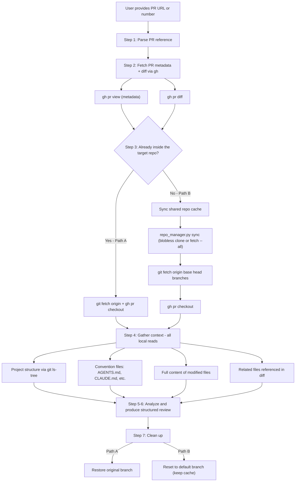
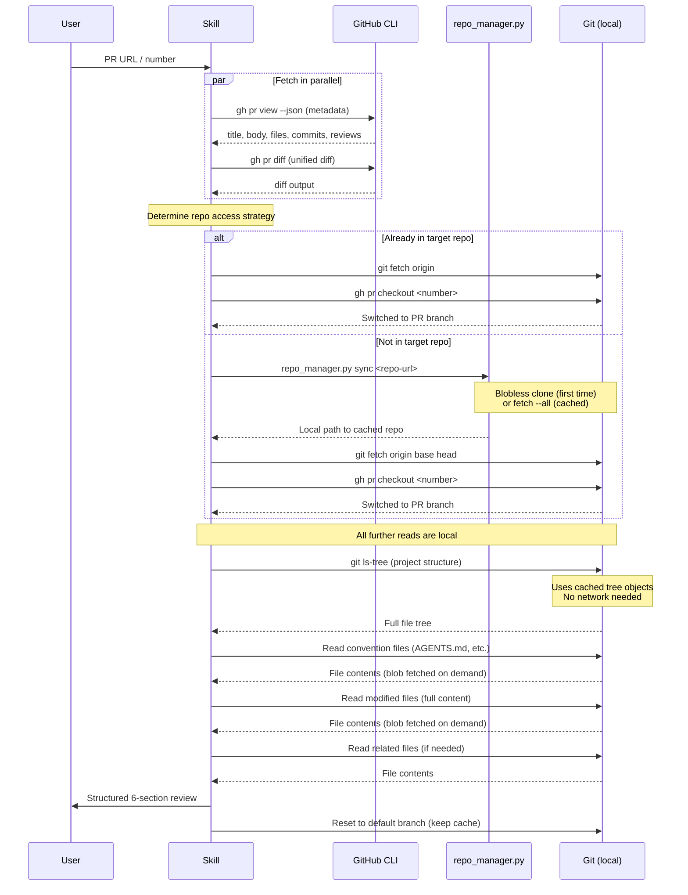

# github-code-review-pr

Context-aware code review for GitHub Pull Requests. Uses a shared blobless repo cache to gather deep repository context efficiently.

## How It Works

The key challenge of PR review is that a **diff alone lacks context**. To give a high-quality review, the skill needs to understand the project's structure, coding conventions, and the full content of modified files — not just the changed lines.

This skill uses a **shared repo cache** (powered by `scripts/repo_manager.py`) combined with **blobless clone** (`--filter=blob:none`) to download only what's needed while keeping the full repo structure available. The `git-repo-reader` skill bundles an identical copy of the same script — both read/write the same cache directory, so a repo cloned by one skill is instantly available to the other.

### Shared Repo Cache

The repo cache is shared across skills (`git-repo-reader`, `github-code-review-pr`, etc.):

```
mythril-skills-cache/
├── git-repo-cache/              # Shared repo cache (long-lived)
│   ├── repo_map.json
│   └── repos/
│       └── github.com/owner/repo/
└── github-code-review-pr/       # Image artifacts (ephemeral)
    └── <random>/images/
```

Benefits:
- **First review** of a repo: blobless clone (~tens of MB) + fetch PR branches
- **Subsequent reviews** of the same repo: just `fetch --all` (~seconds) + checkout PR branch
- **Cross-skill reuse**: if `git-repo-reader` already cached the repo, PR review reuses it

### Review Flow



### Data Flow



## Why Blobless Clone + Shared Cache?

The problem: you need repo context, but you don't want to download a 2 GB monorepo just to review a 10-file PR.

| Method | What gets downloaded | Typical size (50K-file repo) | Reusable? |
|--------|---------------------|------------------------------|-----------|
| Full clone | All commits + all blobs | ~2 GB | Yes |
| `--depth=1` (shallow) | 1 commit, but **all** blobs | ~500 MB | Partially |
| `--filter=blob:none` (blobless) | Commits + trees only, blobs on demand | ~5-50 MB | Yes |
| `--filter=blob:none --sparse` (old approach) | Same + limited working tree | ~5-50 MB | No (was deleted after review) |
| Per-file `gh api` calls | Only requested files | ~same bytes | No |

Blobless clone + shared cache wins because:

1. **Initial clone is small** — only git metadata (tree objects), no file content
2. **Full repo structure available** — `git ls-tree`, `git log`, `git diff`, `git blame` all work immediately
3. **On-demand blob fetch** — reading a file transparently downloads just that blob
4. **No guessing needed** — unlike sparse checkout, you don't need to predict which directories matter
5. **Shared cache** — same repo clone serves `git-repo-reader`, PR reviews, and future skills
6. **Fast repeat reviews** — second review of the same repo is just a `fetch` (~seconds)

## Context Gathering Strategy

The skill gathers context at three levels:

### 1. Project-level context (cheap, always gathered)

- **File tree** via `git ls-tree` — understand module layout and naming conventions
- **Convention files** — `AGENTS.md`, `CLAUDE.md`, `GEMINI.md`, `CONTRIBUTING.md`, `pyproject.toml`, `package.json`, `.editorconfig`, etc.

### 2. Change-level context (selective)

- **Full file content** of modified files — not just the diff, but the complete file on the PR branch
- This lets the reviewer see the function a change sits inside, the class structure, nearby code patterns
- Git auto-fetches only the blobs for files you actually read

### 3. Reference-level context (on-demand)

- If the diff imports from or calls into files not in the PR, just read them directly
- Git's blobless clone handles this transparently — read the file and git fetches the blob
- Limited to 2-3 files to avoid scope creep

## Ensuring Branch Freshness

A critical concern with cached repos is stale branches leading to inaccurate reviews. The skill addresses this with a **two-layer fetch strategy**:

1. **`repo_manager.py sync`** — runs `git fetch --all --prune` to refresh all remote refs
2. **Explicit branch fetch** — `git fetch origin <baseRefName> <headRefName>` to double-ensure the two branches involved in the PR are current
3. **Remote-tracking refs for comparison** — always uses `origin/<baseRefName>` (not local branches) as the diff base

## Requirements

- **GitHub CLI (`gh`)** — installed and authenticated
- **Git 2.25+** — for blobless clone support (most systems have this)
- **`curl`** — for downloading PR screenshots/assets when visual evidence matters
- Run `skills-check github-code-review-pr` to verify

## Visual Evidence Handling (Screenshots/Images)

When PR body/comments/reviews include image links, the skill should proactively download and inspect them when:
- the user asks to interpret screenshots,
- screenshots are part of verification steps (UI proof, tracking proof, offline check), or
- image content is necessary to validate correctness/risk.

Recommended retrieval order:
1. `curl -fsSL <image_url> -o <local_file>`
2. If enterprise auth blocks access, retry with `curl -fsSL --negotiate -u : <image_url> -o <local_file>`

Store image files under a random run dir in `$(realpath "${TMPDIR:-/tmp}")/mythril-skills-cache/github-code-review-pr/`.

Do not store artifacts in ad-hoc paths like `/tmp/pr81_deskcheck/...`.
Then summarize what each image shows and whether it supports PR claims.

## Cleaning Up

Two types of cached data exist:

| Type | Location | Lifecycle |
|---|---|---|
| **Repo cache** | `mythril-skills-cache/git-repo-cache/` | Long-lived, shared across skills |
| **Image artifacts** | `mythril-skills-cache/github-code-review-pr/` | Ephemeral, per-review |

Both can be cleaned via:
```bash
skills-clean-cache          # interactive — lists cache contents, asks for confirmation
skills-clean-cache --force  # delete without asking
```

Individual repos can be removed via:
```bash
python3 scripts/repo_manager.py remove "<repo-url>"
```

## Usage Examples

```
"Review this PR: https://github.com/owner/repo/pull/42"
"帮我审查一下这个 PR https://github.com/owner/repo/pull/42"
"帮我看一下这个 PR https://git.company.com/org/repo/pull/456"
"PR review #15"
"review PR owner/repo#99"
```
