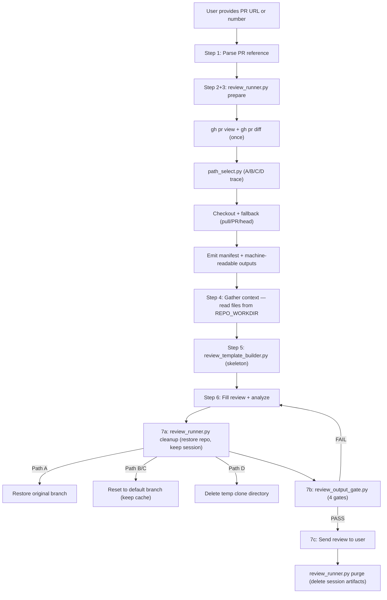
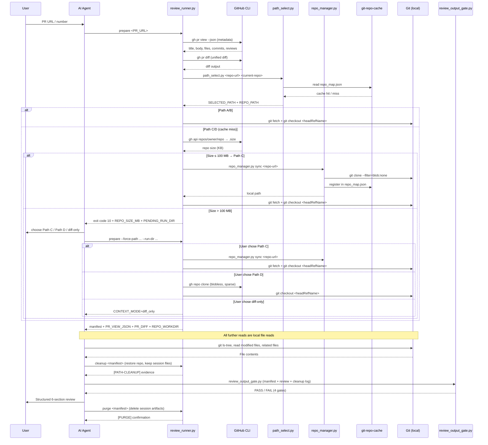

# github-code-review-pr

Context-aware code review for GitHub Pull Requests. Uses a hybrid strategy to gather repository context efficiently.

## How It Works

The key challenge of PR review is that a **diff alone lacks context**. To give a high-quality review, the skill needs to understand the project's structure, coding conventions, and the full content of modified files — not just the changed lines.

This skill uses a **four-path strategy** that adapts to what's available, from fastest to most self-sufficient:

| Path | Condition | Speed | Context depth |
|---|---|---|---|
| **A** | Already inside the target repo | Instant | Full repo |
| **B** | Repo found in shared cache (`git-repo-cache`) | Fast (fetch 2 branches) | Full repo |
| **C** | Repo not cached, ≤ 100 MB — clone to shared cache | Moderate (blobless clone, reusable) | Full repo |
| **D** | Repo > 100 MB (user chose D), or Path C clone failed | Moderate (blobless sparse clone, disposable) | Targeted files only |
| **DIFF_ONLY** | User explicitly chose no clone (large repo) | Instant | PR diff + metadata only |

## Guarded Runner (MANDATORY)

The skill uses bundled Python scripts to enforce deterministic behavior and prevent prompt drift. These scripts are **mandatory** — the SKILL.md instructs the agent to use them as the primary execution path, with manual `gh` commands only as a fallback when scripts are unavailable.

### Execution flow

1. **Prepare session** — single fetch + path select + checkout fallback (replaces manual Step 2 + Step 3)

```bash
python3 scripts/review_runner.py prepare "<PR_URL_OR_NUMBER>"
```

2. **Generate review skeleton** — deterministic 6-section template with PR metadata pre-filled

```bash
python3 scripts/review_template_builder.py \
  --manifest "<RUN_MANIFEST>" \
  --output "<REVIEW_DRAFT_PATH>" \
  --language en
```

3. **Cleanup** — restore branches, emit `[PATH-CLEANUP]` evidence (keeps session files for gate)

```bash
python3 scripts/review_runner.py cleanup "<RUN_MANIFEST>" 2>&1 | tee /tmp/cleanup_log.txt
```

4. **Quality gates** — validate review output before sending to user

```bash
python3 scripts/review_output_gate.py \
  --manifest "<RUN_MANIFEST>" \
  --review-text "<REVIEW_TEXT_PATH>" \
  --cleanup-log /tmp/cleanup_log.txt
```

5. **Purge** — delete session artifacts after gate passes

```bash
python3 scripts/review_runner.py purge "<RUN_MANIFEST>"
```

### What the gates enforce

| Gate | What it checks |
|---|---|
| `NO_SPECULATION_PASS` | No forbidden platform-guessing phrases in output |
| `SINGLE_FETCH_PASS` | `gh pr view` and `gh pr diff` each executed exactly once |
| `CLEANUP_EVIDENCE_PASS` | `[PATH-CLEANUP]` marker present in cleanup logs |
| `VERDICT_STATE_PASS` | Verdict is consistent with PR state (e.g., no "Request Changes" on merged PRs) |

### Shared Cache Integration

Path B leverages repos cached by the `git-repo-reader` skill (or previous reviews that used Path B/C). The bundled path selector (`scripts/path_select.py`) checks A → B → C → D in order, prints explicit `[PATH-CHECK]` / `[PATH-SELECTED]` trace lines, and reads the shared `git-repo-cache` mapping. When the cache hits (Path B), the skill fetches the two PR branches and checks out by `headRefName`, avoiding any clone operation. When the cache misses, the runner queries repo size via `gh api` — small/medium repos (≤ 100 MB) go to Path C (clone into shared cache, reusable); large repos (> 100 MB) pause with exit code 10 so the user can choose Path C / Path D / diff-only.

### Script Location Policy (Permission-safe)

To avoid sandbox prompts from broad home-directory scans, locate bundled scripts (`review_runner.py`, `path_select.py`) by checking fixed known install paths one by one (for example `~/.config/opencode/skills/...`, `~/.claude/skills/...`, `~/.cursor/skills/...`).

Do **not** run recursive glob/find over the whole home directory (for example `**/review_runner.py` in `~`).

### Review Flow



### Data Flow



## Why This Hybrid Strategy?

| Method | Download size (50K-file repo) | Reusable? | When used |
|--------|------------------------------|-----------|-----------|
| Path A — already in repo | 0 (just fetch) | N/A | Working in the repo |
| Path B — shared cache hit | ~KB (fetch 2 branches) | Yes | Repo was cloned previously (by git-repo-reader, Path C, or other skills) |
| Path C — clone to shared cache | ~5-50 MB (tree/commit metadata) | Yes (becomes Path B next time) | First encounter, repo ≤ 100 MB |
| Path D — sparse clone | ~5-50 MB (metadata + sparse files) | No (deleted after) | Repo > 100 MB, or Path C clone fails |
| Full clone (not used) | ~2 GB | Yes | Too slow for review |

Path B is the sweet spot for repos you work with regularly — near-instant after the first clone. Path C makes first encounters reusable: the blobless clone into the shared cache means the second review on the same repo is as fast as Path B. Path D handles large repos (> 100 MB) with minimal downloads via sparse checkout, and also serves as fallback when Path C fails.

## Context Gathering Strategy

### With full repo (Path A / Path B / Path C)

1. **Project structure** via `git ls-tree` — full file tree, no network needed
2. **Convention files** — read root-level config files directly
3. **Modified files** — read full content, git auto-fetches blobs on demand
4. **Related files** — read any file in the repo, auto-fetched transparently

### With partial clone (Path D)

1. **Project structure** via `git ls-tree` — full file tree from cached tree objects
2. **Convention files** — checked out via `sparse-checkout set /` (root-level)
3. **Modified files** — checked out via sparse-checkout of their directories
4. **Related files** — add directories to sparse checkout as needed (2-3 max)

## Path D Step-by-Step (Blobless + Sparse — Fallback)

Path D is the last-resort fallback when Path C (shared cache clone) fails. It uses a disposable blobless sparse clone to stay lightweight while still enabling context-aware review.

1. **Fetch PR metadata and diff once (no pager)**
   - Use the PR URL as the canonical reference.
   - Disable interactive paging so automation does not block.

```bash
GH_PAGER=cat gh pr view "<PR_URL>" --json number,title,body,baseRefName,headRefName,files,changedFiles,additions,deletions,url
GH_PAGER=cat gh pr diff "<PR_URL>"
```

2. **Create a temp review directory under the unified cache**

```bash
if [[ "$(uname -s)" == "Darwin" ]]; then
  CACHE_ROOT="$HOME/Library/Caches/mythril-skills-cache"
else
  CACHE_ROOT="${XDG_CACHE_HOME:-$HOME/.cache}/mythril-skills-cache"
fi
CACHE_DIR="$CACHE_ROOT/github-code-review-pr"
mkdir -p "$CACHE_DIR"
REVIEW_DIR=$(mktemp -d "$CACHE_DIR/XXXXXXXX")
```

3. **Clone with blobless + sparse mode (not full clone)**
   - `--filter=blob:none`: skip file blobs during clone.
   - `--sparse`: start with a minimal working tree.

```bash
gh repo clone "<REPO_URL_OR_OWNER/REPO>" "$REVIEW_DIR" -- --filter=blob:none --sparse
cd "$REVIEW_DIR"
```

4. **Add only directories touched by the PR**
   - Extract parent directories from the `files` list returned by `gh pr view`.
   - Add only those directories to sparse checkout.

```bash
git sparse-checkout add src/moduleA deploy .github/workflows
```

5. **Checkout the PR branch after sparse scope is set**

```bash
git fetch origin <headRefName>
git checkout <headRefName>
```

6. **Read context incrementally**
   - Read modified files in full when change volume justifies it.
   - If a dependency/reference points outside current sparse scope, add one more directory and continue.

```bash
git sparse-checkout add src/shared src/types
```

7. **Clean up temp repo after review**

```bash
rm -rf "$REVIEW_DIR"
```

### Why this is efficient

- Initial clone transfers commit/tree metadata, not full file content.
- File content is fetched only when directories are added to sparse checkout.
- Review stays focused on changed areas plus minimal related context.
- This avoids the cost of a full clone while preserving review quality.

### Operational best practices for Path D

- Use one canonical PR reference per run (URL if user provided URL).
- Disable pager for all `gh` review commands (`GH_PAGER=cat`).
- Fetch metadata/diff once, then reuse; avoid repeated `gh pr diff` calls.
- In the final report, clearly separate confirmed findings from potential risks.

## Path D Visual Map (What gets downloaded, when)

```mermaid
flowchart TD
    S0["Input: PR URL"] --> S1["1) GH_PAGER=cat gh pr view + gh pr diff"]
    S1 --> D1["Downloads: PR metadata + patch text\n(no repo clone yet)"]
    D1 --> A1["Analyzable now:\n- PR title/body/commits/reviews\n- changed file list\n- unified diff"]

    A1 --> S2["2) gh repo clone --filter=blob:none --sparse"]
    S2 --> D2["Downloads: commits + trees + refs\n(no full file blobs)"]
    D2 --> A2["Analyzable now:\n- full repo tree via git ls-tree\n- root files in sparse checkout"]

    A2 --> S3["3) git sparse-checkout add <PR dirs>"]
    S3 --> D3["Downloads: blobs only for PR-touched directories"]
    D3 --> A3["Analyzable now:\n- full content of modified files\n- directory-local context"]

    A3 --> S4["4) git fetch origin <headRefName> + git checkout <headRefName>"]
    S4 --> D4["Downloads: head branch refs\n+ blobs for sparse paths as needed"]
    D4 --> A4["Analyzable now:\n- PR branch version of sparse files"]

    A4 --> S5["5) git sparse-checkout add <related dirs> (optional)"]
    S5 --> D5["Downloads: additional blobs for only those related dirs"]
    D5 --> A5["Analyzable now:\n- cross-file interfaces/callers/tests\n  required for correctness checks"]
```



### Step-to-Command Matrix

| Step | Command | Network download at this step | Files analyzed after this step |
|---|---|---|---|
| 1 | `GH_PAGER=cat gh pr view ...` + `GH_PAGER=cat gh pr diff ...` | PR metadata and diff text | PR intent, changed files, patch hunks |
| 2 | `gh repo clone ... --filter=blob:none --sparse` | Commit graph, tree objects, refs (no full blobs) | Repo structure, root convention files |
| 3 | `git sparse-checkout add <pr-dirs>` | Blobs for changed directories only | Full content of modified files |
| 4 | `git fetch origin <headRefName>` + `git checkout <headRefName>` | Head branch refs and sparse-path blobs as needed | PR branch version of sparse files |
| 5 | `git sparse-checkout add <related-dirs>` | Blobs for specifically added related dirs | Interfaces/callers/tests needed for validation |
| 6 | `rm -rf "$REVIEW_DIR"` | None | Cleanup only |

## Ensuring Branch Freshness

A critical concern with cached repos (Path B) is stale branches leading to inaccurate reviews:

1. **Targeted branch fetch** — `git fetch origin <baseRefName> <headRefName>` fetches exactly the two branches the PR needs
2. **Remote-tracking refs for comparison** — always uses `origin/<baseRefName>` (not local branches) as the diff base
3. **Direct branch checkout** — `git checkout <headRefName>` uses metadata from `gh pr view` and avoids `gh pr checkout` auth edge cases on Enterprise hosts

## Requirements

- **GitHub CLI (`gh`)** — installed and authenticated
- **Git 2.25+** — for sparse-checkout support (most systems have this)
- **`curl`** — for downloading PR screenshots/assets when visual evidence matters
- Run `skills-check github-code-review-pr` to verify

## Visual Evidence Handling (Screenshots/Images)

When PR body/comments/reviews include image links, the skill should proactively download and inspect them when:
- the user asks to interpret screenshots,
- screenshots are part of verification steps (UI proof, tracking proof, offline check), or
- image content is necessary to validate correctness/risk.

Store image files under a random run dir in `~/Library/Caches/mythril-skills-cache/github-code-review-pr/` (Linux: `${XDG_CACHE_HOME:-~/.cache}/mythril-skills-cache/github-code-review-pr/`).

Do not store artifacts in ad-hoc paths like `/tmp/pr81_deskcheck/...`.
Then summarize what each image shows and whether it supports PR claims.

## Cleaning Up

| Type | Location | Lifecycle |
|---|---|---|
| **Shared repo cache (Path B/C)** | `mythril-skills-cache/git-repo-cache/` | Long-lived, managed by `git-repo-reader` and `repo_manager.py` |
| **Temp clones (Path D)** | `mythril-skills-cache/github-code-review-pr/` | Deleted after each review |
| **Image artifacts** | `mythril-skills-cache/github-code-review-pr/` | Ephemeral, per-review |

```bash
skills-clean-cache          # interactive — lists cache contents, asks for confirmation
skills-clean-cache --force  # delete without asking
```

## Usage Examples

```
"Review this PR: https://github.com/owner/repo/pull/42"
"帮我审查一下这个 PR https://github.com/owner/repo/pull/42"
"帮我看一下这个 PR https://git.company.com/org/repo/pull/456"
"PR review #15"
"review PR owner/repo#99"
```
