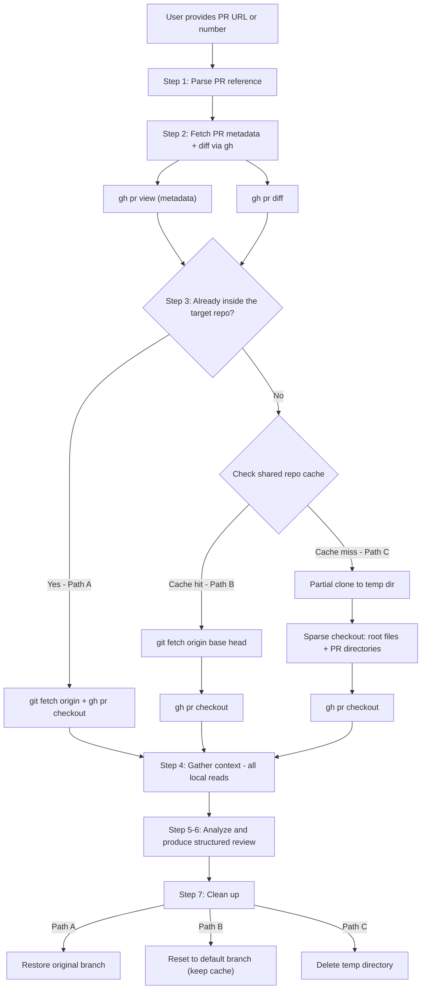
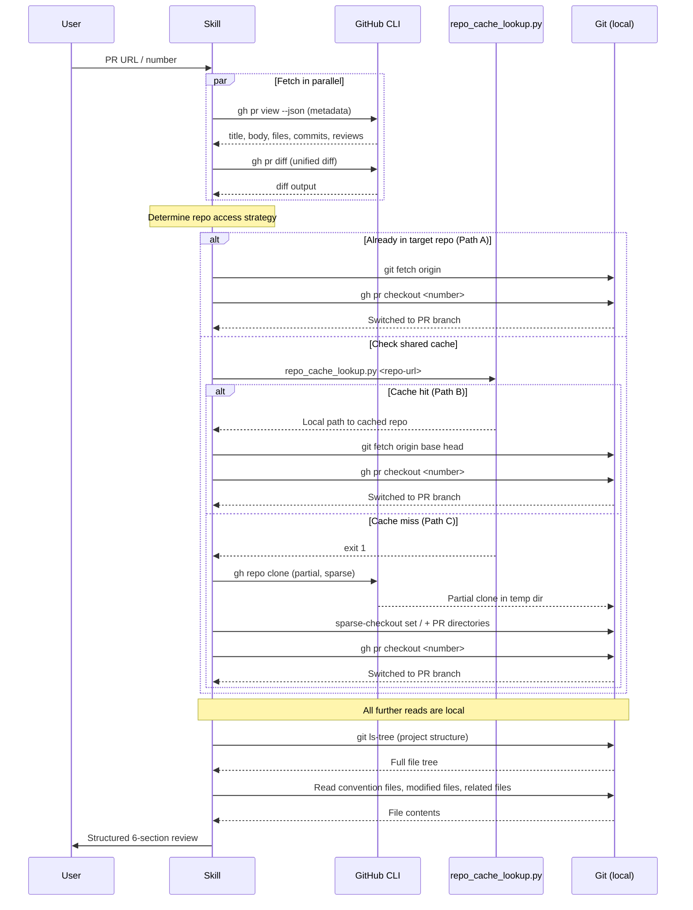

# github-code-review-pr

Context-aware code review for GitHub Pull Requests. Uses a hybrid strategy to gather repository context efficiently.

## How It Works

The key challenge of PR review is that a **diff alone lacks context**. To give a high-quality review, the skill needs to understand the project's structure, coding conventions, and the full content of modified files — not just the changed lines.

This skill uses a **three-path strategy** that adapts to what's available, from fastest to most self-sufficient:

| Path | Condition | Speed | Context depth |
|---|---|---|---|
| **A** | Already inside the target repo | Instant | Full repo |
| **B** | Repo found in shared cache (`git-repo-cache`) | Fast (fetch 2 branches) | Full repo |
| **C** | Repo not cached anywhere | Moderate (partial clone) | Targeted files only |

### Shared Cache Integration

Path B leverages repos cached by the `git-repo-reader` skill (or previous reviews that used Path B). A lightweight lookup script (`scripts/repo_cache_lookup.py`) checks the shared `git-repo-cache` mapping — read-only, never clones. When the cache hits, the skill just fetches the two PR branches and checks out, avoiding any clone operation.

### Review Flow



### Data Flow



## Why This Hybrid Strategy?

| Method | Download size (50K-file repo) | Reusable? | When used |
|--------|------------------------------|-----------|-----------|
| Path A — already in repo | 0 (just fetch) | N/A | Working in the repo |
| Path B — shared cache hit | ~KB (fetch 2 branches) | Yes | Repo was cloned by git-repo-reader or previous review |
| Path C — partial clone | ~5-50 MB (metadata + sparse files) | No (deleted after) | First encounter with the repo |
| Full clone (not used) | ~2 GB | Yes | Too slow for review |

Path B is the sweet spot for repos you work with regularly — near-instant after the first `git-repo-reader` clone. Path C is the safe fallback that works for any repo without waiting for a full clone.

## Context Gathering Strategy

### With full repo (Path A / Path B)

1. **Project structure** via `git ls-tree` — full file tree, no network needed
2. **Convention files** — read root-level config files directly
3. **Modified files** — read full content, git auto-fetches blobs on demand
4. **Related files** — read any file in the repo, auto-fetched transparently

### With partial clone (Path C)

1. **Project structure** via `git ls-tree` — full file tree from cached tree objects
2. **Convention files** — checked out via `sparse-checkout set /` (root-level)
3. **Modified files** — checked out via sparse-checkout of their directories
4. **Related files** — add directories to sparse checkout as needed (2-3 max)

## Ensuring Branch Freshness

A critical concern with cached repos (Path B) is stale branches leading to inaccurate reviews:

1. **Targeted branch fetch** — `git fetch origin <baseRefName> <headRefName>` fetches exactly the two branches the PR needs
2. **Remote-tracking refs for comparison** — always uses `origin/<baseRefName>` (not local branches) as the diff base
3. **`gh pr checkout`** — ensures the local PR branch matches the remote HEAD

## Requirements

- **GitHub CLI (`gh`)** — installed and authenticated
- **Git 2.25+** — for sparse-checkout support (most systems have this)
- **`curl`** — for downloading PR screenshots/assets when visual evidence matters
- Run `skills-check github-code-review-pr` to verify

## Visual Evidence Handling (Screenshots/Images)

When PR body/comments/reviews include image links, the skill should proactively download and inspect them when:
- the user asks to interpret screenshots,
- screenshots are part of verification steps (UI proof, tracking proof, offline check), or
- image content is necessary to validate correctness/risk.

Store image files under a random run dir in `~/Library/Caches/mythril-skills-cache/github-code-review-pr/` (Linux: `${XDG_CACHE_HOME:-~/.cache}/mythril-skills-cache/github-code-review-pr/`).

Do not store artifacts in ad-hoc paths like `/tmp/pr81_deskcheck/...`.
Then summarize what each image shows and whether it supports PR claims.

## Cleaning Up

| Type | Location | Lifecycle |
|---|---|---|
| **Shared repo cache** | `mythril-skills-cache/git-repo-cache/` | Long-lived, managed by `git-repo-reader` |
| **Temp clones (Path C)** | `mythril-skills-cache/github-code-review-pr/` | Deleted after each review |
| **Image artifacts** | `mythril-skills-cache/github-code-review-pr/` | Ephemeral, per-review |

```bash
skills-clean-cache          # interactive — lists cache contents, asks for confirmation
skills-clean-cache --force  # delete without asking
```

## Usage Examples

```
"Review this PR: https://github.com/owner/repo/pull/42"
"帮我审查一下这个 PR https://github.com/owner/repo/pull/42"
"帮我看一下这个 PR https://git.company.com/org/repo/pull/456"
"PR review #15"
"review PR owner/repo#99"
```
